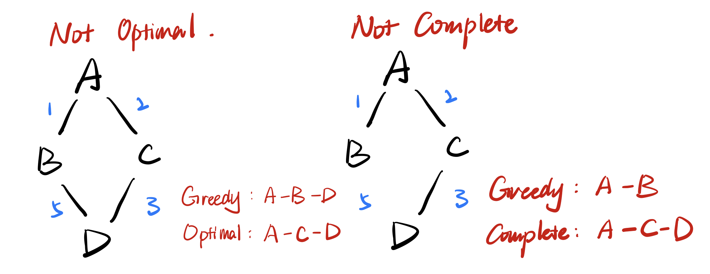

## Session 4: Heuristic Searches

>   ### Outline
>
>   -   Heuristic Search
>       -   Admissable
>   -   Greedy Search
>   -   A* Search
>   -   Informedness
>       -   a good heuristic

#### 1. Heuristic Search

`Path_Cost = Past_Cost(S) + h(S)`

-   Heuristic function `h(n)` :
    -   estimation of minimal cost path (or distance) from n to a goal state
-   All domain knowledge used in the search is encoded in `h(n)`
    -   in some cases, `h(n)` comes from our common sense
-   In general, $h(n) \geq 0$  for all nodes n
    -   $h(n)=0$ , means n is a goal node

-   **Admissable**: 
    -   `h(n)` must ==never over estimate== the cost to reach the goal
    -   The alg. will not waste time exploring unpromising paths, thus leading to a more efficient search process

#### 2. Greedy Search

-   decide which is the **next best node** to expand to reach the goal using domain knowledge

-   Function $f(n)$: how close the node is to the goal state
-   Select the node **believed to be** the closest to a goal node

|               | Order of nodes to explore                                | Cost(n)                                                     |
| ---- | ------------------------- | ------- |
| UCS           | Nodes of the lowest path (**past cost**)                 | $f(n) = g(n)$ : actual path cost thus far |
| Greedy search | Node which are the closest to the goal (**future cost**) | $f(n) = h(n)$ : estimate cost to the goal (using heuristic) |

-   **Evaluation**

    -   **Time and Space Complexity**: $O(b^d)$

    -   ==Not Complete and Not Optimal==

#### 3. A* Algorithm

-   ==If the heuristic is admissble, then it is **optimal** and **complete**==

-   combine the cost **so far** and the estimated cost **to the goal**

    `f(n) = g(n) + h(n)`

    -   g: cost from the `initial state` to the `current state`
    -   h: cost from the `current state` to a `goal state`
    -   f: estimated cost of the cheapest solution **through n**

-   `if h = 0`

    -   A* becomes UCS
    -   complete & optimal, but search undirected

-   `if g = 0`

    -   A* becomes Greedy, lose optimality

#### 4. Informedness

-   For two A* heuristic h1 and h2, 
    for all states n in the search space if $h_{1}(n)\le h_{2}(n)$, 
    we say h2 `dominates` h1 or h2 is `more informed` than h1
-   Using h2 will be more **efficient** than h2 
-   ==Hence it is always better to use a heuristic function with **higher values**==

-   **A good heuristic**
    -   closer the estimate of the heuristic
    -   lower average effective branching factor
    -   admissable

