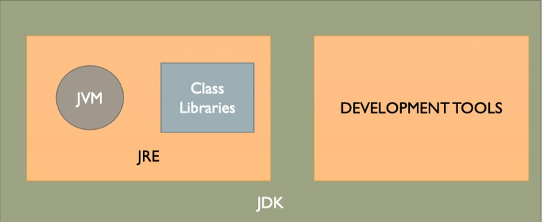

## L002 Fundamentals

##### 1. JDK, JRE, and JVM

-   <u>Java Development Kit (JDK)</u>
    -   a software development environment used for developing java applications and applets
-   <u>Java Runtime Environment (JRE)</u>
    -   minimum requirements for executing a java application
-   <u>Java Virtual Machine (JVM)</u>
    -   Compiler: translate high-level programming languages' source code into machine code
    -   java: translate source code into bytecode
    -   JVM: a program execute java bytecode
    -   JVM is invoked by the `java` command




##### 2. `public static void main (String[] args)`

-   `public`: access modifer
    -   It means that you can call this method from outside of the current class. The main method must be declared as public
-   `static` : keyword
    -   When the JVM makes a call to the main method there is no object existing for the class being called. `static` allows `main()` to be executed independently of any object
-   `void`: 
    -   no particular type of data has to be returned through the function
-   `main`
    -   the name of the method
-   `(String[] args)`: parameters


##### 3. `System.out.println("Hello World");` 

-   `println()` : built-in method that display the given string
-   `System`: a **pre-defined class** which provides access to the system
-   `out` : the output stream that is connected to the console


##### 4. Java Identifiers

-   a name given to a method, variable. or other user-defined item

-   Rules
    -   `$, _, [A-Z, a-z], [0-9]`
    -   no white space
    -   cannot be empty, i.e. one or more characters
    -   the first character cannot be a digit, e.g, 9sees
    -   case-sensitive


##### 5. Data Types

-   OO types
-   8 Non-OO types (primitive data types)
    -   byte, short, int ,long, float, double, char, Boolean (by default is false)


##### 6. class and public class

-   一个java源文件当中可以定义多个class，public的class不是必须的

-   一个class会定义生成一个xxx.class字节码文件

-   每一个class当中都可以编写main方法，想执行x.class当中的main方法:java x

-   当在命令窗口中执行java Hello，那么要求hello.class当中必须有主方法

-   一个java源文件当中定义公开的类的话，只能有一个，并且该类名称必须和java源文件名称一致

-   虽然一个 java 源文件可以定义多个 class，实际上这是不规范的，比较规范的写法是一个 java 源文件中只定义一个 class


##### 7. Array

-   a collection of variables of the same type
    -   fixed size
    -   variables are of the same type
    -   one or more dimensions
    -   implementd as objects
-   one-dimensional arrays
    -   `type[] array-name = new type[size];`


##### 8. lab01: Float Pounds

```java
float twentyPence = 0.2f;
System.out.println("20 pence = " + twentyPence);
for (int i=1; i<1000; i++){
    twentyPence += 0.2f;
}
System.out.println("total = " + twentyPence);
```

-   float并不能在内存中精确地被表示，是采用single precision的储存方式，会有误差$\epsilon$
-   因此对0.2进行1000次累加的时候，微小的误差 $\epsilon$ 会被放大
-   因为java实在累加完成过后再进行数据误差的检验
-   最好使用乘法，java会在做乘法以前进行数据检验，因此0.2*1000的结果会是200


