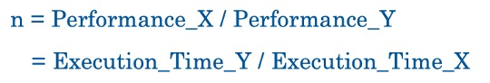
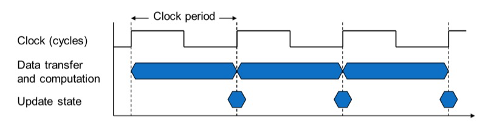
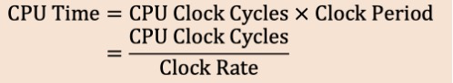
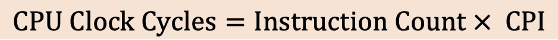
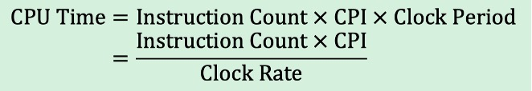
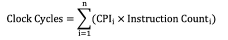
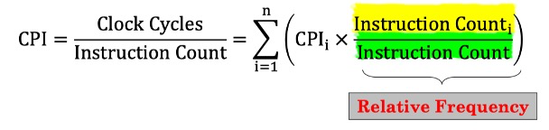
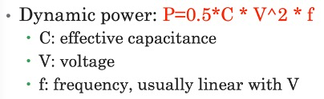

## Computer Performance

#### *. Instruction Set Architecture

-   Defines the set of instructions that a computer/processor can execute
-   The contract between the hardware and software
-   examples:
    -   x86
    -   ARM
    -   MIPS

#### 1. Timing Performance

##### 2. CPU Clocking

-   one clock cycle: the unit of the CPU clock
-   clock period: time per clock cycle
-   clock frequency (clock rate): clock cycle per second

##### 3. CPU Time

##### 4. Clock cycles per instructions (CPI)

the average number of clock cycles each instruction takes to execute

-   CPI is determined by how you design the CPU

-   Instruction Count is determined by program, ISA and compiler

    

##### 5. The Classic CPU Performance Equation

##### 6. Average CPI (weighted average)

-   IC~i~ is weighted SUM of instructions
-   IC is just the SUM of instructions

##### 7. Power and Energy

