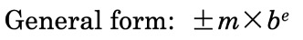
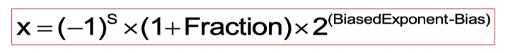
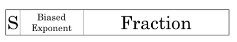
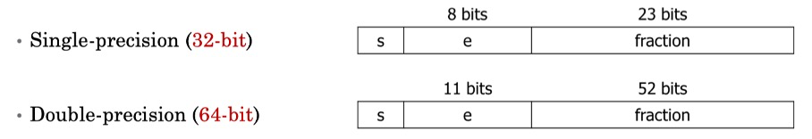

## Computer Arithmetic

##### 1. Scientific Notation

-   m: significand
-   b: base number
-   exponent e: an integer

##### 2. Normalized scientific notation

1 <= |m| < 10

##### 3. Normalized scientific notatoin in binary

==We'll always have a '1' to the left of the binary point==

##### 4. The IEEE Standard for Floating-Point Arithmetic (IEEE 754)

-   a technical standard for floating-point computation
-   a type of sign adn magnitude representation
-   s: sign bit of the fraction
-   <u>biased exponen</u>t: actual exponent + bias
-   <u>bias of single precision</u>: 127
-   <u>bias of double precision</u>: 1023

##### 5. Special Values (Single Precision)

-   Smallest postive normalized number: 1.0~2~ * 2^-126^

-   Least negative normalized number: -1.0~2~ * 2^-126^

-   Zero: 1.0~2~ * 2^-127^ or -1.0~2~ * 2^-127^

-   Largest positive normalized number:

    1.1111 1111 1111 1111 1111 111~2~ * 2^127^

-   Most negative normalized number:

    -1.1111 1111 1111 1111 1111 111~2~ * 2^127^

-   Infinitude: 1.0 * 2^128^ or -1.0 * 2^128^

-   NaN: 1.f * 2^128^ where f != 0

##### 6. NaN (Not-a-Number)

a numeric data type value representing an undefined value

##### 7. Equality Conditions

-   In most computers: $0.3 + 0.2 \neq 0.5$

    -   Neither 0.3 nor 0.2 has exact binary representation

-   Never directly test floating point numbers for equality

    -   Usiing the following statement instead

        $|0.3 + 0.2 - 0.5| < \varepsilon$

