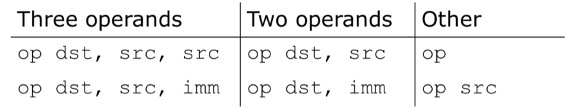

## MIPS Programming 1


### MIPS Instruction Basics

##### 1. Bit, Byte and Word

-   Bit: binary digit, either 0 or 1
-   Byte: a byte has 8 bits in length
-   Word: a word is 4 bytes long on the 32-bit MIPS


##### 2. Program Counter (PC)

-   points to the memory location of the current instruction
-   fetches instructions from where PC points
-   change for the next instruction


##### 3. MIPS (Microprocessor without Interlocked Processor States)

-   Instruction Set Architecture based on Reduced Instruction Set Computing **(RISC)** CPU design strategy
-   Make instructions simple but execute them fast
-   In contrast with Complex Instruction Set Computing (CISC)


##### 4. MIPS Basic Syntax

-   <u>Assemble directives</u> begin with a dot '.'
    -   .data: start assembling data used by the program
    -   .text.: start assembling program instructions
    -   .asciiz: place a null-terminated **ASCII string** in the memory
-   <u>Labels</u> are names followed by a colo ':'
    -   Descriptive names chosen by programmers
    -   The assembler will assign memory address to labels for later reference
    -   The label "main" is the entry of the program
-   Lines after "main": contain symbolic machine instructions


### MIPS Operands

##### 5. General syntax



-   dst: destination register
-   src: source register
-   imm: immediate value **(16 bits)**


##### 6. MIPS Arithmetic

-   add

`add $s0, $s1, $s2		# s0 = s1 + s2`

-   subtract

`sub rd, rs1, rs2		# rd = rs1 - rs2 `


##### 7. MIPS Registers

-   assembly don't use variables => (most) assembly operands are registers
    -   Limited number of special hardware built directly inside the CPU
    -   Operations are **performed on them directly**
-   Benefits
    -   Registers in CPU: faster than memory
    -   Registers are easier for compiler to use
    -   Register can hold variables to reduce memory traffic


-   32 registers, each is 32 bits wide
    -   Group of 32 bits called a word in MIPS
    -   Registers are numbered from 0 to 31
    -   Each can be referred to by number or name


##### 8. Memory Operands

-   Memory contains large data structures like arrays
-   But MIPS arithmetic instructions operate on registers, not directly on memory
    -   data transfer instructions (lw, sw, lb, sb) to transfer between memory and register
-   ==Only load and store instructions can access memory==


##### 9 Data Transfer

```assembly
lw $t0, 12($s0)		// lw: load word	Memory to Register
sw $t0, 12($s0)		// sw: store word	Register to Memory
```

-   `$s0` is called the **base register**, 12 is called the **offset**
-   Offset is generally used in accessing elements of array
-   Base register points to the beginning of the array


##### 10. Memory Addressing

-   MIPS memory is byte-addressable (not word addressable)
-   Each byte has a unique address
-   Load and store single bytes: lb adn sb
-   Each 32-bit words has 4 bytes, so the word address increments by 4


-   Little-Endian: orders bytes starting at the least significant end
-   Big-Endian: order bytes starting at the most significant end


##### 11. Role of Registers vs. Memory

-   What if there are more variables than registers in your code?
    -   Compiler tries to keep most frequently used variables in registers
    -   Put less common variables into memory: spilling
-   Why not keep all variables in memory?
    -   **Design Principle**: Smaller is faster
    -   Registers are more versatile


##### 12. Immediate Operands

-   Add Immediate:

    ```assembly
    addi $s0, $s1, 10		// s0 = s1 + 10
    addi $s2, $s1, -1		// use addition to perform subtraction
    ```

-   The Constant zero
    -   ==We define register zero to be constant 0==
    -   $zero cannot be overwritten
    -   useless instruction: `addi $0, $0, 5`


### Other MIPS Operations

##### 13. Bitwise operations

-   Shift Instrutions

    -   `sll` (shift left logical): shifts left, fills empty with 0

    -   `srl` (shift right logical): shifts right, fills empty with 0

    -   sra` (shift right arithmetic): shifts right, fills empty with **sign extending**

-   Logical operators

    -   `NOT(A) = NOR(A, F)`
    -   `nor $t0, $t1, $zero`

    -   **==There is no `nori` operation==** 


##### 14. Floating-Point-Architecture

-   IEEE operations performed by **Floating Point Unit** (FPU)
    -   MIPS core refers to FPU as coprocessor 1
-   FPU features **32 single precision (32-bit)** registers
    -   `$f0, $f1, $f2, . . . , $f31`
-   Or as 16 pairs of **double precision (64 -bit)** registers
    -   `$f0, $f2, $f4, . . . , $f30 (even registers only!)`
    -   Here `$fi` actually stands for the pair `$fi` and `$f(i+1)`
-   ==`$f0` is NOT hardwired to the value 0.0!==


-   Addition:

    ```assembly
    add.s $f0, $f1, $f2		// single precision
    add.d $f0, $f2, $f4		// double precision
    ```

-   Load/Store

    ```assembly
    lwc1 fd, n(rs)			// load word coprocessor 1
    swc1 fd, n(rs) 			// store word coprocessor 1
    ```

-   Copying Data

    -   **only copy the bit pattern, not the actual value it represents**

    ```assembly
    mfc1 $t0, $f7 			// copy content of $f7 to $t0
    mtc1 $zero, $f12 		// set $f12 := 0
    ```


##### 15. Multiplication Instructions

-   MIPS stores the 64 bit result of the multiplication of two 32 bit registers in

    -   Bits 32 to 63 are stored in **Hi**
    -   Bits 0 to 31 are stored in **Lo**

-   There are two instructions: 

    -   multiply (`mult`) and unsigned multiply (`multu`)

    

##### 16. Division Instructions

-   MIPS stores the result of the division of two 32 bit registers in
    -   remainder is stored in **Hi**
    -   quotient is stored in **Lo**
-   There are two instructions: 
    -   divide (`div`) and unsigned divide (`divu`)


