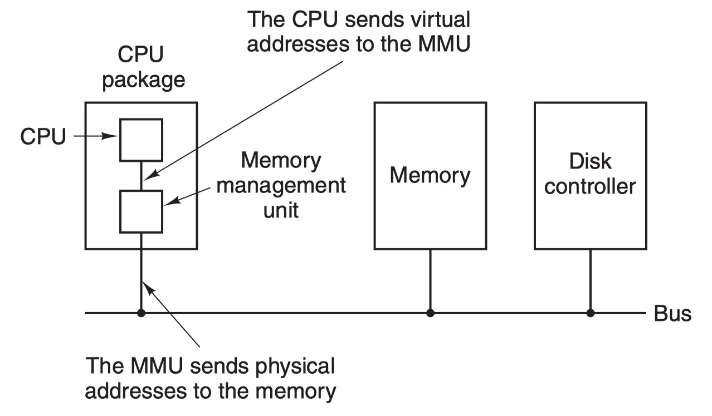

# lec16: Memory Management 3

>   **Overview**
>
>   -   **Memory allocation**
>       -   First fit, best fit, worst fit
>       -   Quick fit, coalescing, compacting
>   -   **Paging** - page tables, address translation

## Memory Allocation

### Description

**First Fit**

-   **First fit** scans from the start of the list until an sufficiently large gap is found

-   `if`: the space is the **exact size**, then all the space is allocated

-   `else`: the space is split:

    -   The first entry is set to the **size requestd** and marked **used**

    -   The second entry is set to **remaining size** and marked **free**

-   **Shortcomings**

    -   It does **not** account for a **better fitting** hole

    -   It may **break up a large hole** early in the list

**Next Fit**

-   **Next fit** algorithm maintains a record of where it got to:
    -   It restarts its search from where **it stopped last time**
    -   It gives an **even chance** to all memory to get allocated (first fit concentrates on the start of the list)

**Best Fit**

-   **Best fit** searches the entire linked list for the smallest hole that is big enough to satisfy the request
    -   **slower** than first fit
    -   results in **small waste memories**

**Worst Fit**

-   **Worst fit** finds the **largest available partition** and splits it
    -   The leftover part will still be large
    -   **Not good** in practice

**Summary**

-   **First fit**: allocate **first block** that is large enough 
-   **Next fit**: allocate **next block** that is large enough, i.e. starting from the current location 
-   **Best fit**: choose block that **matches required size closest** - O(N) complexity
-   **Worst fit**: choose the **largest possible block** - O(N) complexity

### Quick Fit

-   **Quick fit** maintains lists of commonly used sizes
    -   e.g.: a separate list for each of 4K, 8K, 12K, 16K... holes
    -   **Odd sizes** can either go into the nearest size or into a special separate list
-   It is **much faster** to find the required size hole using quick fit
-   Similar to best fit, it has the problem of **creating many tiny holes**
-   Finding neighbours for coalescing (combining empty partitions) becomes more time consuming

>   ### **Example**
>
>   0.   **初始状态：**
>
>        -   10KB 列表：空闲块 A (10KB), 空闲块 B (10KB)
>
>        -   20KB 列表：空闲块 C (20KB)
>
>        -   30KB 列表：空闲块 D (30KB), 空闲块 E (30KB)
>
>   1.  **内存请求**：一个程序请求 20KB 的内存。
>   2.  **查找适当的列表**：系统检查维护 20KB 块的列表。
>   3.  **分配内存**：系统发现空闲块 C 是 20KB，于是将其分配给该程序。
>   4.  **更新列表**：20KB 列表现在为空，因为 C 块已被分配。
>       -   10KB 列表：空闲块 A (10KB), 空闲块 B (10KB)
>       -   20KB 列表：(空)
>       -   30KB 列表：空闲块 D (30KB), 空闲块 E (30KB)
>   5.  **另一个内存请求**：另一个程序请求 10KB 的内存。
>   6.  **再次分配内存**：系统查看 10KB 列表，找到空闲块 A，并将其分配给该程序。
>   7.  **更新列表**：10KB 列表现在只剩下空闲块 B。
>       -   10KB 列表：空闲块 B (10KB)
>       -   20KB 列表：(空)
>       -   30KB 列表：空闲块 D (30KB), 空闲块 E (30KB)

### Coalescing

-   **Coalescing** (joining together) takes place when two **adjacent entries** in the linked list become free
-   Both **neighbours** are examined when **a block is freed**
-   Algorithm
    -   `if` both are **free**
    -   `then` the three entries are combined into one larger block by adding up the sizes
        -   The earlier block in the linked list gives the **start point**
        -   The **separate links are deleted** and a single link inserted

**Compacting**

-   Even with coalescing, free blocks may still distributed across memory 
-   **Compacting** can be used but is **harder to implement** and **time consuming** 
-   Processes may have to be **moved/swapped out**, **free space coalesced**, and processes swapped back in at lowest available location

**Contiguous Allocation Schemes**

-   **Mono-programming** is easy but does result in **low resource utilisation** 
-   **Fixed partitioning** facilitates **multi-programming** but results in **internal fragmentation** 
-   **Dynamic partitioning & segmentation** facilitate **multi-programming**, reduce **internal fragmentation**, but result in **external fragmentation** (allocation methods, coalescing, and compacting help)

>   ### Example
>
>   在内存管理的动态分区中，"Coalescing"（合并）算法是一种优化技术，用来减少由于动态内存分配和释放导致的外部碎片。外部碎片是指内存中分散的小块空闲空间，它们单独可能太小，无法满足新的内存分配请求。合并算法通过将相邻的空闲内存块合并成更大的单个块来解决这个问题。
>
>   ### 示例说明
>
>   假设我们的内存空间如下：
>
>   ```
>   | 已分配 | 空闲 | 已分配 | 空闲 | 已分配 |
>   ```
>
>   在这个简化的示例中，内存被分为五个区块，其中有两个空闲块被夹在已分配的块之间。现在假设中间的已分配区块被释放了，情况变为：
>
>   ```
>   | 已分配 | 空闲 | 空闲 | 空闲 | 已分配 |
>   ```
>
>   这里，有三个连续的空闲区块。如果没有合并，这些小块可能无法满足稍大一点的内存请求，即使总的空闲空间足够。使用合并算法，操作系统会检测并合并这些相邻的空闲块：
>
>   ```
>   | 已分配 |        空闲        | 已分配 |
>   ```
>
>   经过合并，现在有一个更大的连续空闲块，可以满足更大的内存分配请求。这样，合并算法减少了外部碎片，提高了内存的利用率。

## Paging

### Page

-   **MMU**
-   The **virtual addresses** do not go **directly** to the memory bus. 
    
-   Instead, they go to an **MMU** that **maps** the virtual addresses onto the **physical memory** addresses



-   Definitions
    -   A **page** is a small block of **contiguous memory** in the **logical address space**
    -   A **frame** is a **small contiguous block** in **physical memory** 
    -   Pages and frames (commonly) have the **same size**:
        -   The size is usually **a power of 2** 
        -   Sizes range between 512 bytes and 1Gb
-   **Paging** uses **fixed partitioning** and **code re-location** to devise a new non-contiguous management scheme:
    -   Memory is split into **much smaller blocks** 
    -   A process is allocated **one or more blocks** (e.g., a 11KB process would take up three 4KB blocks) 
    -   Blocks do **not** have to be **stored in contiguous** in physical memory 
    -   The process **perceives** them to be **contiguous**
-   **Benefits** of non-contiguous schemes include:
    -   **Internal fragmentation** is reduced to the **last “block”** only 
    -   **No external fragmentation** (blocks in physical address space are stacked directly on top of each other)

>   ### Example (MOS 3.3.1)
>
>   
>
>   -   When the program tries to access address 0 using `mov REG, 0`, it would be translated into `mov REG, 8192`
>   -   Since we have 16 page frames of **virtual address space** with only 8 page frames of **physical memory space**, so here only 8 virtual pages are mapped onto physical memory.
>       -   a **Present/absent bit** keeps track of which pages are physically present in memory.

**Page fault**

-   If **the program accesses a page that is not mapped to the physical memory**, it would cause a **page fault**
-   In the example above, if the OS wanna evict virtual page frame 1 and replace with frame 8
    1.   mark virtual page 1’s entry as unmapped
    2.   it would replace the cross in virtual page 8’s entry with a `1`
    3.   when the trapped instruction is re-executed, the new map would work

### Page Table

-   **Segmentation table:** 


-   **Page table**


-   An example from *MOS 3.3.1*


**Relocation**

-   **Logical address** needs to be translated into a **physical address** (frame number, offset within frame)
-   Multiple "base registers" will be required
    -   Each page has a **base register** that identifies the start of the associated **frame**
    -   A **set of base registers** must be maintained for every process
-   The set of base registers is stored in the **page table**


