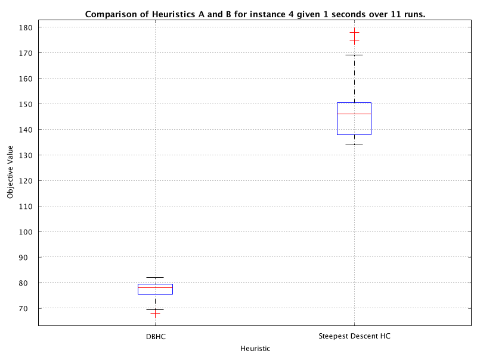
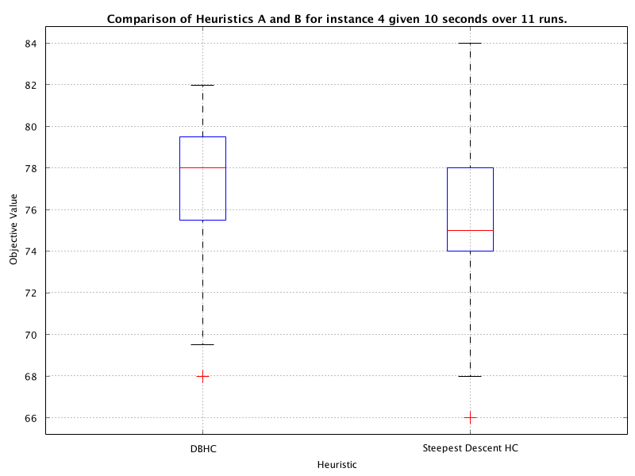
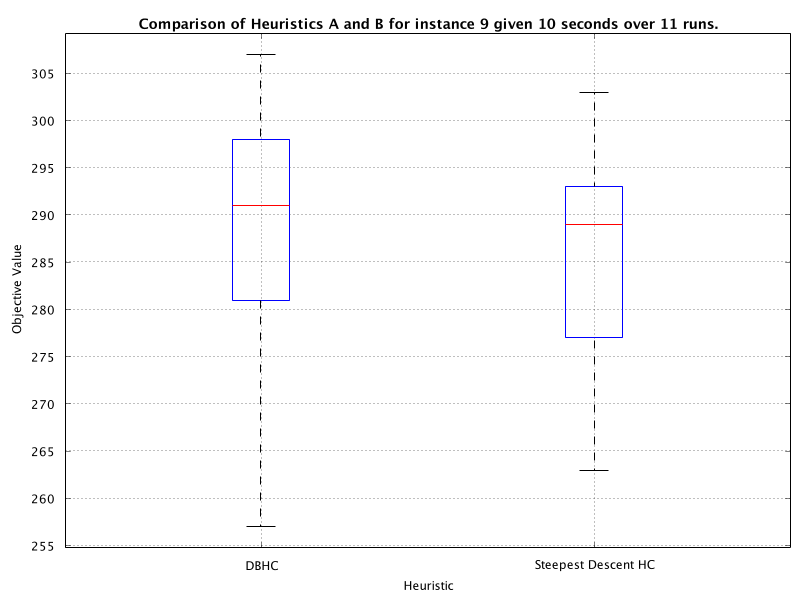

# lab01-Report

## Q1

What would be the issue if a heuristic was implemented to modify a solution that is stored in a non-current solution memory index? Hint: think about the experimental framework and any assumptions that it regarding the layout of solutions. You might also find it useful to read and understand the code for the method `public RunData runExperiment(int run, int heuristicId` in the `Exercise1Runner` class.

```java
SATHeuristic heuristic = Exercise1TestFrameConfig.getSATHeuristic(heuristicId, random);

// record the objective value of the initial solution
fitnessTrace.add(sat.getObjectiveFunctionValue(SATHeuristic.CURRENT_SOLUTION_INDEX));

// continually apply the local search heuristic until the execution time expires
while (!sat.hasTimeExpired()) {

    // apply DBHC/SDHC to the solution-in-hand
    heuristic.applyHeuristic(sat);

    // evaluate the cost of the solution-in-hand
    double fitness = sat.getObjectiveFunctionValue(SATHeuristic.CURRENT_SOLUTION_INDEX);

    // add data to progress plot
    if (!sat.hasTimeExpired()) {
        fitnessTrace.add(fitness);
    }
}
```

-   The object value in the fitness trace would remains the same, since the value in `CURRENT_SOLUTION_INDEX` is not changed

## Q2

Run both heuristics for 1 second on SAT instance `#4`. Which of these heuristics performs better for solving this instance given this run time?

-   DBHC performs better if given **1s**
-   SDHC is much slower than DBHC but more accurate



## Q3

Run both heuristics for an extended run time for solving SAT instance #4. Which heuristic performs better now? Why do you think this is the case? Evidence your claim(s) using the plots provided after running your experiment.

-   SDHC performs better if given **10s**
-   SDHC is much slower than DBHC but more accurate



## Q4

Run both heuristics for some amount of time for solving SAT instance #9. Which heuristic performs the best for solving this problem instance using your chosen run time?


