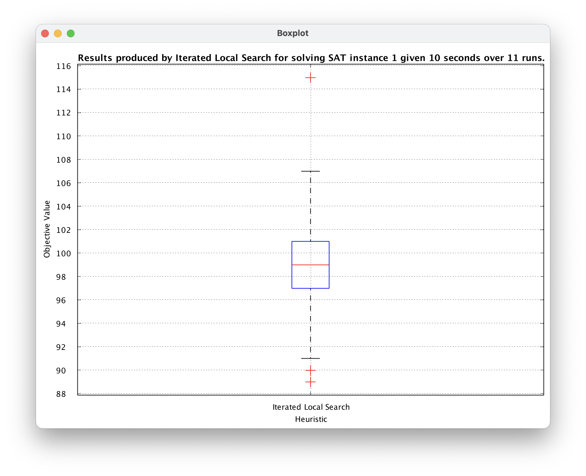
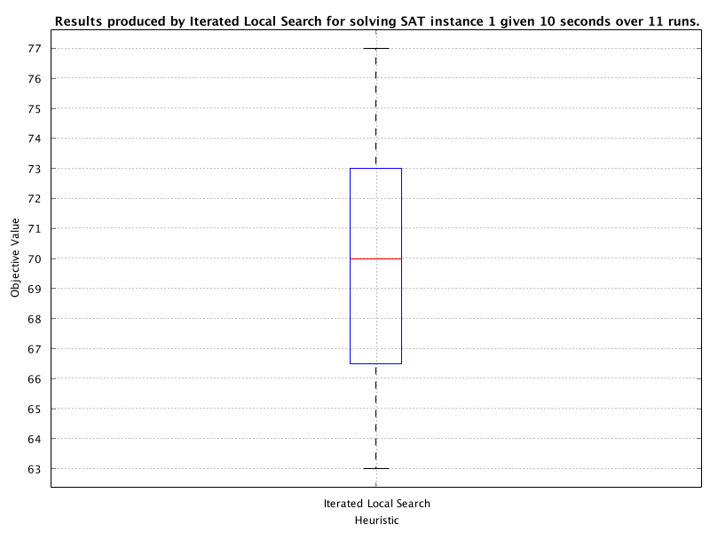
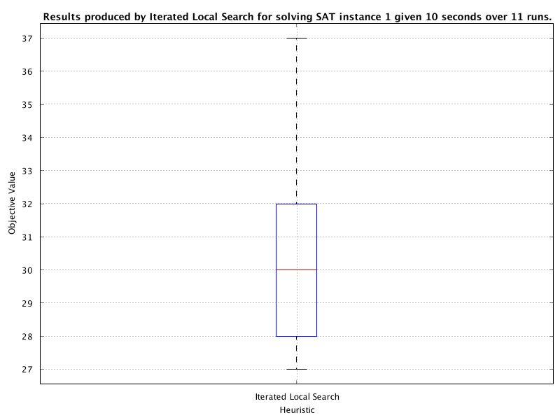
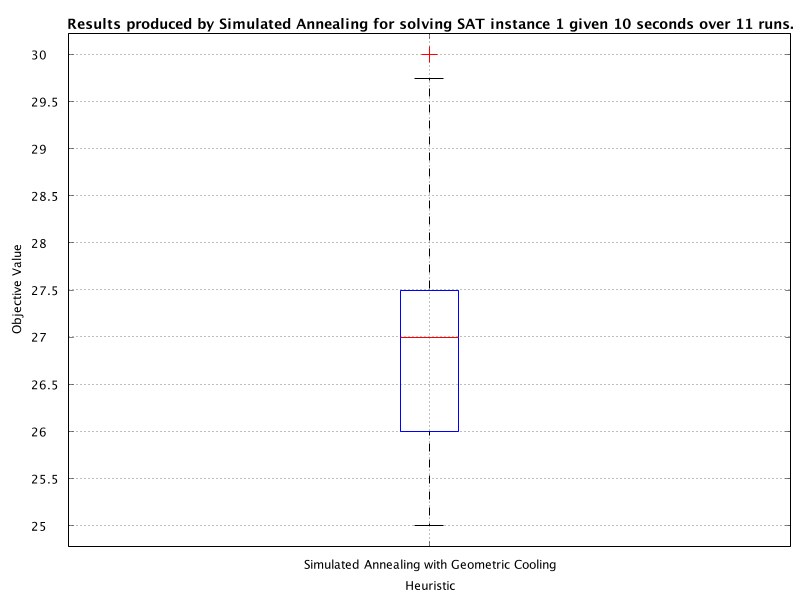
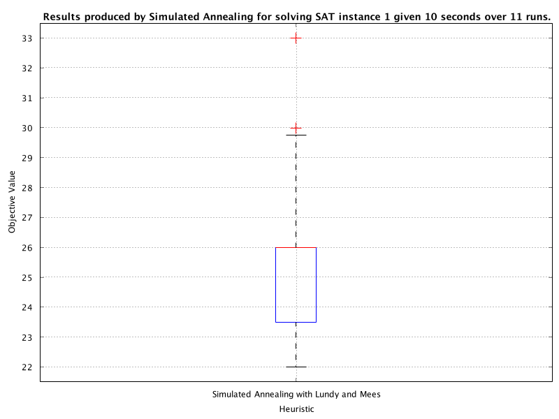
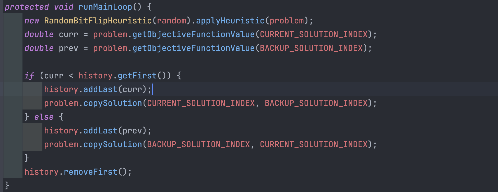

# lab02-Report

## Q1

In Java, deep copying of objects is expensive as we need to create a copy of all classes, member variables/fields, and construct a new Object to contain these. The COMP2001 framework performs a deep copy of a solution when using the `copySolution(int indexFrom, int indexTo)` API method. 

Q1a) How might we reduce the runtime of an algorithm that uses a bit flip neighbourhood operator? 

-   Do bit flip again

Q1b) How might we reduce the runtime of an algorithm that uses other neighbourhood operators where we cannot know exactly what modifications were made to the incumbent solution?

-   Exchange the value of BACKUP_SOLUTION_INDEX and CURRENT_SOLUTION_INDEX

## Q2

Perform some experimentation to find a parameter configuration for Iterated Local Search (ILS) that **outperforms** a default configuration of (depth_of_search = 0; intensity_of_mutation = 1). Report your configuration in the Moodle forum and discuss why you think your configuration performed better than the default. Alternatively, come to chat with us in the lab to check your understanding.

-   `dos = 0, iom = 1`

-   `dos = iom = 2`

## Q3

Update your implementation of DBHC from lab 1 to accept **non-worsening moves**. Perform some experimentation to find the **best configuration** for intensity of mutation and depth of search. Report your configuration in the Moodle forum and critically evaluate from the perspective of parameter tuning how you found the best parameter configuration. How might this scale with hundreds or thousands of configurations?

-   `iom = dos = 2`

## Q4

In the Moodle forums, or in the labs, discuss why you think accepting “non-worsening” or “improving or equal” cost moves for the acceptance of moves in ILS would result in better performance. You should think critically about how ILS operates and the search space when using each of the acceptance criteria.

-   Larger **search space** with non worsening moves

## Q5

Update the `Exercise2btestFrameConfig` to use the **geometric cooling schedule**. Find the best configuration for 𝛼 and report your results (boxplot and progress plot) into the Moodle discussion forum. How does your value of 𝛼 compare to that suggested in the lecture and how does Simulated Annealing appear to behave when looking at your progress plot?

-   𝛼 = 0.9, suggested in lecture `[0.9, 0.99]`

## Q6

Update the Exercise2btestFrameConfig to use the Lundy and Mees cooling schedule. Find the best configuration for 𝛽 and report your results (boxplot and progress plot) into the Moodle discussion forum. How does your value of 𝛽 compare to that suggested in the lecture and how does Simulated Annealing appear to behave when looking at your progress plot?

-   𝛽 = 0.0001, suggested in lecture `0.0001`

## Q7

Compare your best variant of Simulated Annealing to your results obtained when using Iterated Local Search from the previous lab. Why do you think algorithm A performed better than algorithm B? Do you think that the better performing algorithm is guaranteed to perform better for all MAX-SAT problem instances and why?

-   SA is better
-   **性能比较**：
    -   **适用性**：SA算法**在解空间较为复杂**、有很多局部最优解的问题上表现较好。而ILS则在那些通过局部变动就能有效寻找更优解的问题上表现更佳。
    -   **效率**：ILS通常在计算时间上更高效，因为它侧重于在局部最优解附近搜索，而SA可能在搜索过程中探索更多无效区域。
    -   **稳定性**：SA的性能可能更依赖于退火过程的参数设置（如初始温度、冷却速率等），而ILS的性能则更依赖于局部搜索策略和扰动机制。

## Q8

By default, the list length is set to `L = 1`. What move acceptance is LA equivalent to with this configuration?

-   L = 1 的 BACKUP_SOLUTION 和 list 的头部是重叠的
-   退化成了 Hill Climbing
-   在我写的lab例子当中，LA退化成了Random Mutation Hill Climbing

## Q9

Run a series of experiments on a MAX-SAT instance of your choice with at least **three different** list lengths. After each experiment you will want to save the results of each trial by copying the output from the console and saving them in an appropriately labelled dataset for analysis. After which, you should perform some statistical comparison and report your **best list length along** with any statistical measures that evidence your hypothesis.

-   没跑