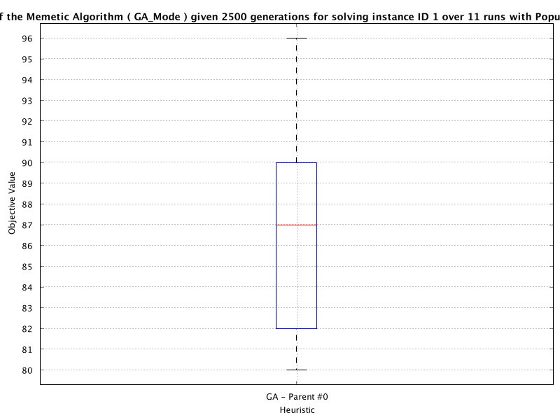
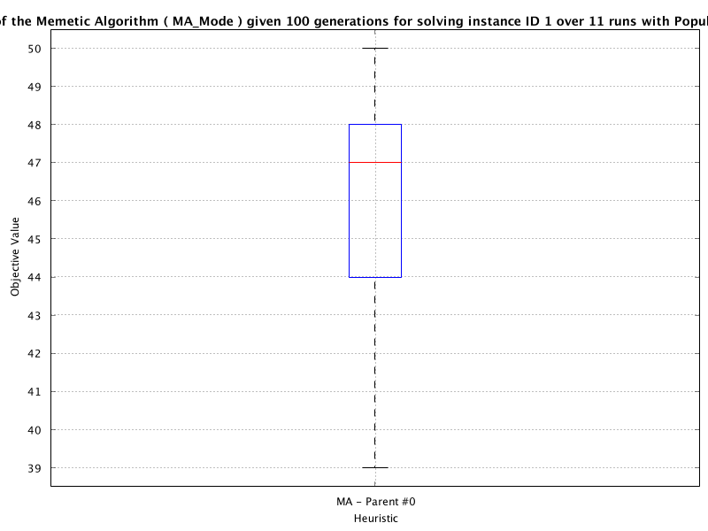
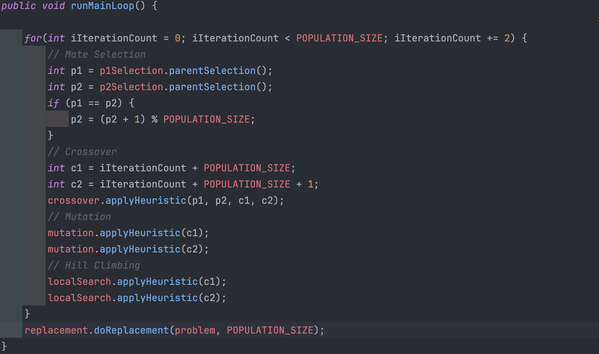

# lab03-Report

## Q1

A Memetic Algorithm is an extension of a Genetic Algorithm with the inclusion of a local search step; you should compare the performance of your implementation using GA mode and MA mode. Assuming that the number of iterations is equivalent in terms of nominal runtime, discuss on the Moodle forum why do you think the GA/MA performed better than the other?

## Q2

A Memetic Algorithm is an extension of a Genetic Algorithm with the inclusion of a local search step. You should experiment with **placing the local search operator at different points** within the memetic algorithm (applied once per offspring) and find the best placement for the local search step. Discuss on the Moodle forum why you think that the placement of the local search step that you found to be the best is where it is in the EA process.

-   我把local search放在Mutation后面，别的我没试过，钟阳说放这里最好

## Q3

Experiment with **increasing and decreasing the population size** from the default setting of 8 and the number of generations. What is the effect on the results? For example, try the following:

-   Set the population size = 4 and double the run time (set to GA(5000))
-   Set the population size = 16 and half the run time (set to GA(1250))

## Q4 

By default, the tournament size is set as a constant equal to 3. Can you find either a constant value for the tournament size or a variable tournament size that depends on the population size that outperforms the default configuration?

**最佳关系**：

-   当锦标赛规模相对较小（如2或3），与较大种群规模结合时，可以维持遗传多样性，同时保证算法有足够的压力选择好的个体，这有助于平衡探索（exploration）和利用（exploitation）。
-   当锦标赛规模增加时，选择压力增加，有助于快速收敛，但可能导致多样性过快丧失，从而陷入局部最优。因此，较大的锦标赛规模适合于较小的种群规模，或者在种群规模较大时，应谨慎使用以避免过早收敛。

因此，并没有一种固定的“最佳”关系，因为最佳设置取决于具体问题和优化目标。然而，作为一般性原则，建议选择一个中等大小的锦标赛规模（例如，总种群的**5%到10%**），这样可以在选择压力和遗传多样性之间取得良好的平衡。最终，通过实验调整和问题特性的考量来确定最佳配置是非常必要的。

## Q5 (Optional)

In the trans-generational replacement with elitism mechanism, the best solution replaces the worst in the offspring population iff the offspring does not contain the best solution from the union of the current and offspring populations. Can you implement a trans-generational replacement with k-best elitism mechanism that replaces the k-best solutions in the offspring population and does this outperform that from question 4?

Note you will need to create a new class and edit the Exercise3aRunner and Exercise3aTestFrameConfig classes to enable performing experiments with this alternative selection mechanism.

## Q6

What do the allele frequency values tell us over the different problem instances tested when using the simple inheritance method?

## Q7

Are the ratios of the allele frequency values as expected?

-   If yes, why?
-   If no, what in the test frame configuration could have caused the discrepancy? Update and re-run any experiments to test your theory is correct. Does updating this/these lead to an improvement in overall performance?

## Q8

Does the MMA using k-DBHC in place of DBHC perform better or worse (or neither conclusively) than the MMA from task 5? Why might this be the case?

-   Prompt 1: Which values of ‘k’ did you use?
-   Prompt 2: Which acceptance of bitflips did you use in k-DBHC and how does this compare to that in task 5?
-   Prompt 3: Will adding more (or using less) versions of ‘k’ for k-DBHC improve the performance further? Why/Why not?