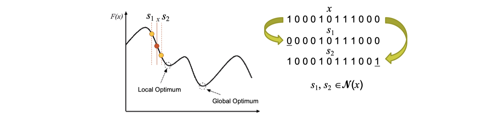
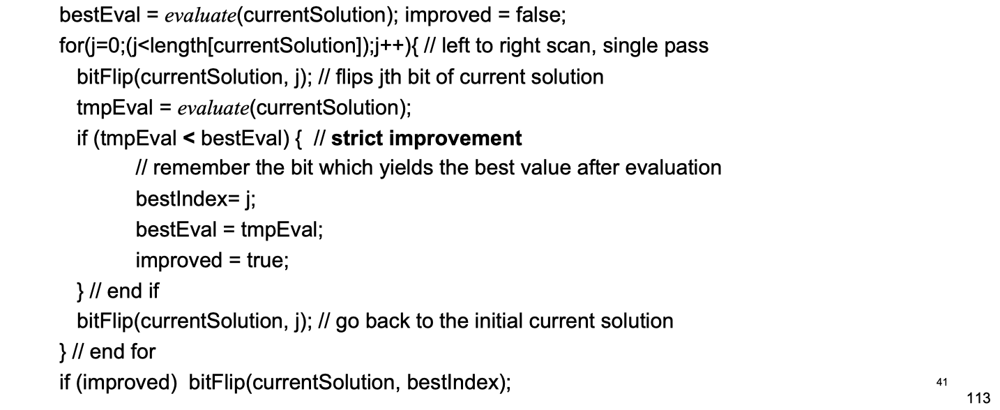
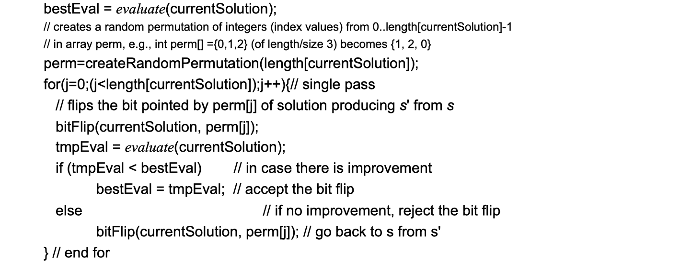
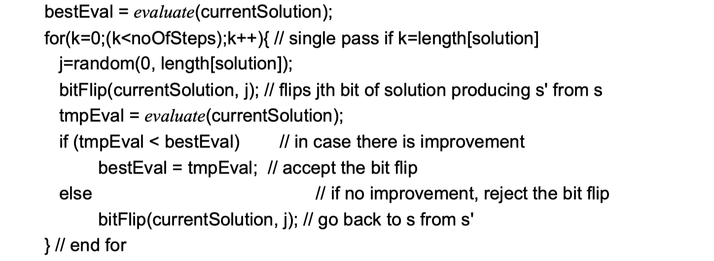

# lec02: Components of Heuristic Search Methods and Hill Climbing

[toc]

## 1. Main components of heuristic search/optimisation methods

**Main Components of Heuristic Search/Optimisation Methods**

-   Representation (encoding) of candidate solutions 
-   Neighbourhood relation (move operators) 
-   Evaluation function (objective function) 
-   Initialisation (e.g., random) 
-   Search process (guideline) 
-   Mechanism for escaping from local optima

### Representation (Encoding of a Solution)

**Characteristics**

-   **Completeness**
    -   All solutions associated with the problem must be represented
    -   每一种情况（解）都可以被表示出来
-   **Connexity**
    -   A search path must exist between any two solutions of the search space. **Any solution of the search space**, especially the global optimum solution, can be attained.
    -   两个解之间可以用通过搜索来达到，最优解可以被达到
    
-   **Efficiency**
    -   The representation must be easy/fast to manipulate by the search operators.

**Example**

-   **Binary encoding**
    -   e.g. **0/1 Knapsack problem**
    -   search space size is $2^N$​


-   **Permutation encoding**

    -   Travelling salesman problem
    -   Sequencing problems
    -   Search space size is $N!$

-   **Integer encoding 整数编码**

    -   Personnel rostering problem

    -   Timetabling problem

    -   For a general problem with M composite materials to form an N-layer composite structure, search space size is $M^N$

-   **Value encoding 值编码**

    -   Parameter/Continuous optimisation

    -   E.g.: **DNA sequencing** is the process of determining the precise order of nucleotides within a DNA molecule. (Adenine, Guanine, Cytosine, and Thymine)

        `ATGCTTCGGCAAGACTCAAAAAATA`

-   **Nonlinear encoding**
    
    -   **Tree encoding - Genetic programming**
    -   E.g.: Computers **generating heuristics** or heuristic components


### Boolean Satisfiability Problem

-   The first problem proven to be NP Complete

-   Given the formula: $\varphi = (\neg x_0 \or \neg x_1) \and (x_1 \or \neg x_2) \and (x_0) \and (x_2)$

-   **Boolean Satisfiability (SAT) Problem**

    -   Is there an assignment of `true` or `false` values to variables such that $\varphi$​ evaluates to true?

-   **MAX-SAT**: Given a Boolean formula in conjunctive normal form: a **conjunction** of clauses, where a clause is **a disjunction of literals** (e.g., x0 , x1 ,…, xn ),

    find the **maximum number** of clauses that can be satisfied by some truth assignment

## 2. Neighbourhoods

### Definitions

**A neighbourhood of a solution x** is **a set of solutions** that can be reached from x applying a (move) operator/heuristic



### Neighbourhood for Binary Representation

-   **Bit-flip operator**: flips a bit in a given solution
-   **Hamming Distance** between two bit strings (vectors) of equal length is the number of positions at which the corresponding **symbols differ**.
    -   E.g., `HD(011,010)=1, HD(0101,0010)=3`
    -   对不上的位数的数量
-   If the binary string is of **size** `n`, then the neighbourhood size is `n`.
-   **Example**: `1` 0 1 0 0 0 1 1 → `0` 0 1 0 0 0 1 1
    -   **Neighbourhood size: 8, Hamming distance: 1**

### Neighbourhood for Integer/Value Representation

-   Random neighbourhood/move/perturbation/ assignment

    **operator**: a discrete value is replaced by any other character of the alphabet.

-   If the solution is of size `n` and alphabet is of size `k`, then the neighbourhood size is `(k-1)n` 注意是 ==**k-1**==

-   Examples

    -   `5` 7 9 6 4 4 8 3 → `0` 7 9 6 4 4 8 3
    -   **Neighbourhood size**: `(10-1) * 8 = 72` (alphabet:0..9)
    -   `A`DJEIF → `M`DJEIF
    -   **Neighbourhood size**: `(26-1) * 6 = 150` (alphabet:A..Z)


### Neighbourhood for Permutation Representation

-   **Adjacent pairwise interchange**: swap **adjacent** entries in the permutation, If permutation is of size `n`
    -   **Neighbourhood size** is `n-1`
    -   Example: `5 1` 4 3 2 → `1 5` 4 3 2
-   **Insertion operator**: take an entry in the permutation and insert it in another position
    -   **Neighbourhood size**: `n(n-1)`
    -   Example: `5` 1 4 3 2 → 1 4 `5` 3 2

-   **Exchange operator**: arbitrarily selected two entries are swapped
    -   **Neighbourhood size**: `n(n-1)`
    -   Example: `5` 4 3 `1` 2 → `1` 4 3 `5` 2
-   **Inversion operator**: select two arbitrary entries and **invert the sequence in between them**
    -   **Neighbourhood size**: `n(n-1)`
    -   Example: 1 `4 5 3` 2 → 1 `3 5 4` 2

## 3. Evaluation/Objective Function

### Evaluation Function

-   Also referred to as **objective**, **cost**, **fitness**, penalty, etc.
    -   Indicates **the quality of a given solution**, distinguishing between better and worse solutions
-   Serves as a major link between the algorithm and the problem being solved
    -   provides an important feedback for the search process
-   Many types: (non)separable, uni/multi-modal, single/multiobjective, etc.
-   Evaluation functions could be computationally expensive
-   **Exact vs. approximate**
    -   Common approaches to constructing **approximate/surrogate models**: polynomials, regression, SVMs, etc.
    -   Constructing a globally valid approximate model remains difficult, and so beneficial to selectively use the original evaluation function together with the approximate model

### MAX-SAT Problem - Evaluation function

-   **Maximising**: count the number of **satisfied clauses**
-   **Minimising**: count the number of **unsatisfied clauses**

### TSP -Evaluation function

-   TSP requires a search for permutation
-   Use a cost matrix $C = [c_{ij}]$, where $c_{ij}$ denotes the cost of the travel from city $i$ to $j$, that minimizes the **path length**

$$
f(\pi, C) = \sum^{N-1}_{i=0} c_{\pi(i), \pi((i+1)\mod N)}
$$

-   where $\pi(i)$ denotes the city at i-th location in the tour and

$$
c_{ij} = \sqrt{(x_i - x_j)^2 + (y_i - y_j)^2}
$$

-   The same as

$$
f(P) = \sum^{n-1}_{i=1}d(p_{i}, p_{i+1}) + d(p_{n}, p_1)
$$

### Delta (Incremental) Evaluation

-   **Key idea**: calculate effects of **differences** between current search position `s` and a neighbour `s'` **on the evaluation function value**.
-   Evaluation function values often consist of independent contributions of solution components; hence, $f(s')$ can be efficiently calculated from $f(s)$ by differences between `s` and `s'` in terms of solution components.
-   Crucial for **efficient implementation** of heuristics/metaheuristics/ hyper-heuristics

$$
f(s') = \sum + \bigtriangleup
$$


> **Example: TSP**
>
> 在TSP中，如果考虑交换两个城市在路径中的位置作为解的一个微小变化，使用全局评估需要重新计算整个路径的总距离。而使用增量评估，则只需考虑与这两个城市直接相关的路段如何改变。具体来说：
>
> -   假设有城市序列...-A-B-C-D-E-...，现在交换城市B和D的位置，得到...-A-D-C-B-E-...
> -   使用增量评估，我们只需重新计算与B和D直接相关的路径段的距离，即A到D，D到C，C到B，以及B到E的距离，而其他城市间的距离保持不变。
> -   **这种方法只涉及少数几次距离计算，而不是整个路径的重新计算。**

## 4. Hill Climbing Algorithms

### Search Paradigms - Perturbative Heuristics/Operators

-   **Mutational (diversification/exploration)**
    -   generates a solution which is not guaranteed to be better than the input


-   **Hill-climbing (intensification/exploitation)**
    -   generates a better or equal quality solution


### Hill Climbing Algorithm - Minimisation/Maximisation Problem

-   A **local search algorithm** which constantly **moves** in the direction of **decreasing/increasing** level/objective value for a minimisation/maximisation problem to find the **best/optimal solution** to the problem.
-   The hill climbing algorithm **halts when it detects a peak value** where no neighbour has a **lower/higher value** while solving a **minimisation/maximisation** problem.

**Pseudocode**


**More info**

-   Initial starting point
    -   chosen randomly
    -   use a constructive heuristic
    -   according to some regular pattern

### Simple Hill Climbing Heuristics

-   Simple Hill Climbing examining neighbours
    -   Best improvement (steepest descent/ascent) (**SDHC**)
    -   First improvement (next descent/ascent) (**NDHC**)

-   Stochastic Hill Climbing (**randomly** choose neighbours)
    -   Random selection/random mutation hill climbing (RMHC)
-   Random-restart (shotgun) hill climbing is built on top of hill climbing and operates by changing the starting solution for the hill climbing, randomly and returning the best

**Best Improvement or Steepest Descent Hill-Climbing (SDHC)** 

-   把neighbour都试一遍，找到最好的最好的**neighbour**
-   每一步走的很稳



**First Improvement or Next Descent Hill Climbing** 

-   每一个neighbour遍历过去，找到好的就拿，在此基础上再走下一步


**Davis's Bit Hill-Climbing**

-   在 **First Improvement** 的基础上增加了 random permutation



**Random Mutation Hill-Climbing**

-   在 **First Improvement** 的基础上，原本是按照顺序**bitFlip**，现在是随机**bitFlip**



**Improving vs. Non-worsening**

```java
while (termination criteria not satisfied) {
	...
	for() { // single pass
        ...
		if (tmpEval <= bestEval) {	// accept non-worsening moves
			...
        }
    }
} 
```

### Evaluation for Hill Climbing

**When to stop**

-   If the **target objective** is known, then the search can be stopped when that target objective value is achieved.
-   Hill climbing could be applied repeatedly until **a termination criterion is satisfied** 
    -   Note that there is no point applying Best Improvement, Next Improvement and DBHC if there is **no improvement** after any single pass over a solution.
    -   Random Mutation Hill Climbing requires **consideration**.

**Hill Climbing vs. Random Walk**

-   **A Hill-climbing** method **exploits** the best available solution for possible improvement but neglect exploring a large portion of the search space
-   **Random walk** (performs search in the search space, sampling new points with equal probability, e.g., random bit flip, random swap) **explores** the search space thoroughly but misses exploiting promising regions.


**Strengths of Hill Climbing**

-   Very easy to implement, requiring:
    -   a representation
    -   an evaluation function 
    -   a measure that defines the neighbourhood around a point in the search space

**Weakness of Hill Climbing**

-   **Local Optimum**: If all neighboring states are worse or the same. The algorithm will halt even though the solution may be far from satisfactory.
-   **Plateau** (neutral space/shoulder): All neighboring states are the same as the current state. In other words the evaluation function is essentially flat. **The search will conduct a random walk**.
    -   在高原区域内，随机地走面

-   **Ridge/valley**: The search may oscillate from side to side, making little progress. In each case, **the algorithm reaches a point at which no progress is being made**. If this happens, an obvious thing to do is **start again** from a different starting point.
    -   在河谷地区，随机地走线

-   As result
    -   HC may not find the optimal solution and may **get stuck at a local optimum**
    -   No information as to how much the discovered local optimum **deviates** from the global (or even other local optima) 
    -   Usually **no upper bound** on computation time 
    -   Success/failure of each iteration depends on **starting point**
    -   Success defined as returning a local or a global optimum

### Home Exercise

>   Assume that there are N examinations to timetable within M weeks (5 working/exam day per week), and 3 exam sessions per day. You are provided with a list of students and the exams that each one of them takes. The goal is to schedule all exams in such a way that there are no clashes for the students.
>
>   -   What representation would you use for the solution algorithm? 
>   -   How would you design your objective function?
>   -   Is it possible to design delta evaluation?

-   There are 15 sessions in total. We could use an array of integer of length N, each element range from 1 to 15, representing each time period
-   Number of conflicts. If a student had two exams in the same period, f += 1
-   Yes
