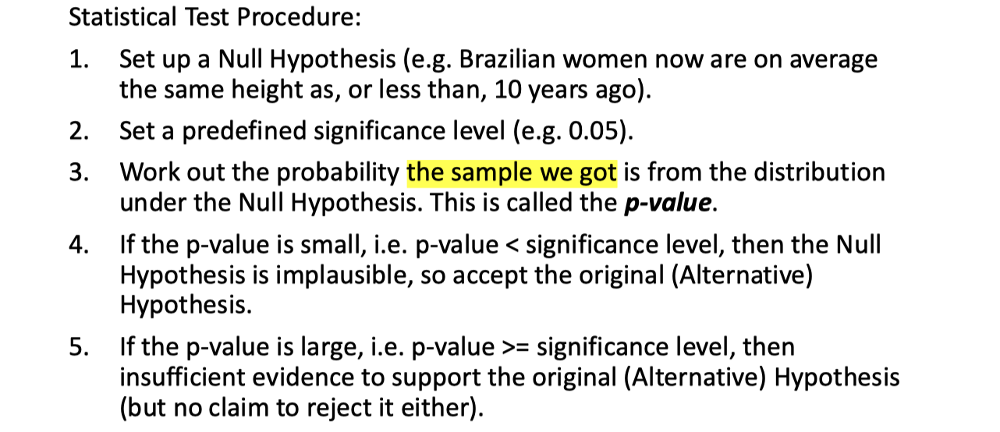
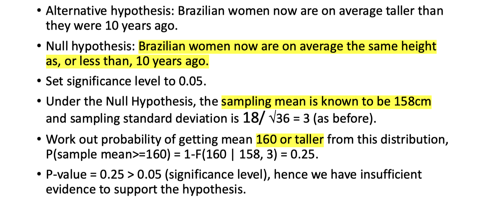
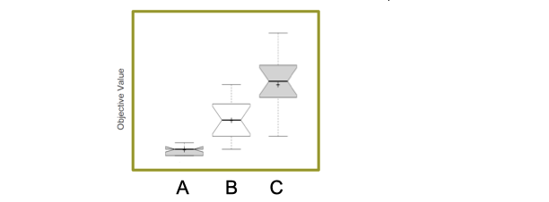
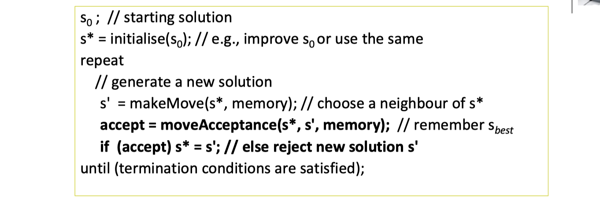
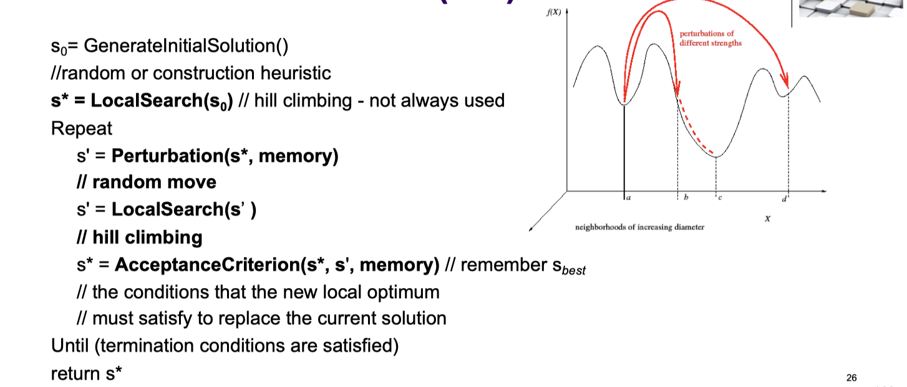
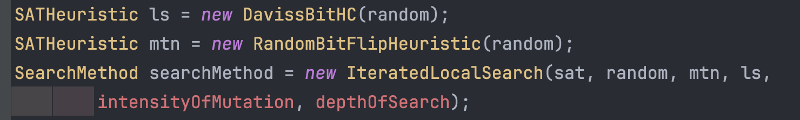

# lec03: Metaheuristics

[toc]

## 1. Performance Comparison of Stochastic Search Algorithms

### Which Stochastic Search Algorithm Performs Better for Solving Problem X?

-   Algorithm A is new, B & C are previous approaches applied to the instance Inst1 of the **minimising** problem X 
-   Assume all algorithms are run for the same number of objective function evaluations, and experiments are fair 
-   Each algorithm is run for 30 times,
    -   **avg**: mean objective value computed by an averaging the objective values
    -   **std**: standard deviation associated with avg
    -   **med**.: median objective value
    -   **min**.: objective value of the best solution found in all trials/runs

### Statistical test, null hypothesis and p-values

>   **Statistical Hypothesis Test from MCS**
>
>   
>
>   

-   The null hypothesis states the results are due to chance and are not significant in terms of supporting the idea being investigated.
-   A **p-value**, or probability value, is a number describing how likely it is that your data would have occurred by random chance (i.e. that the null hypothesis is true).

-   Apply non-parametric statistical test
    -   Given two algorithms; X versus Y, > (<) denotes that X (Y) is better than Y (X) and this performance difference is statistically significant within a confidence interval of 95% and X ≥ Y (X ≤ Y) indicates that X (Y) performs better on average than Y (X) but no statistical significance

### Boxplots 箱型图

### Notched Boxplots 缺口箱型图

-   The notched boxplot allows you to evaluate confidence intervals (by **default 95% confidence interval**) for the medians of each boxplot.
-   Since **the notches in the boxplots A vs B, A vs C and B vs C do not overlap**, you can conclude that with 95% confidence, that the true medians do differ between each pair of those algorithms on Inst1: **A performs significantly better than B as well as C, and B performs significantly better than C.**

>   https://blog.csdn.net/markwy/article/details/126082275

-   Algorithms are run on multiple instances from Problem X – now even a stronger conclusions can be made, e.g.,:
    -   Algorithm A performs the best on (this benchmark/dataset) all problem X instances based on the mean/median objective values achieved over 30 trials.
    -   Algorithm C is the worst performing approach based on all metrics.
    -   Algorithm B provides the same best solution for 3 instances as Algorithm A.

## 2. Metaheuristics 元启发式

### What is a Metaheuristic

A **metaheuristic** is a high-level problem independent algorithmic framework that provides a set of guidelines or strategies to develop heuristic optimization algorithms

>   **和启发式的区别**
>
>   | 启发式                       | 元启发式                                                     |
>   | ---------------------------- | ------------------------------------------------------------ |
>   | 基于经验或直觉而非严格的规则 | 不依赖于问题的具体领域知识，因此它们更加通用                 |
>   | 不保证最优解                 | 尝试探索解空间，避免陷入局部最优，寻找全局最优或可接受的近似解 |
>| 启发式搜索常用于AI领域       | 通过引入随机性和多样性的机制来避免局部最优解，提高搜索效率   |

### Main Components of a Metaheuristic Search

-   Representation of candidate solutions 
-   Evaluation function 
-   Initialisation: initial candidate solution may be chosen
    -   randomly
    -   using a constructive heuristic 
    -   according to some regular pattern 
    -   based on other information (e.g. results of a prior search), and more 
-   Neighbourhood relation (move operators)
-   Search process (guideline) 
-   Stopping conditions 
-   Mechanism for escaping from local optima

### Mechanism for escaping from local optima

-   Iterate with different solutions, or restart (**re-initialise** search whenever a local optimum is encountered).
    -   Initialisation could be costly
    -   E.g., Iterated Local Search 局部迭代搜索, GRASP 贪婪随机自适应搜索过程
-   Change the **search landscape**
    -   Change the **objective function** (E.g., Guided Local Search 引导局部搜索) 
    -   Use (mix) **different neighbourhoods** (E.g., Variable Neighbourhood Search 变邻域搜索, Hyper-heuristics 超启发式)
-   Use Memory (e.g., tabu search 禁忌搜索) 
    -   通过记住搜索过程中的一些状态，防止算法返回到之前访问过的解

-   **Accept non-improving moves**: allow search using candidate solutions with **equal or worse** evaluation function value than the one in hand
    -   Could lead to **long walks on plateaus** (neutral regions) during the search process, potentially causing cycles – **visiting of the same states**
-   **None** of the mechanisms is **guaranteed to always escape** effectively from local optima

### Termination Criteria - Examples

-   Stop if

    -   a **fixed maximum number of iterations**, or moves, objective function evaluations), or a fixed amount of CPU time is exceeded.

    -   **consecutive number of iterations since the last improvement** in the best objective function value is larger than a specified number.

    -   evidence can be given than **an optimum solution has been obtained.**

        (i.e. optimum objective value is known)

    -   **no feasible solution** can be obtained for a fixed number of steps/time. (a solution is feasible if it satisfies all constraints in an optimisation problem)

### Feasibility Example

**How to deal with infeasible solutions**

-   Use a problem domain specific **repair operator**
    -   randomly flip a bit until the solution is feasible
-   Penalise each constraint violation for the infeasible solutions such that **they can’t be better than the worst feasible solution** for a given instance
    -   set a fixed penalty value poorer than the worst
    -   Distinguish the level of infeasibility of a solution with the penalty

>   **方法是给这些解一个固定的惩罚值（死亡惩罚），确保它们的目标函数值永远不会比任何一个可行解好。这样可以保证算法总是倾向于选择可行解**
>
>   **固定（死亡）惩罚值**：为不可行解设置一个固定的惩罚值
>
>   -   对于解 `1 1 0 1 0`，重量为18公斤，其惩罚值为$0.5。
>   -   对于解 `1 0 0 1 0`，重量为16公斤，其惩罚值同样为$0.5。
>
>   **区分不可行解的不可行程度**：通过惩罚值来区分解的不可行程度，惩罚值与解超出容量的程度成比例。
>
>   -   对于解 `1 1 0 1 0`，重量为18公斤，其惩罚值调整为$0.167，显示出由于重量超出容量，惩罚值减少了。
>   -   对于解 `1 0 0 1 0`，重量为16公斤，由于其不可行程度不同，惩罚值保持为$0.5。

## 3. Local Search Metaheuristics and Iterated Local Search

### Local Search Metaheuristics

**Stochastic Local Search - Single Point Based Iterative Search**

-   **Move Acceptance** decides **whether to accept or reject** the new solution considering its evaluation/quality, `f(s')`
-   **Accepting non-improving moves** could be used as a mechanism to escape from local optimum

**The Art of Searching**

-   Effective search techniques provide a mechanism to balance **exploration and exploitation**
    -   **Exploration** aims to **prevent stagnation** of search process getting trapped at a local optimum 
    -   **Exploitation** aims to **greedily increase solution quality** or probability, e.g., by exploiting the evaluation function 
-   Aim is to design search algorithms/metaheuristics that can 
    -   **escape local optima**
    -   **balance exploration and exploitation** 
    -   **make the search independent from the initial configuration**

### Iterated Local Search (ILS)

-   Based on visiting a sequence of locally optimal solutions by
    -   **perturbing** the current local opotimum (**exploration**)
    -   applying local search/hill climbing (**exploitation**) after starting from the modified solution
-   A perturbation phase might consist of one or more steps
-   The perturbation **strength is crucial**
    -   Too small: may generate cycles
    -   Too big: good properties of the local optima are lost 步子迈大了
-   Acceptance criteria
    -   Extreme in terms of **exploration**: accept any solution
    -   Extreme in terms of **exploitation**: accept only improving solutions
    -   Other: **deterministic** (like threshold), **probailisitc** (like simulated annealing)
-   Memory
    -   Very simple use: restart search if for a number of iterations no improved solution is found

>   **Java Code from [lab](../Lab/)**
>
>   -   if `IOM = 0`, then **ILS** becomes a **Local Search Heuristic 局部搜索启发式** 
>       -   当前解的邻域中创建一个或多个变异，以此来跳出局部最优
>   -   if `DOS = 0`, then **ILS** becomes a **Mutation Heuristic 突变启发式** 
>       -   这部分接着对突变后的解应用局部搜索，试图在新的区域找到局部最优解。
>
>   
>
>   
>
>   

### Example 1a: Design an ILS algorithm for MAX-SAT

-   `GenerateInitialSolution`: Random
-   `Perturbation`: A number of random bit flips (random walk)
-   `LocalSearch`: Use 1-bit-flip neighbourhood, **Steepest Descent HIll Climbing (SDHC)**
-   `AcceptanceCriterion`: accept improving and equal moves (non-worsening): 
    -   accept `s'` if and only if `f(s') ≤ f(s*)`

### Example 1b: Design another ILS alg. for MAX-SAT

-   `GenerateInitialSolution`: Random
-   `Perturbation`: **intensityOfMutation** times random bit flips
-   `LocalSearch`: Davis's Bit Hill Climbing for **depthOfSearch**
-   `AcceptanceCriterion`: accept improving and equal moves (non-worsening): 
    -   accept `s'` if and only if `f(s') ≤ f(s*)`

### Example 2: Design an ILS alg for TSP

-   `GenerateInitialSolution`: Nearest-neighbour
-   `Perturbation`: a number of exchange moves
    -   E.g.:1 2 3 4 5 6 → 1 4 3 2 5 6, then 6 4 3 2 5 1
-   `LocalSearch`: **first improvement using insertion neighbourhood moves**
-   `AcceptanceCriterion`: accept improving and equal moves (non-worsening): 
    -   accept `s'` if and only if `f(s') ≤ f(s*)`

### ILS: Some Guidelines

-   **Initial solution** should be to a large extent **irrelevant** for longer runs.
-   The interactions among **perturbation strength** and **acceptance criterion** can be particularly important
    -   it determines the relative balance of **exploration and exploitation**
    -   large perturbations are only useful **if they can be accepted.**
-   Advanced acceptance criteria may take into account **search history**
    -   e.g., by occasionally reverting to **incumbent solution**.
-   Advanced ILS algorithms may change nature and/or strength of perturbation 
    -   (e.g., number of bit flips) adaptively during search
-   Local search should be as effective and as fast as possible. Better local search generally leads to better ILS performance
-   Choose a perturbation operator whose **steps cannot be easily undone** by the local search

## 4. Tabu Search 禁忌搜索

### Overview

-   Uses **history** (memory structures) to **escape from local minima**
-   Applies hill climbing/local search
    -   Some solution elements/moves are regarded as **tabu (forbidden)** 
    -   Proceeds according to the assumption that there is no point in accepting a new (poor) solution unless it is to avoid a path already investigated

**Algorithm**

**3 main components**

-   **Forbidding strategy**: control what **enters** the tabu list
-   **Freeing strategy**: control what **exits** the tabu list and when
-   **Short-term strategy**: manage interplay between the forbidding strategy and freeing strategy to select trial solutions

### Tabu Search - Fundamentals

-   A stochastic local search algorithm which **heavily relies on** the use of an **explicit memory** of the search process
    -   **systematic use of memory** to guide search process 
    -   memory typically contains only specific attributes of **previously seen solutions** 
    -   **simple** tabu search strategies exploit only **short term** memory 
    -   **more complex** tabu search strategies exploit **long term** memory
-   In each step, move to **‘non-tabu’ best** neighbouring solution (admissible neighbours) although it may be worse than current one 
-   To avoid cycles, tabu search tries to **avoid revisiting previously seen solutions**
-   Avoid storing complete solutions by basing the memory on attributes of recently seen **solutions**
-   Tabu solution attributes are often defined via local search moves 
-   **Tabu-list** contains moves which have been made in the recent past
    -   tabu list length or tabu tenure
-   Solutions **which contain tabu attributes** are forbidden for a certain number of iterations.
-   Often, an additional **aspiration criterion** is used: 
    -   this specifies conditions under which tabu status may be overridden (e.g., if considered step leads to improvement in incumbent solution).

### Design a Tabu Search Algorithm for MAX-SAT

-   **Initialisation**: random – select an assignment randomly from set of all truth assignments 
-   **Neighbourhood**: 1-bit flip neighbourhood 
-   **Memory**: Associate tabu status (Boolean value) with each variable in given CNF.
    -   variables are tabu iff they have been changed in the last T steps

**Example 1**

**Example 2**

**Practical Considerations**

-   **Tabu tenure**: the length of time/number of steps `t` for which a move is forbidden
    -   `t` too low: risk of cycling
    -   `t` too high: restrict the search too much
    -   number of tabu moves: 5 - 9 or 7

$$
t = \sqrt{n}
$$

-   If a tabu move is smaller than the **aspiration level** then we accept the move (use of aspiration criteria to override tabu status)

## 5. Introduction to Scheduling

**Scheduling**

-   Scheduling deals with the allocation of resources to tasks over given time periods and its goal is to **optimize one or more objectives**. The resources and tasks in an organization can take many different forms.
-   It is a decision-making process that is used on a regular basis in many manufacturing and services industries. Many real-world applications including
    -   Project planning 
    -   Semiconductor manufacturing 
    -   Gate assignment at airports 
    -   Scheduling tasks in CPUs/parallel computers, …

**Framework and Notation**

-   jobs j =1,…,n machines i=1,…,m
    -   `(i, j)` processing step, or operation of job `j` on machine `i`

**Classification of Scheduling Problems Notation**

-   Scheduling problem $\alpha \  | \  \beta \ | \ \gamma$
    -   $\alpha$: machine characteristics
    -   $\beta$: processing/job characteristics
    -   $\gamma$: optimality criteria

### Sample Machine Characteristics ($\alpha$)

-   `1`: Single Machine
-   `Pm`: Identical machine in parallel
    -   `m` machins in parallel
    -   Job `j` requires a single operation and may be processed on any of the `m` machines
-   `Qm`: **Machines in parallel with different speeds**
-   `Rm`: **Unrelated machines** in parallel machines have different speeds for different jobs

### Sample Job Characteristics ($\beta$)

-   The processing time may be different, or equal for all jobs, or even of unit length. 
    -   All processing times are assumed to be integers.
-   **Processing time** $p_{ij}$
    -   **processing time** of job `j` on machine `i` (if a **single machine** then $p_j$ )
-   **Due date** $d_j$ 
    -   committed shipping or completion (due) date of job `j` 
-   **Weight** $w_j$ 
    -   **importance** of job j relative to the other jobs in the system
-   **Release date** $r_j$ 
    -   earliest time at which job j can start its processing 
-   **Precedence** `prec` 
    -   Precedence relations might be given for the jobs. If k precedes l, then starting time of l should be not earlier than completion time of k.
-   **Sequence dependent setup times** $s_{jk}$ 
    -   setup time between jobs `j` and `k` 
-   **Breakdowns** `brkdwn` 
    -   machines are not continuously available

### Sample Optimality Criteria ($\gamma$)

### Scheduling Notation

### A Single Machine Scheduling Problem

$$
1 | d_j | \Sigma w_j T_j
$$

-   Given n jobs to be processed by a single machine
-   each job (j) with a due date (dj ) (i.e. hard deadline), processing time (pj ), and a weight (wj) (i.e., job with the highest weight, say more important and so needs to finish on time), 
-   find the **optimal sequencing** of jobs producing the **minimal weighted tardiness** (Tj ).
-   Tardiness is 0 if a job completes on time (**Cj ≤ dj** ), otherwise it is the time spent after the due date to completion (C j - d j )

**Computing Weighted Tardiness**

