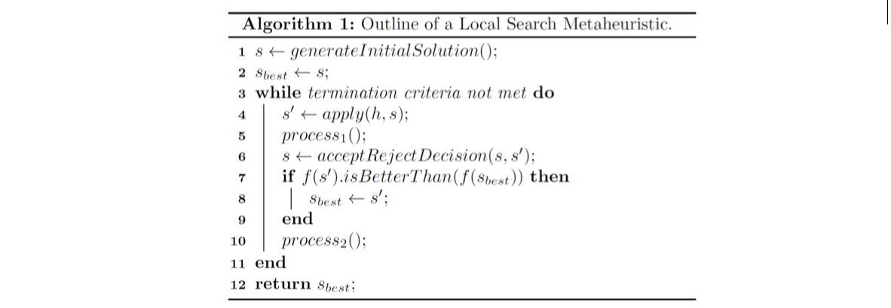
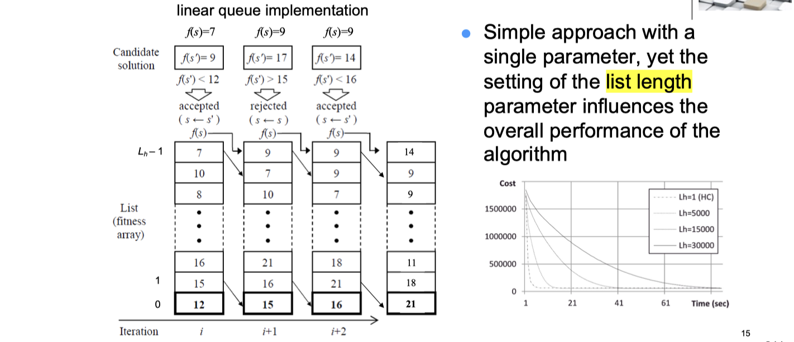
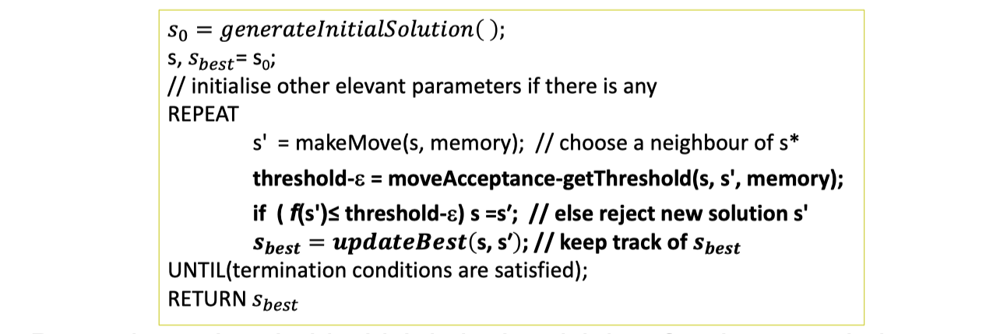
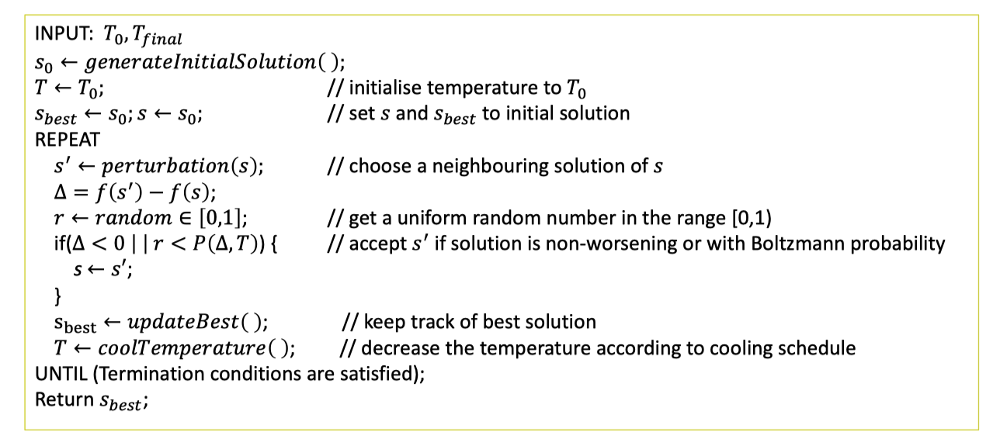
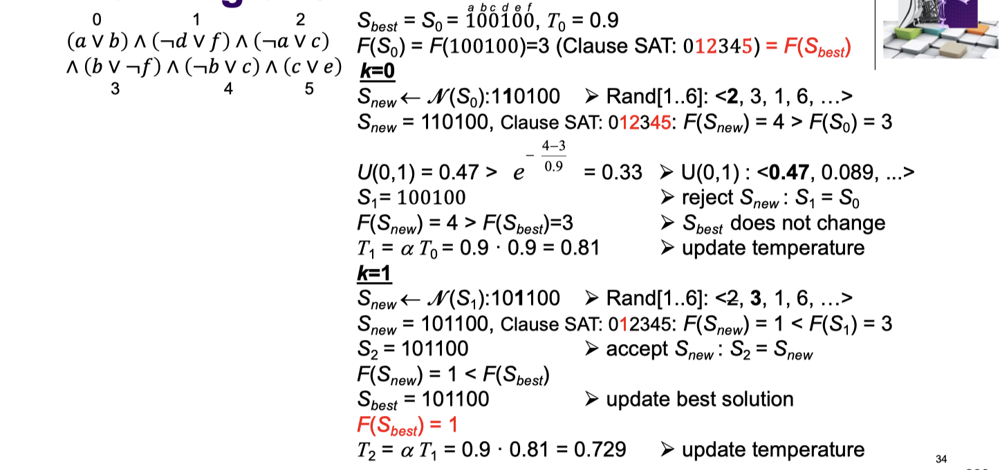
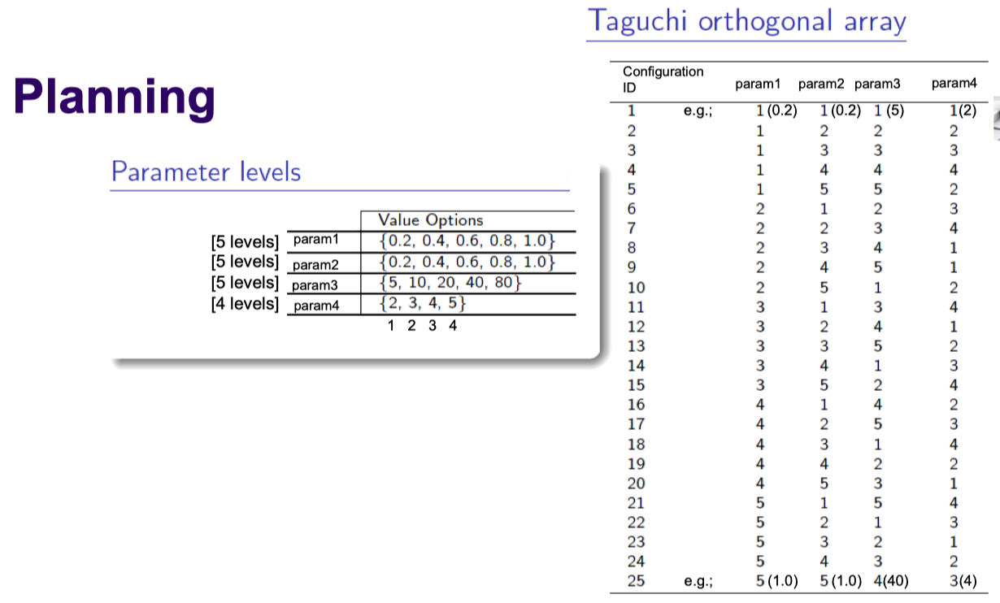

# lec04: Move Acceptance in Local Search Metaheuristics and Parameter Setting Issues

[toc]

## 1. Local Search Metaheuristics and Move Acceptance Methods

**Stochastic Local Search Single Point Based Iterative Search (Local Search Metaheuristics) - revisited**

-   Move Acceptance decides **whether to accept or reject** the new solution considering its evaluation/quality, $f(s')$
-   Accepting non-improving moves could be used as a mechanism to escape from local optimum

**Move Acceptance Methods Taxonomy**

**Parameter Setting Mechanisms in Move Acceptance**

-   **Static**, either there is no parameter to set or parameters are **set to a fixed value**. 
    -   E.g., IoM = 5; **intensity of mutation (IOM)**

-   **Dynamic**, parameter values **vary with respect to time/iteration count**. Given the same candidate and current solutions at the same current elapsed time or iteration count, the acceptance threshold or acceptance probability would be the same **irrespective of search history**.
    -   E.g., IoM = round( 1+ (iter current / itermax ) * 4);
-   **Adaptive**, Given the same candidate and current solutions at the same current elapsed time or iteration count, the acceptance threshold or acceptance probability is not guaranteed to be the same as one or more components depend on search history. 
    -   E.g., if for 100 steps best solution found in the stage cannot be improved, then IoM++, and after any improvement, reset IoM=1;

### Non-stochastic Basic Move Acceptance

-   Reuse the objective values of previously encountered solutions for the accept/reject decisions
-   **Static**
    -   All Moves: returns true regardless of `f(s')`
    -   Improving Moves Only: `f(s') < f(s)`
    -   Improving and Equal: `f(s') ≤ f(s)`
-   **Dynamic**: None 
-   **Adaptive**
    -   **Late Acceptance**: compares the quality of the solution with that of the solution accepted/visited L iterations previously $s_{t-L}$ , and accepts the move iff $f(s') \le f(s_{t-L})$

**Late Acceptance Algorithm**

-   **Initilisation**: Assign all elements of the list to **be equal to the initial cost** (objective value)
-   **List for the history of the objective values** of the recent solutions is implemented as a circular queue
-   Simple approach with **a single parameter**, yet the setting of the list length parameter influences the overall performance of the algorithm

**Pseudo Algorithm**

### Non-stochastic Threshold Move Acceptance

**Pseudocode**

-   **Static**
    -   Accept a worsening solution if the worsening of the objective value is no worse than a fixed value
-   **Dynamic**
    -   **Great Deluge** 大洪水
    -   Flex Deluge
-   **Adaptive**
    -   Record to record travel (RRT) 
    -   **Extended Great Deluge** 扩展大洪水
    -   Modified Great Deluge

**Great Deluge - minimisation**

>   **大洪水算法**
>
>   这种算法通过设定一个随时间**逐渐提升的“水位”阈值**来控制解的接受标准，模拟大洪水逐渐淹没较低地势的过程。
>
>   **原理**
>
>   1.  **初始设置**：在搜索开始时，设置初始水位（阈值）。这个初始水位通常基于问题的目标函数值设定，可能是当前解的目标函数值或一个近似的最优值。
>   2.  **水位上升**：随着算法的迭代进行，水位按照预定的规则逐渐上升。这个上升的速度可以是固定的，也可以根据搜索过程的动态调整。
>   3.  **生成新解**：从当前解出发，通过某种启发式操作生成新的候选解。
>   4.  **接受决策**：
>       -   如果新解的目标函数值高于（对于最大化问题）或低于（对于最小化问题）当前水位，新解被接受，成为当前解。
>       -   如果新解的目标函数值低于（对于最大化问题）或高于（对于最小化问题）当前水位，新解被拒绝，搜索继续从当前解出发。
>
>   **特点**
>
>   -   **避免局部最优**：通过允许在一定程度上接受恶化的移动（只要它们的目标函数值高于水位），大洪水算法可以帮助搜索逃离局部最优解。
>   -   **参数调整**：算法的效果高度依赖于水位上升的速度和策略。**过快的上升可能导致搜索过早地聚焦于局部区域，而过慢的上升则可能使搜索效率降低。**
>   -   **灵活性**：大洪水算法的实现可以根据具体问题和需求调整，提供了一定的灵活性来平衡搜索的全局探索和局部开发。

**Extended Great Deluge - minimisation**

### Stochastic Move Acceptance

-   **Static**
    -   E.g., Naive Acceptance: P is fixed, e.g. if improving P=1.0, else P=0.5
-   **Dynamic**
    -   E.g., **Simulated Annealing**
    -   **P changes in time** with respect to the difference in the quality of current and previous solutions (see the next slides). 
    -   Temperature parameter is changes dynamically.
-   **Adaptive**
    -   E.g., **Simulated Annealing with reheating**: 
    -   P is modified via increasing temperature time to time causing partial restart – increasing the probability of acceptance of non-improving solutions

### Simulated Annealing 模拟退火

-   A **stochastic local search algorithm**
-   Easy to implement 
-   Achieves good performance given sufficient running time 
-   Requires a **good parameter setting** for improved performance 
-   Has interesting theoretical properties (convergence), but these are of very limited practical relevance

**Pseudocode**

**Accepting Moves using SA**

-   Improving moves are accepted 
-   Worsening moves are accepted using the **Metropolis criterion** at a given temperature T
-   **Boltzman probability**: $P(\triangle, T) = e^{-\triangle / T}$

**Cooling/Annealing**

-   Temperature T is **slowly decreased**
    -   T is initially high - many inferior moves are accepted
    -   T is decreasing - inferior moves are nearly always rejected
-   As the temperature T decreases, the probability of accepting worsening moves decreases.

### Cooling Schedule

**Schedules**

-   Starting Temperature 
-   Final Temperature 
-   Temperature Decrement 
-   Iterations at each temperature

**Starting Temperature (`T0`)**

-   **hot enough**: to allow almost all neighbours

-   **not so hot**: random search for sometime 

-   Estimate a suitable starting temperature:
    -   Reduce quickly to **60% of worse moves are accepted**

    -   Use this as the starting temperature

**Final Temperature**

-   Usually 0, however in practise, not necessary 
-   T is low: accepting a worse move is almost the same as T=0
-   **The stopping criteria**
    -   either be a **suitably low** T
    -   or “frozen” at the **current** T (i.e. no worse moves are accepted)

**Temperature Decrement**

-   **Linear**: `T = T – x `
-   **Geometric**: `T = T * a`
    - Experience: $\alpha$ is typically in the interval `[0.9, 0.99]`

-   **Lundy Mees**: `T = T/(1 + bT)`
    - One iteration at each T, but decrease T very slowly. 
    - Experience: $\beta$​ is typically a very small value, that is close to 0 (e.g., 0.0001)

**Iterations at each temperature**

-   One iteration at each T
-   A constant number of iterations at each T 
-   *Compromise*
    - Either: a large number of iterations at a few Ts, or

    - A small number of iterations at many Ts, or

    - A balance between the two

-   Dynamically change the no. of iterations
    - **At higher Ts: less no. of iterations**

    - **At lower Ts: large no. of iterations, local optimum fully exploited**
    
    - 当T很高的时候，$e^{-\triangle/T}$​ 会接近于1，接受更差结果的概率越高，所以需要减少T高时候的循环次数
    
    - 当T很低的时候，$e^{-\triangle/T}$​ 会接近于0，接受更差结果的概率越低，所以需要增加T低时候的循环次数

**Reheating**

-   if stuck at a local optimum for a while, increase the current temperature with a certain rate

**Behaviour of SA, Great Deluge and Late Acceptance HC**

**Similated Annealing with Geometric Cooling**

### Exercise

-   Consider the MAX-SAT problem instance:
    -   $(a\or b) \and (\neg d \or f) \and (\neg a \or c) \and (b \or \neg f) \and (\neg b \or c) \and (c \or e)$
    
-   Objective function: number of **unsatisfied clauses** 
-   Apply the simulated annealing to the instance starting out with the 100100 as an initial solution for 3 SA steps/iterations.
-   **Neighbourhood operator**: perform random 1-bit flip 
-   Choose `a = 0.9` and `T0 = 0.9` 
-   Use the following numbers in the given order as **random numbers where appropriate** 
    -   for choosing a random literal `i` in `[1..6]: <2, 3, 1, 6, …>` to apply 1-bit flip of `(i)th` literal’s truth asssigment in the candidate solution 
    -   for `U(0,1) : <0.47, 0.089, ...>`

## 2. Parameter Setting Issues and Tuning Methods

### Parameters

>   **Local Search Metatheuristics vs. Single-Point Based Metaheuristics**
>
>   **局部搜索启发式（Local Search Metaheuristics）**: 这一术语通常指的是一类算法，它们以一个解为出发点，在解的邻域内搜索更优的解。局部搜索启发式的关键在于邻域搜索策略——算法会持续地在当前解的邻域中寻找一个更优的解，并将其作为新的当前解，直到满足停止条件。这个类别包括很多不同的算法，例如模拟退火（Simulated Annealing）、禁忌搜索（Tabu Search）和变量邻域搜索（Variable Neighborhood Search）等。
>
>   **单点启发式（Single-Point Based Metaheuristics）**: 这一术语通常用来描述那些在任意时刻都只维护一个当前解的算法。这意味着，与基于种群的启发式（如遗传算法或粒子群优化）不同，单点启发式不会同时考虑多个候选解。因此，所有基于局部搜索的算法也可以被认为是单点启发式，因为它们通常在每个时刻都只关注单个解。
>
>   综上所述，可以认为所有单点启发式都是局部搜索启发式，但不是所有局部搜索启发式都是单点启发式。

**Metaheuristics**

**Example of Parameters**

**Parameter Types**

-   Categorical/symbolic/structural parameters
    -   Choice of initialisation method, choice of mutation,… 
-   Ordinal parameters
    -   Neighbourhoods (e.g., small, medium, large),..
-   Numerical/behavioural parameters
    -   integer, real-valued, …
    -   population sizes, evaporation rates,…
    -   values may depend on the setting of categorical or ordinal parameters

### Parameter Setting Methods

-   **Parameter tuning** 参数调整
    -   Finding the **best initial settings** for a set of parameters before the search process starts (off-line)
    -   E.g., fixing the **mutation strength** in ILS, **mutation probability** in genetic algorithms, etc.
    -   The initial parameter setting influences the performance of a metaheuristic
    
-   **Parameter control** 参数控制
    -   Managing the settings of parameters during the search process (online) (dynamic, adaptive, self-adaptive).
    -   E.g., changing the mutation strength in ILS, changing the mutation probability in genetic algorithms during the search process
    -   Controlling parameter setting could yield a system which is not sensitive to its initial setting

**Classification**

### Parameter Tuning Methods

-   **Traditional approaches**
    -   Use of an arbitrary setting (e.g., $\phi = 0$ and $\delta = 80$) 
    -   Trial&error with settings based on intuition 
    -   Use of theoretical studies 
    -   A mixture of above
-   **Sequential tuning**: fix parameter values **successively** 
    -   (e.g., fix fixing $\delta 20$ and tune $\phi$ that is try {0, 0.3, 0.5, 0.8, 1.0}, 
    -   then fixing the best setting for $\phi$ from the previous trials and tune $\delta$​ that is try {20, 40, 50, 60, 80})
    -   有点像控制变量法
-   **Design of experiments** 
-   **Meta-optimisation**: use a metaheuristic to obtain “optimal” parameter settings

**Automated Parameter Tuning**

### Design of Experiments (DoE)

-   A systematic method (controlled experiments) to determine the relationship between controllable and uncontrollable **factors** (inputs to the process, variables) affecting a process (e.g., running of an algorithm), their **levels** (settings) and the **response** (output) of that process (e.g., quality of solutions obtained – performance of an algorithm). (Fisher 1926, 1935)
-   Important outcomes are measured and analysed to determine the factors and their settings that will provide the best overall outcome
    -   E.g., Two factors; 
    -   $\phi \in \{ 0, 0.3, 0.5, 0.8, 1.0 \}  $ and $\delta \in \{ 20, 40, 50, 60, 80 \}$
    -   each with 5 levels – at least **5^2** runs required
    -   ==上面这个例子是Full Factorial Design，遍历了所有因子可能出现的情况==

**Fractional Factorial Designs**

-   Assuming the number of factors is `k` in an `n` level factorial design, then number of runs for even a single replicate of the `n^k` design becomes very large.
    -   E.g, a replicate of an 8 factor two level experiment would require 2^8 =256 runs. If a run consists of 31 trials each taking 5 min, such an experiment would take ~28 days (1 instance)
-   Fractional factorial designs can be used in these cases to **draw out valuable conclusions from fewer runs**.
-   **Key observation**: Responses are **often affected by a small number of main effects** and lower order interactions, while higher order interactions are relatively unimportant.

**Sampling**

-   Whenever factorial design is not possible, sampling is performed:
    -   **Random**
    -   **Latin Hyper-cube** 
    -   **Orthogonal**
-   Example: Assume that we have **two parameters,**
    -   $\phi \in [ 0, 1] , \ \delta \in [0.2 , 0.8]$

**Random Sampling**

-   Generate each sample point independently

**Latin Hypercube Sampling**

-   Decide the number of sample points (M) for N variables and for each sample point remember in which row and column the sample point was taken
-   ==它通过将每个维度划分为若干层，然后从每层中随机抽取一个点，确保每个维度的每个层都被均匀地抽样==

**Orthogonal Sampling**

-   The sample space is divided into **equally probable subspaces**.
-   Sample points simultaneously, ensuring they form an ensemble of Latin Hypercube sample

### Taguchi Orthogonal Arrays Method for Parameter Tuning

-   **Aim**: make a “product” or “process” **less variable (more robust)** in the face of variation over which we have little or no control.

-   Taguchi method is a structured statistical (experimental design) method for determining the **best combination of parameter settings** to achieve certain objective(s)

-   **Best** when 
    -   there are an **intermediate number** of parameters/variables/ factors **(3 to 50)**
    -   few interactions between variables
    -   a few variables contribute significantly.
    -   E.g., 3 factors and 2 levels (settings) per factor: 2^3 combinations

-   Taguchi's orthogonal arrays are **highly fractional orthogonal designs**, which can be used to estimate main effects using only a few experimental runs (which can consist of multiple trials).

**Main Steps**

**Planning**

-   Assume that we have a metaheuristic with 4 parameters (factors):
    -   param1 $\in [0,1.0] (ℝ)$​
    -   param2 $\in [0,1.0] (ℝ)$
    -   param3 $\in [1..80] (ℤ^+)$
    -   param4 $\in [1..5] (ℤ^+)$​
-   Choosing a suitable Taguchi Orthogonal Array Design

**Conduct Experiments**

-   **Run experiments**
    -   say for 30 times using the algorithm with each setting (potentially on multiple ‘training’ instances) 
-   **Use a performance metric**
    -   e.g., record Formula 1 score for each run/trial (higher the better), where the top 8 algorithms score 10, 8, 6, 5, 4, 3, 2 and 1 point(s).
-   **Collect results using an appropriate performance indicator**
    -   e.g., obtain mean F1 score per run for each algorithm with a specific parameter combination setting per instance, and sum those scores up from all instances
-   **For analysis**: Main effect of param3 for the setting of 20 is the mean score for all experiments with that setting: (17.5+2.5+0+18.38+1.88)/5 =8.052

**Analysis - Main Effects Plot**

**Validation**

-   **Best configuration**: 0.2 for param1, 1.0 for param2, 5 for param3 and 5 for param4.

## Summary

-   It is not trivial which (meta)heuristic optimisation/search algorithm will perform better than the other one on a given problem domain

    -   Experiments using a single or only small instances might not be realistic or true performance indicator of an algorithm

-   There is a variety of statistical tools for the performance analyses of algorithms.

-   Move acceptance methods as a part of local search metaheuristics can be used for escaping from the local optima, enabling acceptance of non-improving solutions.

    -   **Great Deluge** and **Simulated Annealing** are well-known and well-studied such local search metaheuristics, and recently **Late Acceptance**. 
    -   These are easy to implement methods and there are more elaborate variants.
    -   Move acceptance methods vary depending on the mechanism and components they have for accepting a non-improving solution.

-   Many (meta)heuristic optimisation/search algorithms come with parameters which often require an **initial setting (tuning)**

    -   Parameter tuning is possible, however it is time consuming.
    -   There is a range of different techniques varying from manual/semi-automated experimental design methods to automated tuning, such as, Taguchi method, Irace.
    -   ==Parameter control as an alternative to parameter tuning changes parameter values during the run of the algorithm==
    -   There is no guidance indicating which method is the best, however many studies show that parameter tuning/control often does improve the performance of an algorithm as compared to the variant where it is not used

-   Move acceptance methods can be hybridised:

    -   **Single stage strategy:**

    -   Use a decision mechanism to choose which move acceptance to employ at each step.

    -   Use group decision making. E.g, combine simulated annealing, great deluge and late acceptance and apply majority vote.

    -   **Multi-stage**

    - Use a different move acceptance at different stages of the search process. For example, use improving and equal until the search process gets stuck, then switch to simulated annealing.

