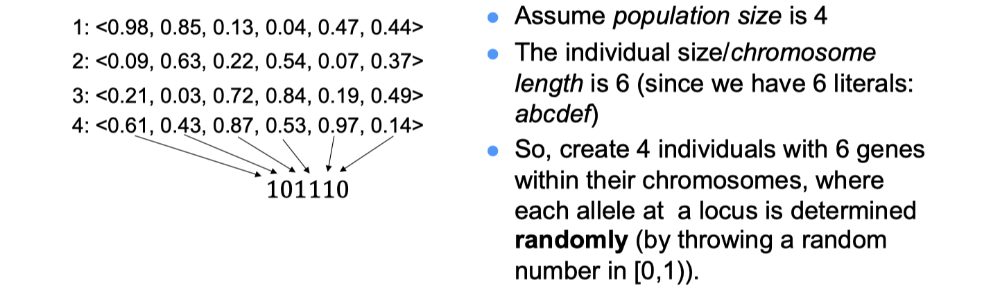
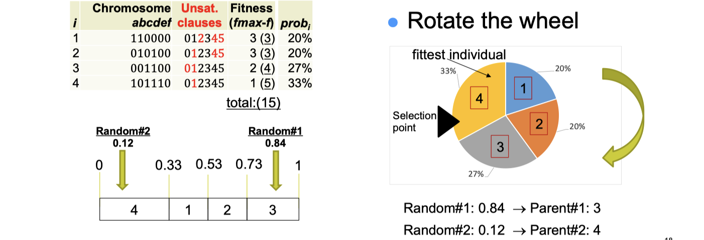
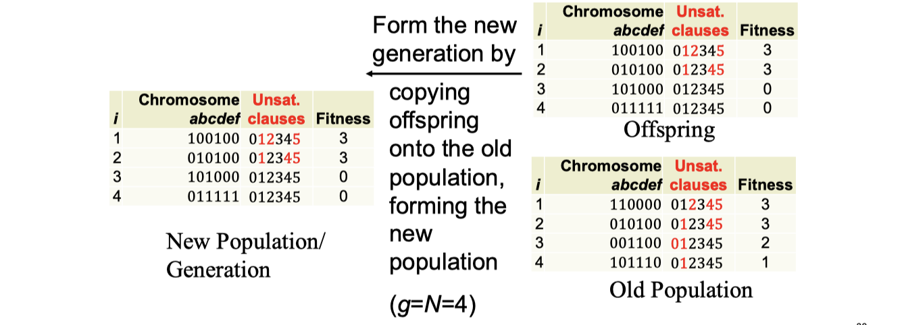
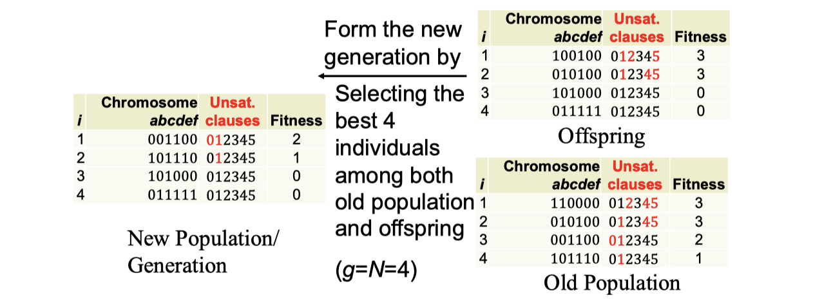
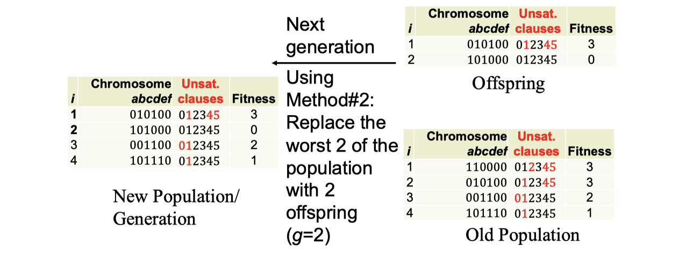
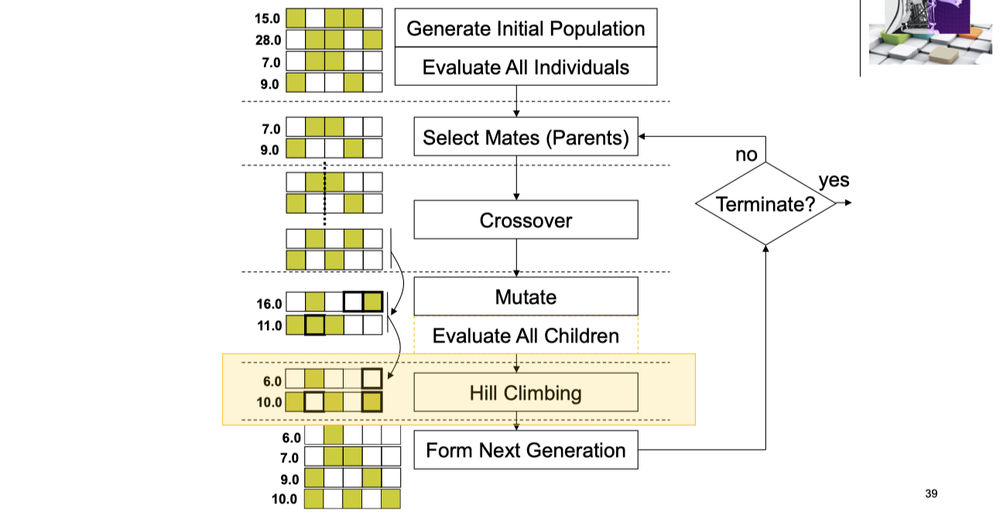

# lec05: Evolutionary Algorithm I

[toc]

## Evolutionary Algorithm EAs

-   EAs simulate natural evolution of **individual** structures at the genetic level using the idea of **survival of the fittest** via processes of **selection**, **mutation**, and **reproduction** (recombination)
-   An **individual (chromosome)** represents a candidate solution for the problem at hand. 
    -   (e.g., `<2 1 3 4>`)
-   A collection of individuals currently “alive”, called **population** (set of individuals/chromosomes) is evolved from one **generation** (iteration) to another depending on the **fitness** of individuals in a given environment, indicating how fit an individual is, (how close it is to the optimal solution) – **objective value**. 
    -   (e.g., `f(<2 1 3 4>)= 28` )
-   **Hope**: Last generation will contain the best solution
-   **Genetic Algorithms** (evolves (bit) strings)
    -   **Memetic Algorithms** 
-   **Evolutionary Programming** (evolves parameters of a program with a fixed structure) 
-   **Evolution Strategies** (vectors of real numbers)
-   ==**Genetic Programming** (evolves computer programs in tree form)==
    -   **Gene Expression Programming** (computer programs of different sizes are encoded in linear chromosomes of fixed length)
    -   **Grammatical Evolution** (evolves solutions wrt a specified grammar) 

## Genetic Algorithms GAs

**Pseudocode of Algorithm**

### Components of GAs

**Basic Components of GAs**

-   A genetic **representation (encoding)** for candidate solutions (individuals) to the problem at hand
-   An **initialisation** scheme to generate the first population (set) of candidate solutions (individuals)
-   A **fitness (evaluation) function** that plays the role of the environment, rating the solutions in terms of their fitness
-   A scheme for **selecting mates** (parents) for recombination 挑爸妈
-   **Crossover (recombination)** exchanges genetic material between mates producing offspring (children) 生孩子
-   **Mutation** perturbs an individual creating a new one 
-   **Replacement strategy** to select the surviving individuals for the next generation 挑孩子
-   **Termination Criteria** 
-   Values for various parameters that GA uses (population size, probabilities of applying genetic operators, etc)

**Representation**

-   **Haploid structure** is used: 
    -   Each individual contains one chromosome 
-   Each individual is evaluated and has an associated **fitness** value 
-   Chromosomes contain a fixed number of genes: **chromosome length** 
-   Traditionally **binary encoding** is used for each gene: **Allele** value: {0,1} 
-   A population contains a fixed number of individuals: **population size** 
-   Each iteration is referred as **generation**

### Initialisation

-   **Random Initialisation** 
-   **Population size** number of individuals are created randomly
-   Each gene at a locus of an individual is assigned an **allele** value 0 or 1 randomly, decided by flipping a coin 
    -   (E.g., if the random value is <0.5, then allele is assigned to 0, otherwise to 1).

**Example - MAX-SAT**
$$
(a\or b) \and (\neg d \or f) \and (\neg a \or c) \and (b \or \neg f) \and (\neg b \or c) \and (c \or e)
$$

### Fitness Calculation

-   **Fitness value** indicates
    -   how fit the individual is to survive and reproduce under the current conditions
    -   how much the current solution meets the requirements of the objective function
-   **Fitness value** is obtained by applying the fitness function to the individual’s chromosome (candidate solution)
    -   genotype (e.g., 101110) to phenotype (e.g., 1) mapping

**Example**

### Reproduction 繁衍

**Reproduction (Mate Selection) consists of**

-   **selecting** individuals: apply selection pressure considering the fitness of individuals in the population
    -   e.g., roulette wheel selection, tournament selection, rank selection, truncation selection, Boltzmann selection, etc.
    -   Selection pressure means the individuals with better fitness have higher chance for being selected
-   usually 2 parents (individuals/candidate solutions) are selected using the **same method**, which will go under the crossover operation

**Fitness Proportionate Selection Roulette Wheel Selection 轮盘选择**

-   Fitness level is used to associate a probability (probi) of selection with each individual chromosome (i) 
-   While candidate solutions with a higher fitness will be less likely to be eliminated, there is still a chance that they may be (maximisation problem) 
-   Expected number of representatives of each individual in the pool is proportional to its fitness (maximisation problem)

**Tournament Selection**

-   This method involves running a number of "tournaments" **among randomly chosen individuals (of tour size)** 
-   selecting the one with best fitness at the end
    -   This process is repeated for selecting each parent to be recombined

### Recombination - Crossover 重组

-   Selected pairs/mates (parents) are recombined to form new individuals (candidate solutions/children/offspring) – exchange of genetic material
-   Crossover is applied with a **crossover probability** `p_c` which in general is chosen close to `1.0`

**One Point Crossover (1PTX)** 

-   Generate a random number in `[0,1)`, if it is smaller than a **crossover probability** `p_c` Then
    -   Select a random crossover site in `[1,choromosome length]`
    -   Split individuals at the selected site 
    -   Exchange segments between pairs to form two new individuals
-   Else
    -   Copy the individuals as new individuals

**Other Crossover Operators**

-   2 Point Crossover (2PTX)

-   K-point Crossover
-   Uniform Crossover (UX)

### Mutation 突变

-   Any offspring might be exposed to mutation
-   Loop through all the alleles of all the individuals one by one, and if that allele is selected for mutation with a given probability $p_m$, you can either **change it** by a small amount or **replace it** with a new value
    -   For binary representation mutation corresponds to **flipping** a selected gene value (`0->1, 1->0`)
-   Mutation provides diversity and allows GA to **explore different regions** of the search space (**escaping**)
-   Mutation rate is typically chosen to be very small `(0.001, 0.001)`. Choosing $p_m$ as `(1/chromosome length)` implies on average **a single gene** will be mutated for an individual.

### Replacement Strategy

-   There are variety of strategies for replacing the old population (generation) by the new (offspring) population to form the next generation
-   **Generation gap** ($\alpha$) controls the **fraction of the population** to be replaced in each generation, where $\alpha \in [1/N, 1.0]$
    -   Number of **offspring** produced at each generation is $g = \alpha * N$
-   **(Trans-)Generational GA** (`g>2`, that is `a>2/N`) 
-   N individuals produce aN offspring, so `(N + aN) -> N`
    -   `aN` replaces worst aN of N （**只要孩子，把最差的父母踢掉**）
        -   largest generation gap where **a=1.0 yields g=N.**
        -   GA relies on improvement of average objective values from one population to another
        -   It is always a good idea not to loose the best solution found so far.
    -   sort `(N + aN)` and choose the `N` best (**elitism**)
-   **Steady-State GA** (`g=2`, that is `a=2/N`)
-   Two offspring replace two individuals from the old generation.
    -   Method#1: two offspring replace two parents
    -   Method#2: two offspring replace worst two of the population
    -   Method#3: best two of (parents and offspring) replace two parents (elitism)
    -   Method#4: best two of (parents and offspring) replace worst two of the population (strong elitism)

**Transgenerational GA Replacement (no elitism)** 只要儿子不要爹

**TGA Replacement with elitism** 爹儿里面挑最好的

**A Steady State GA with elitism** 最差的爹被儿替换

### Termination Criteria

-    The evolution (main loop) continues until a termination criteria is met, possibly until:
    -   A **predefined** maximum number of generations is exceeded 
    -   A goal is reached, for example:
        -   Expected fitness is achieved
        -   Population converges
    -   Best fitness does not change for a while
    -   A condition is satisfied depending on a combination of above

### Convergence

-    Defined as the progression towards uniformity (individuals become alike)
    -   **Gene convergence**: a location on a chromosome is converged **when 95%** of the individuals have the same gene value for that location
    -   **Population (Genotypic) convergence**: a population is converged when all the genes have converged (all individuals are alike – they might have different fitness)
    -   **Phenotypic Convergence**: average fitness of the population approaches to the best individual in the population (all individuals have the same fitness)

>   定义为趋向统一（个体变得相似）
>   - **基因收敛**：当 95% 的个体在该位置具有相同的基因值时，染色体上的某个位置就会收敛
>   - **群体（基因型）收敛**：当所有基因都收敛时，群体就会收敛（所有个体都是相似的 - 他们可能有不同的适应度）
>   - **表型收敛**：群体的平均适应度接近群体中最好的个体（所有个体具有相同的适应度）

### Key Features of EAs

-   **Population based** search approaches 
    -   Be **independent** of initial starting point(s): Start search from many points in the search space
    -   Conduct search in parallel over the search space
    -   implicit parallelism
-   Avoid converging to local optima
-   Balances exploration and exploitation?
-   May be used together with other approaches (hybrids)

## Memetic Algorithms MAs

-   Meme (Richard Dawkins): contagious piece of information 
-   Memes are similar to local refinement/**local search** 
-   Gene vs meme: Memes can **change, evolve** using rules and time scales other than the traditional genetic ones 
-   ==MAs aim to improve GAs by **embedding local search**==
-   MAs make use of **exploration capabilities of GAs** and **exploitation capabilities of local search**
    -   MAs have an **explicit mechanism to balance exploitation and exploration**
-   Memetic Algorithms shown to be much **faster and more accurate than GAs** on some problems, and are the “state of the art” on many problems

**Algorithms**

**Examles: MAX-SAT**

-   **Representation**: Bit string of length N (truth assignment for each variable) 
-   **Initialisation**: Randomly generate initial population, population size=N
-   **Fitness function**: (# of clauses – C); ***# of unsatisfied clauses***
-   **Mate selection**: Tournament selection with a tour size of 2
-   **Crossover**: 1PTX, crossover probability = 0.99
-   **Mutation**: random bit-flip, mutation probability = 1/N 
-   **Hill Climbing: Davis’s Bit Hill Climbing**
-   **Replacement**: Steady State GA, best two of (parents and offspring) replaces the worst two individuals in the population (strong elitism)
