# lec06: Evolutionary Algorithms II

[toc]

## Benchmark Functions

**Why to use benchmark (test) functions for optimisation**

-   Benchmark functions serves as a testbed for performance comparison of (meta/hyper)heuristic optimisation algorithms
    -   Their **global minimum** are **known**
    -   They can be **easily computed**
    -   Each function is recognised to have certain characteristics potentially
        representing a different real-world problem
    -   E.g. separable vs non-separable

**Classification of benchmark functions**

-    Continuity (Differentiability)
    -   Discontinuous vs continuous
-   Dimensionality
    -   Scalability
-   Separability
-   Modality
    -   Unimodal
    -   Multimodal with few local minima
    -   Multimodal with exponential number of local minima

### Example Functions

**Example - unimodal function: sphere function**

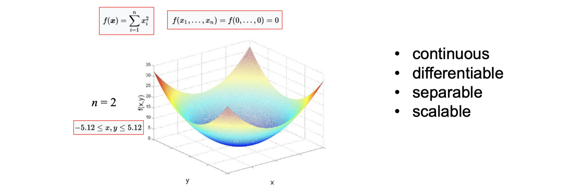

**Delta Evaluation in Function Optimisation**

-   Separable functions allows delta evaluation
-   Example: sphere function: $f(x) = \sum_{i=1}^{n}{x^2_i}$

**Example – unimodal function: Step function**

**Example – multimodal function: Rastrigin’s function**

**Example – multimodal function: Ackley’s function**

### Example - Sphere Function Optimisation

-   **Objective**: find the set of integers $x_i$ which maximize the function $f$ given below, $n=3$

$$
f(x) = x_1^2 + x_2^2 + x_3^2, \ x_i\in (-512, 512]
$$

-   There are 1024 integers in the given interval, that is **10 bits** in binary representation
-   Chromosome consists of 30 bits

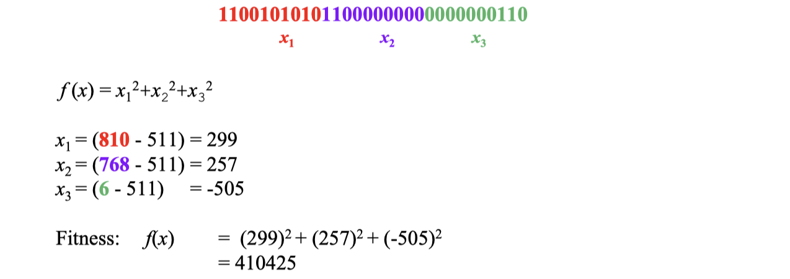

## Case Studies: Benchmark Function Optimisation

### Binary vs. Gray Encoding

-   Gray encoding ensures a **Hamming distance of 1** for the adjacent numbers
-   Shown to be useful in GAs empowering the algorithm to mutate a solution in the right direction

>   **Gray Encoding 格雷编码**
>
>   -   一种二进制数系统，其中两个连续的数值只在一个位上不同。
>
>   1.  计算数字7的格雷编码：
>       -   二进制表示为 `0111`
>       -   右移一位得到 `0011`
>       -   对这两个值进行异或运算：`0111 XOR 0011 = 0100`
>       -   所以，7的格雷编码是 `0100`
>   2.  计算数字8的格雷编码：
>       -   二进制表示为 `1000`
>       -   右移一位得到 `0100`
>       -   对这两个值进行异或运算：`1000 XOR 0100 = 1100`
>       -   所以，8的格雷编码是 `1100`

### Components of EA and Settings

-   **Representation**: Gray encoding
-   **Initialisation**: random
-   **Mate selection**: Tournament with tour size of `2`
-   **Crossover**: 1PTX ($p_c = 1.0$)
-   Traditional mutation based on bit-flip with mutation rate 1/(2 x chromosome_length)
-   A trans-generational EA with a replacement method which keeps only **two best individuals** from the previous generation.

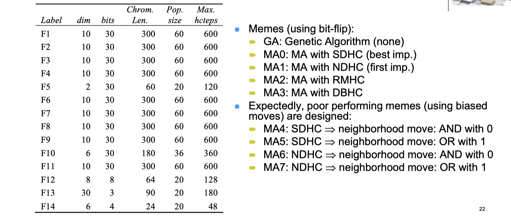

-   **Termination**: Runs are terminated whenever the **overall CPU time exceeds 600 sec**., or **an expected fitness** (optimum) is achieved.
-   All runs are repeated 50 times.
-   Performance indicators:
    -   **Success rate** (effectiveness): The ratio of the number of runs returning the expected optimal solution to the total number of runs (50)
    -   Average number of evaluations/configurations (efficiency) 
    -   Bar chart plots showing the average no. of evaluations in log scale for each algorithm, if the success rate is 100% (all 50 runs yield expected optimum), otherwise no bar is drawn.

### Summary

-   MA0 (SDHC) is the best meme choice for F4, F13 and F14. (noisy + deceptive) 
-   MA1 (NDHC) is the best meme choice for F6-F8. (multimodal) 
-   MA3 is (DBHC) the best meme choice for F2, F3, F5, F10, F12. (functions with plateaus)
-   For functions F1, F11 (unimodal) and F9, GA performs slightly better than the memetic algorithm with the meme MA1 (NDHC). The performance difference is insignificant.
-   In the overall, MA2 (RMHC) and MA3 (DBHC) turn out to be the worst and the best meme, respectively, among MA0-MA3, considering the success rates and average number of evaluations.
-   Different memes yield different performances, designing the right meme for the problem in hand is important.

## Case Studies: Travelling Salesman Problem

**BInary Representation for Encoding Permutation**

Binary representation and classical random initialisation, cross-over and mutation operators are **not suitable** for encoding permutation

-   E.g., for TSP, could cause illegal tours to form
    -   not all cities visited 
    -   undefined city codes 
    -   cities visited more than once 
    -   loops formed within the tour
-   needs repair algorithms

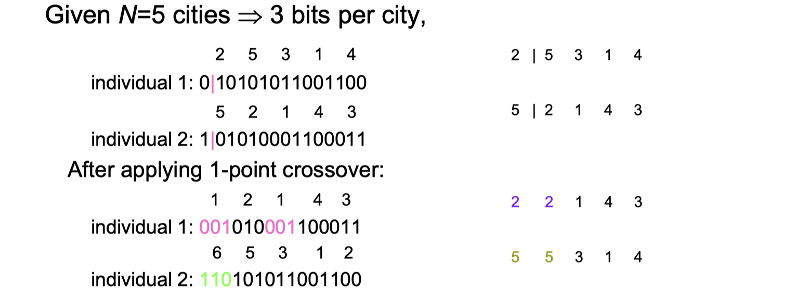

## Generic Permutation based Genetic Operators

### Partially Mapped Crossover (PMX)

-   Builds offspring by
    -   choosing a subsequence of a tour from one parent
    -   choose two random cut points to serve as swapping boundaries 
    -   swap segments between cut points
    -   preserving the order and position of as many cities as possible from other parent
-   Exploits important similarities in the value and ordering simultaneously

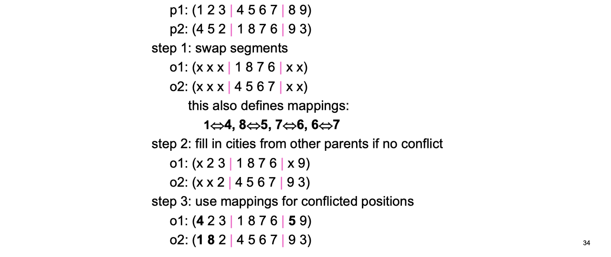

### Order Crossover (OX)

-   Builds offspring by
    -   choosing a subsequence of a tour from one parent 
    -   preserving relative order of cities from other parent
-   Exploits the property that **ordering** of cities important, not **positions**
    -   `9-3-4-5-2-1-8-7-6` and `4-5-2-1-8-7-6-9-3` are identical

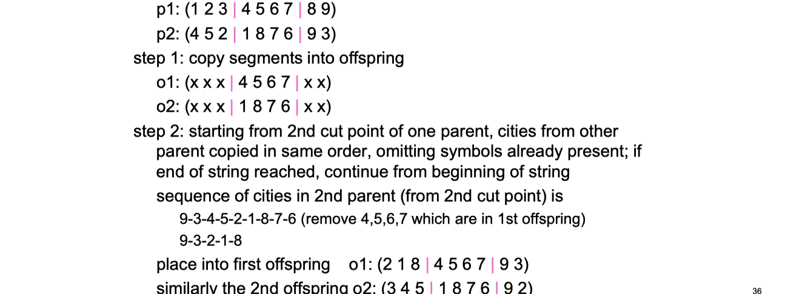

### Cycle Crossover (CX)

-   Builds offspring by
    -   choosing each city and its position from one of the parents 
    -   and when a cycle is completed, the remaining cities filled in from the other parent
-   Preserves absolute positions of the elements in the parent sequence

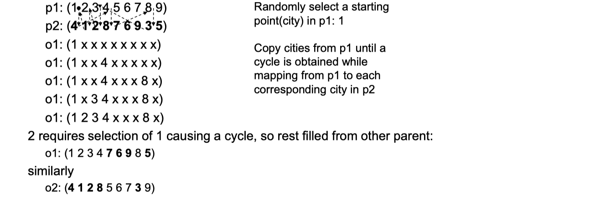

### More Genetic Operators

**Crossover for TSP**

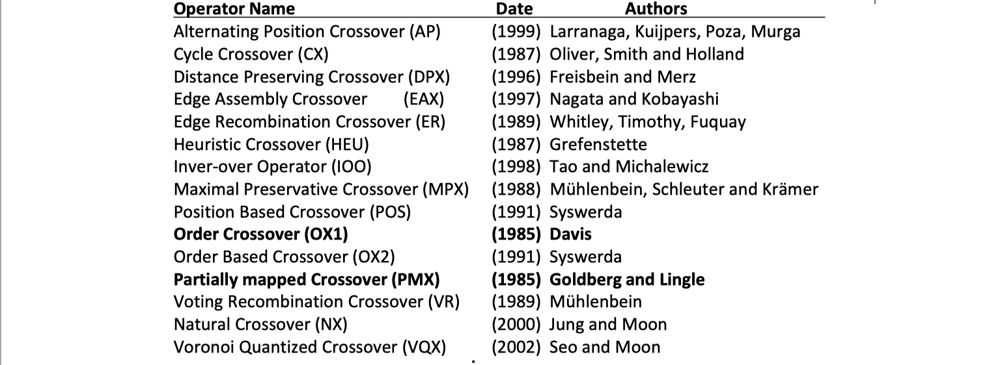

**Mutation for TSP**

### GA vs MA for Solving TSP Experiments – Components

-   **Representation**: path representation (permutation) 
    -   For example, (1 3 5 2 6 4) represents a tour starting from city 1, visiting 3, 5, 2, 6, 4 in that order and returning back to 1.
-   **Fitness function**: path length 
-   **Crossover**: PMX, 2PTX (with repair/patch-up), OX1 
-   **Mutation Operators**: ISM, EM, 
-   **Mate Selection**: RANK, TOUR 
-   **Replacement**: TG, SS 
-   **Hill Climbing**: RMHC using ISM, RMHC using EM 
    A hill climbing step is applied, as long as, max. number of iterations is not exceeded and the indiv. is improved.

**Results**

**A classification of MAs**

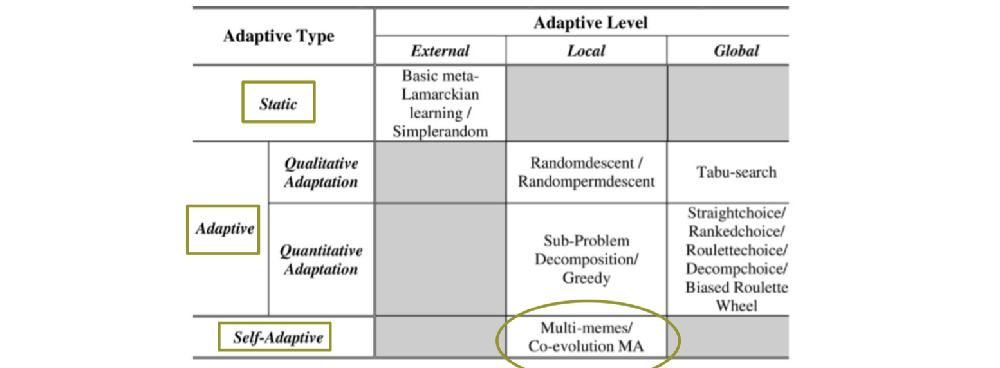

## Multimeme Memetic Algorithms

**Self Adaptation for Genetic Operators**

-   **Self Adaptation**: Deciding which operators and settings to use on the fly whenever needed receiving feedback during the evolutionary search process
-   Davis used varying probabilities of applying different operators
    -   Uses the performance of the operator within the last few generations to update probabilities
-   Spears used an additional bit to decide whether apply 2-PTX or UX to an individual (co-evolution)

**Multimeme Memetic Algorithms**

-   Introduce memetic material for each individual
    -   **Co-evolve genetic and memetic material**
-   A meme encodes how to apply an operator (which one to apply, max. no. of iterations, acceptance criteria), when to apply, where to apply, and how frequent to apply 
-   Meme of each operator can be combined under a **memeplex**

**Grammar for a Memeplex-Compound of Memes**

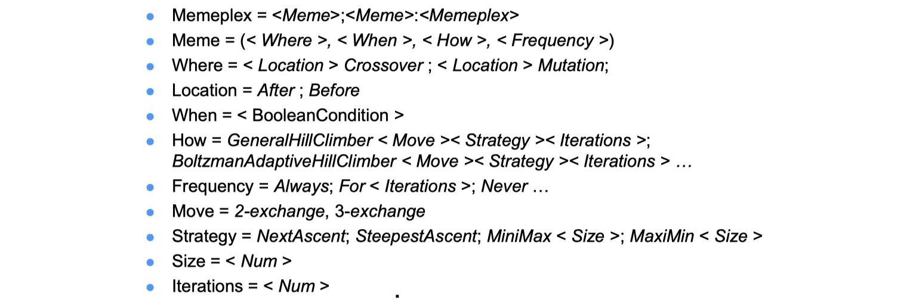

**Multimeme Memetic Algorithms - Features**

-   **Memes represent instructions for self-improvement**
    -   Specify set of rules, programs, heuristics, strategies, behaviors, etc.
-   Interaction between memes and genes are not direct
    -   Mediated by individual (genetic and memetic material)
-   Memes can evolve, change by means of nontraditional genetic transformations and metrics

**Example Implementation**

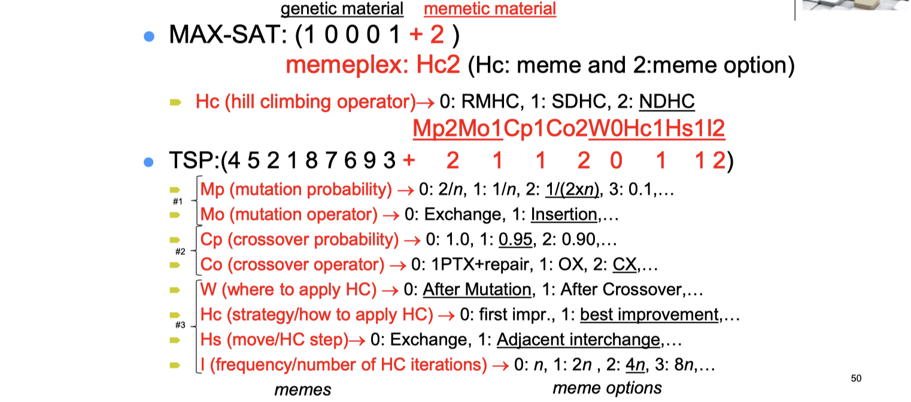

**Inheriting Memetic Material**

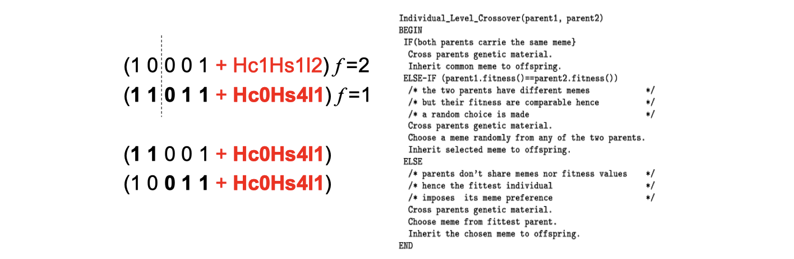

**Simple Inheritance Mechanism (SIM) from Lab**

**Mutating Memes during Evolution**

-   Inovation rate (IR) $\in [0,1]$, is **the probability of mutating the memes** 
-   Mutation randomly sets the meme option to one of the other options

-   IR=0; no innovation, if a meme option is not introduced in the initial generation, it will not be reintroduced again 
-   IR=1; All different strategies implied by the available M memes might be equally used.
-   IR越大，不同的meme被使用的次数会越平均

**Measure for Evaluating Meme Performance**

-   Concentration of a meme $(c_i(t))$ is the total number of individuals that carry the meme `i` at a given generation `t`,
    -   Crude measure of a meme success; gives no information about continual usage of a meme
-   Evolutionary activity of a meme $(a_i(t))$ is the accumulation of meme concentration until a given generation

$$
 a_i(t) = 
\begin{cases}
 	\int_0^t c_i(t) \, dt,	& \text{if } c_i(t) > 0 \\ 
 	0, 						& \text{otherwise} 
\end{cases}
$$

**Memetic Algorithms**

**Multimeme Memetic Algorithms**

## Benchmark Function Optimisation - Revisited

**MMA Experiments for Benchmark Function Optimisation - Additional Settings**

-   IR rate is fixed as 0.20 
-   Two sets of experiments are performed
    -   **MMA1**: A single good meme and two poor performing memes are used to test the power of MMAs in identifying the good ones.
    -   **MMA 2**: Memes GA, MA0, MA1, MA2 and MA3 are used to observe whether MMA will provide some type of synergy between memes.

>   实验图片请见 Lecture06

**Results**

-   **Average evolutionary activity plots show that the multimeme approach successfully identifies useful memes.**
    -   Even if there are useless operators in the system
-   Any hill climber seems to attain the optimum fast for F1, F3 and F11 under any setting
-   In all runs full success is achieved for all cases.
-   MMA can identify the best meme or a meme that does not perform significantly better than the best meme for almost each benchmark function
-   Comparing the experimental results obtained using MMA and MA with the best meme for each benchmark function indicate that **MA with the best meme is superior** based on the average number of evaluations, except for F1, F3, F9 and F11
    -   **Learning is time consuming** hence there is a trade-off

**Weaknesses of Evolutionary Algorithms**

-   Limited theoretical and mathematical analyses – this is a growing field of study
    -   Schema theorem and building block hypothesis 
    -   Markov chain analysis 
    -   Chaos theory 
    -   Martingale theory (for convergence analysis) 
    -   Runtime analysis with respect various parameter settings (e.g., expected runtime analysis based on fitness levels/partitions, drift analysis)
-   Considered slow for online applications and for some large offline problems
    -   Speedy hardware 
    -   Parallel/distributed processing

## Overall Summary

-   Genetic Algorithms represent a subclass of nature inspired Evolutionary Computation Techniques
    -   GAs creates an initial population of individuals and performs the search by applying selection, crossover and mutation on individuals at each evolutionary cycle 
    -   GA components including the parameter settings require careful tailoring to the problem in hand
-   Memetic Algorithms hybridise GAs with Hill Climbing 
-   There is a variety of benchmark functions used for performance comparison of search algorithms
-   ==In general, a memetic algorithm performs better than a genetic algorithm==
-   Choice of meme (operators and their settings) along with the encoding influence the performance of a memetic algorithm
-   **Multimeme Algorithm can indeed learn how to choose an operator and relevant settings through the evolutionary process (co-evolution)**
    -   There is a trade-off as learning requires time and a memetic algorithm with a single setting could perform better
-   If there is **limited number of operators** and settings MMA can be used. 
-   If the number of operators and settings are **large** then additional analyses and methods could be needed to reduce the number of options leading to an MMA with improved performance
-   There is no single recipe for even choosing the set of memes while designing a memetic algorithm for solving a given problem.
-   Synergy between memes/meme components could be possible

