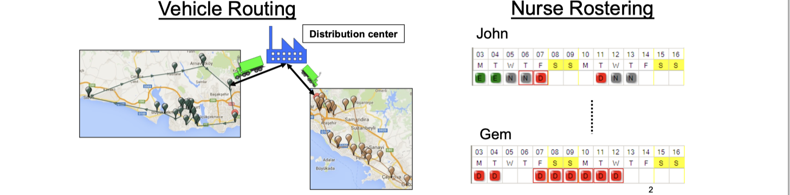
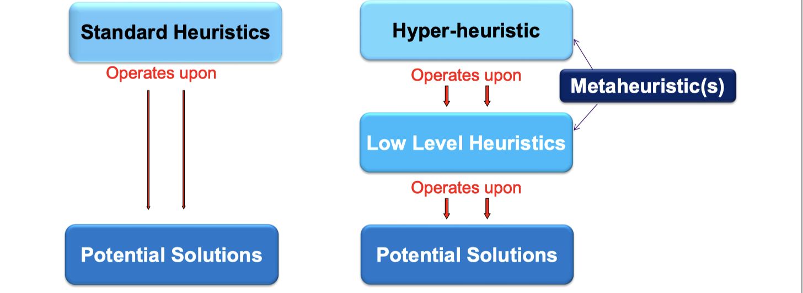
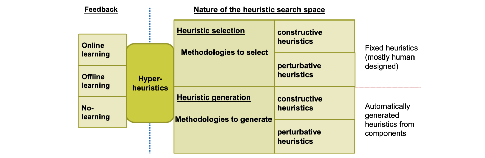
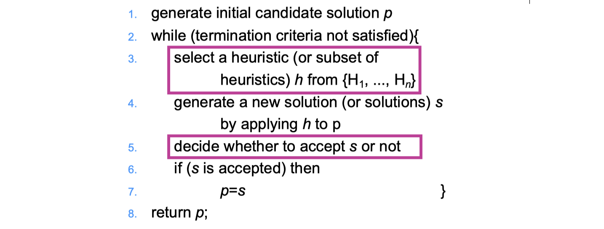
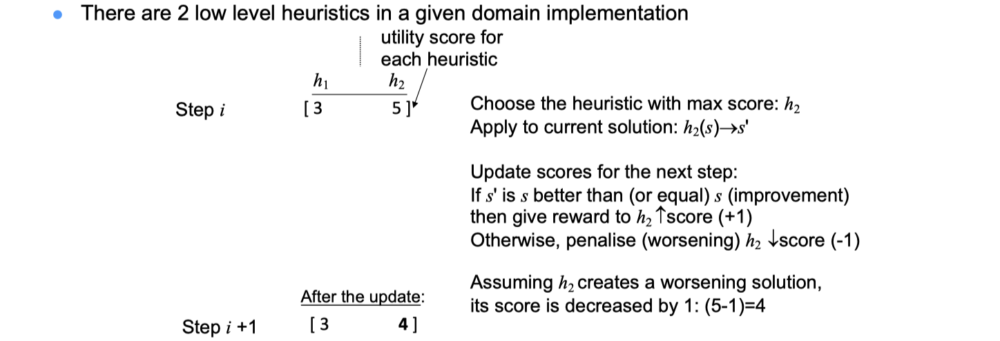
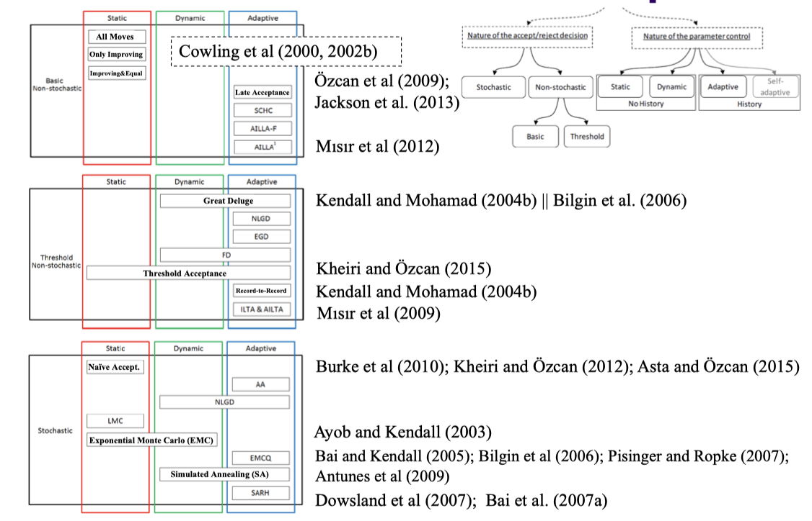

# lec07: Hyper-heuristic I

[toc]

## Hyper-heuristic

**State-of-the-art in (Meta)Heuristic Optimisation**

Trial and Error:

-   Design and implement algorithmic components
-   Configure the algorithm and tune the parameters: Test on selected instances (revisit the design options)
-   Performance analyses (revisit the design options)

**Hyper-heuristics**

>   A hyper-heuristic is a search method or learning mechanism for selecting or generating heuristics to solve computationally difficult problems

-   A class of methodologies for cross-domain search

**Different Search Spaces**

**Motivation - Cross Domain Search**

-   Hyper-heuristic research is motivated by **raising the level of generality of search methods** . 
-   What are the limits?

**A Selection Hyper-heuristic Framework for Cross-domain Search**

-   No domain knowledge, other than that embedded in a range of simple knowledge-poor heuristics.
-   Robust enough to effectively handle a wide range of problems and problem instances from a variety of domains.

### Characteristics of Hyper-heuristics 

-   Operate on a search space of heuristics (neighbourhood operators) rather than directly on a search space of solutions
-   Aim is to take advantage of strengths and avoid weaknesses of each heuristic (operator)
-   No problem specific knowledge is required during the search over the heuristics (operator) space 
-   Easy to implement, practical to deploy (easy, cheap, fast) 
-   Existing (or computer generated) heuristics (operators) can be used within hyper-heuristics

### Classification of Hyper-heuristics

## A Hyper-heuristic Framework

### A Hyper-heuristic Framework

### Single Point Search

###  Hyper-heuristic Flexible Interface (HyFlex)

-   Defines behaviours of components and arranges the interaction between them

**v1.0 Java Implementation**

-   Currently there are 6 problem domain implementations 
-   heuristic types: mutational, ruin-recreate, local search, crossover 
-   parameters: iom, dos

### Example: (1D Offline) Bin Packing

**Problem Domain**

-   Pack a set of items of sizes si for i =1,…, n

    -   Sizes are integer values and si in  [1,C] 

    -   C is the fixed capacity of each bin

-   in such a way that

    -   Never exceed bin capacity

    -   Minimise number of bins used

**Problem Instance**

**Low Level Mutational Heuristics**

-   Parameter `iom`: [0.2: repeat 1 time] – [1.0: repeat 5 times]
    -   **Swap (MU0)**: Select two different pieces at random, and swap them if there is space.
    -   **Split a Bin (MU1)**: This heuristic selects a bin at random from those with more pieces than the average. It then splits this bin into two bins, each containing half of the pieces from the original bin.
    -   **Repack the Lowest Filled Bin (MU2)**: Remove all of the pieces from the lowest filled bin, and repack them into the other bins if possible, with the best-fit heuristic.
-   Parameter `dos`: 0.2: repeat 10 times – 1.0: repeat 20 times
    -   **First-improvement/IE – Swap (HC0)**: Select two different pieces at random, and swap them if there is space, and if it will produce an improvement in fitness.
    -   **First-improvement/IE – Swap from Lowest Bin (HC1)**: Take the largest piece from the lowest filled bin, and exchange with a smaller piece from a randomly selected bin.

**Low Level Ruin&Recreate Heuristics**

-   Parameter `iom`: 0.2: x=3, 0.4: x=6, 0.6: x=9, 0.8: x=12, 1.0: x=15
    -   **Destroy x Highest Bins (RC0)**: Remove all the pieces from the x highest filled bins 
    -   **Destroy x Lowest Bins (RC1)**: Remove all the pieces from the x lowest filled bins
-   Crossover
    -   **(XO0)**: Exon Shuffling Crossover

### Heuristic (Operator) Selection

**Greedy (GR)**

-   Apply each low level heuristic to the candidate solution and choose the **one that generates the best** objective value

**Reinforcement Learning (RL)**

-   A machine learning technique 
-   Inspired by related psychological theory
    -   Reward and punishment
-   Concerned with how an agent ought to take actions in an environment to maximize some notion of long-term reward
-   **Maintains a score for each heuristic**
    -   If an improving move then increase (e.g., +1), otherwise decrease (e.g., -1) the score of the heuristic
-   **Example Iteration**

**Choice Function (CF)**

-   The choice function maintains a record of the performance of each heuristic. Three criteria are maintained:

    1) Its individual performance

    2) how well it has performed with other heuristics

    3) the elapsed time since the heuristic has been called $f_3(h_j)$

**Simplified CF - Example Iteration**

-   `f1` and `f2` are performance scores per iteration where $\alpha$, $\beta$ , $\gamma$ are fixed (oversimplified for illustrative purposes)

### Move Acceptance

### Misconceptions about Hyper-heuristics

-   Hyper-heuristics **do not** require parameter tuning 
-   Hyper-heuristics are all tested under a fair setting (hyflex)
    -   Time allocated (and instances used) for tuning
    -   Reusable vs disposable heuristics
-   Applying a hyper-heuristic to a new domain is easy 
-   Domain specific information should not be passed to the hyper-heuristics (objective value is not a domain specific information, all others are)

## An Iterated Multi-stage Selection Hyper-heuristic

### General Framework

-   Crossover operators are ignored
-   The parameter value of a low level heuristic is **randomly reset** if there is **no improvement** after its application, otherwise the same value is maintained

### Stage 1 Hyper-heuristic

-   Select a low level heuristic i with probability: $score_i / \Sigma score_i$
-   Apply the chosen heuristic 
-   Accept/reject based on an adaptive threshold acceptance method
-   Stage 1 terminates if a duration of `s1` is exceeded without any improvement

### An Adaptive Threshold Move Acceptance

### Parameter Tuning

-   The proposed approach introduces 6 system parameters to be set

### Conclusion

-   The proposed use of two hyper-heuristics with effective components synergise well producing an easy-to-implement, easy-to-maintain, and successful hyper-heuristic for cross domain search
-   The adaptive threshold move acceptance captures the tradeoff between the extent of improvement that a heuristic can generate and the number of steps it takes to achieve that improvement

## Parameter Tuning for Cross-domain Heuristic Search

### SSMA

A previous study shows that a **steady state memetic algorithm (SSMA)** performs better than its trans-generational variant across 6 problem domains of **HyFlex**

### Experimental Design

### Influence of the Setting (toursize = popsize = 5)

-   SSMA-Best selects the best individual as both Parent 1 and 2 for crossover.
-   After the application of a chosen crossover, the new offspring will be identical to the parents.
-   For the HyFlex domains and instances, the crossover operators do not seem to have much of a positive influence on the overall performance of SSMA.
-   Hence, SSMA under the best setting actually performs a single point based search rather than multipoint turning the overall algorithm into an approach similar to Iterated Local Search, where mutation is followed by local search at each step.

### Conclusions

-   Parameter tuning has actual value in cross-domain search.
-   The tuning experiments indicate the success of the SSMA-Best, which, significantly, outperforms the two memetic algorithm variants and even some of the competing search methods in CHeSC2011.
-   The key observations from the empirical results are that crossover should not be used in this case and that single point based search should be preferred.

