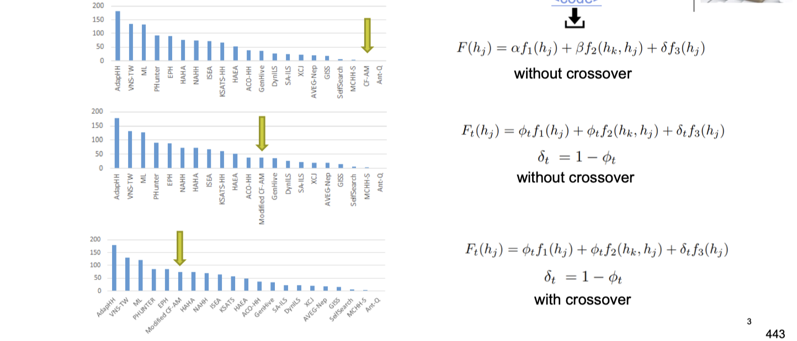
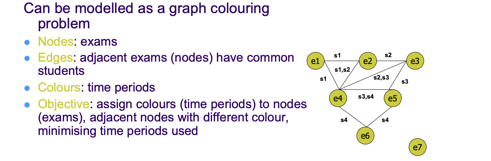

# lec08: Hyper-heuristic II

[toc]

## Configuring/Tuning of Hyper/Metaheuristics for Cross-domain Search



## A Graph-based Hyper-heuristic

-   An assignment of labels traditionally called "colours" to elements of a graph subject to certain constraints.
-   A way of colouring the vertices of a graph such that **no two adjacent vertices share the same colour**
-   this is called a **vertex colouring.**


-   **k-colouring problem**: Can the vertices of a graph be coloured using k colours so that no two vertices connected by an edge have the same colour?
-   **Minimum colouring problem** is an NP-hard problem: colour the vertices of a graph using optimal (minimum) number of colours, so that no two vertices connected by an edge have the same colour.

**Degree and Saturation of a Vertex**

-   **Degree of a vertex**: number of edges connected to that vertex.
-   **Saturation degree of a vertex**: number of differently coloured vertices already connected to it.

### Graph Colouring Heuristics

**Largest Degree:**

-   Compute the degree of all vertices 
-   Sort the vertices from largest degree to smallest 
-   Colour the first vertex in the list with the next colour (starting with the first) that is different than its neighbours 
-   Delete the vertex from the list go to the previous step unless no vertices left.


**Saturation Degree:**

-   Use saturation degree at each step in the previous approach


### Examination Timetabling


-   Hard Constraints
    -   Exams taken by common students can’t be assigned to the same time period 
    -   Room capacity can’t be exceeded
-   Soft Constraints
    -   Separation between exams 
    -   Large exams scheduled early

### Design a Local Search Metaheuristic for Examination Timetabling

-   **Representation**: 
    -   An array of pair of integers, one representing the **period assignment** and the other representing the **room assignment.** 
    -   The array size is the number of events E and each period entry has **a value from 1 to T**, while room has **a value from 1 to R** (integer encoding)
-   **Initilisation**: randomly assign a period and a room (integer values within the given range) for each event
-   **Objective function**: Number of constraint violations 
-   **Neighbourhood (perturbation) operator:**
    -   OP1: Randomly pick an event and reschedule to random period
    -   OP2: Randomly pick an event and assign a different room
    -   OP3: Randomly pick an event and reschedule to random period, also assign a different room
    -   Any of the above can be parametrised, e.g. pick X number of events and apply an operator
    -   More elaborate operators can be designed

**Iterated Local Search**

-   **Local Search**: RMHC, DHC, SDHC, NDHC, in which the neighbourhood operator is **OP3** 
-   **Acceptance Criterion**: accept improving and equal moves (non-worsening): accept a new solution s' if and only if f(s') ≤ f(s*)

**Simulated Annealing**

-   **Initial Temperature**: Objective value of the initial solution generated 
-   **Cooling Schedule**: Geometric cooling,$\alpha =0.99$
-   **Termination criteria**: Stop and return the best solution found so far when the total number of violation is 0 or maximum number of iterations is exceeded

### Graph-based hyper-heuristic


-   A general framework (GHH) employing a set of low level constructive graph colouring heuristics 
-   Low level heuristics: sequential methods that order events by the difficulties of assigning them
    -   5 graph colouring heuristics
    -   Random ordering strategy
-   Applied to exam and course timetabling problem

**Examination Timetabling**




### Tabu Search Graph based Hyper-heuristic


### Graph-based hyper-heuristics


**Largest Degree Graph Construction Heuristic**


**Largest Enrolment Graph Construction Heuristic**


-   Tabu Search at the high level
    -   Neighbourhood operator: randomly change two heuristics in the heuristic list
    -   Objective function: quality of solutions built by the corresponding heuristic list
    -   Tabu list: visits to the same heuristic lists forbidden
-   Other high-level search strategies tested
    -   Steepest Descent 
    -   Variable neighbourhood search → best performing
    -   Iterated Steepest Descent

## Generation Hyper-Heuristic

### Genetic Programming

-   Challenge: “Get a computer to do what needs to be done, without telling it how to do it.”

-   GP provides a method for automatically creating a working computer program from a high-level problem statement of the problem (i.e., program synthesis or program induction) 
-   GP iteratively transforms a population of computer programs into a new generation of programs via evolutionary process

**Why Genetic Programming**

-   For many problems in machine learning and artificial intelligence, the most natural representation for a solution is a computer program.
-   A parse tree is a good representation of a computer program for Genetic Programming

### Example

**Consider the following C program**

```C
int foo(int time) {
    int temp1, temp2;
    if (time > 10) 
        temp1 = 3;
    else 
        temp1 = 4;
    temp2 = temp1 + 1 + 2;
    return temp2;
}
```


**Using Trees to Represent Computer Programs**


### Genetic Operations

-   GP is an **evolutionary algorithm** containing the same algorithmic components, including:
    -   **Random generation** of the initial population of possible solutions (programs)
    -   **Genetic crossover of two promising solutions** to create new possible solutions (programs)
    -   **Mutation of promising solutions** to create new possible solutions (programs)

**Randomly Generating Programs**

-   Randomly generate a program that takes two (or more) arguments and uses basic arithmetic to return an answer
    -   Function set = {+, -, *, /}
    -   Terminal set = {integers, X, Y}
-   Randomly select either a function or a terminal to represent our program
-   If a function was selected, recursively generate random programs to act as arguments

>   具体过程请见 lec08


**Mutation**

-   First pick a random node (e.g., node(+))
-   Delete that node and its children
-   Insert a randomly generated program in place of the deleted node (e.g., ( \ (+ X 8) Y))


**Crossover**

-   Pick a random node in each program including the subtrees having them as the root nodes (e.g., X and / )
-   Swap the two nodes including all their children to generate two offsprings


### A Generation Hyper-heuristic Framework


## Genetic Programming for Packing

**1D Offline Bin Packing**

-   Pack a set of items of sizes $s_i$ for i =1,…, n
    -   Sizes are integer values and $s_i \in [1, C]$ 
    -   C is the fixed capacity of each bin
-   in such a way that
    -   Never exceed bin capacity 
    -   Minimise number of bins used
-   Standard NP-hard Problem

**Genetic Programming**


$$
\frac{C}{ (C - (s_i + fullness))}
$$


## Summary

-   A search method with different components, algorithmic configurations and/or parameter settings often performs differently
-   **A metaheuristic performs search over space of solutions while a hyper-heuristic (which can be a metaheuristic) performs search over the space of (low level) heuristics**
-   **Selection hyper-heuristics can be used to mix perturbative as well as constructive low level heuristics**
-   The choice of low level heuristics used in a hyper-heuristic approach influences its performance
-   Genetic programming hyper-heuristic can be used to build heuristics or heuristic components
    -   Often they operate in a train and test fashion and
    -   Training on selected sample instances could take long time while application to unseen instances is generally fast
    -   Each tree generated by GP can be evaluated using an indicator showing how good it is in building high quality solutions to the sample problem instances, such as, mean quality of solutions over the sample instances

