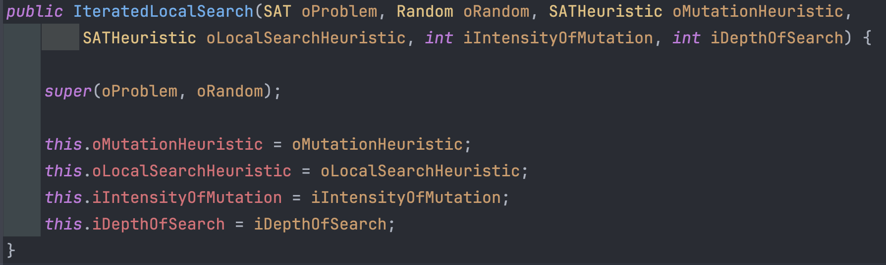

# Quiz-lec03

## Q1

Please indicate which algorithm below is **a local search metaheuristic.**

-   a. Ant colony optimisation
-   **b. Iterated Local Search**
-   c. Greedy Randomized Adaptive Search Procedure
-   d. Particle Swarm Optimisation

### Explanation (lec04-note pt.3)

-   Local Search
    -   Simulated Annealing (SA)
    -   Tabu Search (TS)
    -   Guided Local Search (GLS)
    -   Iterated Local Search (ILS)
    -   Variable Neighborhood Search (VNS)
-   Population-based
    -   Genetic Algorithm (GA)
    -   Genetic Programming (GP)
    -   Genetic and Evolutionary Computation (EC)
    -   Memetic Algorithm (MA)
    -   Particle Swarm Optimisation (PSO)
-   Constructions
    -   Ant Colony Optimisation (ACO)
    -   Greedy Randomised Adaptive Search Procedure (GRASP)

## Q2

The pseudocode below is provided for Iterated Local Search solving a minimisation problem. Which line of the code is problematic, and why?

```
s*= GenerateInitialSolution()
Repeat
	s' = applyLocalSearch(s*) 		// apply hill climbing 
	s' = perturbSolution(s' ) 		// make a random move
	accept = moveAcceptance(s*, s', memory);  	// remember best solution found so far
	if (f(s') < f(s*)) s* = s'; 	// else reject new solution s'
Until (termination conditions are satisfied) 
return s*
```

-   a. line #2, because application of local search is missing before the main loop.
-   **b. line #4, because perturbation must have been performed before local search.**
-   c. line #5, because 'memory' is useless.
-   d. line #6, because improving and equal moves acceptance method must have been used instead.

## Q3

Assume that a generic Iterated Local Search (ILS) algorithm is implemented embedding the Improving Only (IO) acceptance method, **Davis's Bit Hill Climbing (DBHC)** for local search controlled by the depth of search (DOS) parameter, random bit-flip for perturbation controlled by the intensity of mutation (IOM) parameter. These parameters take integer values in the range [0, 10] that correlate to the number of times of calls to DBHC and bit-flip operator before moving on to the next step in the algorithm. For example, DOS=0 (i.e., DOS is set to 0) indicates that DBHC is not applied, or  DOS=3 (i.e., DOS is set to 3) indicates that DBHC is applied to a solution for 3 passes over that solution, while IOM=3 (i.e., IOM is set to 3) indicates that 3 bit-flips are applied to the incumbent solution

Is the following statement TRUE or FALSE?

**If IOM=10 (IOM is set to 10) and DOS=0 (DOS is set to 0), ILS becomes a Random Mutation Hill Climbing algorithm.**

-   **TRUE**
-   FALSE

## Q4

**If IOM=0 (IOM is set to 0) and DOS=10 (DOS is set to 10), ILS is likely to get stuck at a local optimum.**

-   **TRUE**
-   FALSE

## Q5

Which one of the following options would convert the ILS algorithm into a Random Walk algorithm (randomly sampling the search landscape)?

-   a. By setting IOM=2 and DOS=2, and keeping the move acceptance method
-   b. By setting IOM=0 and DOS=2, and keeping the move acceptance method
-   **c. By setting IOM=2 and DOS=0, and changing IO to the All Moves acceptance method**
-   d. By setting IOM=0 and DOS=0, and changing IO to All Moves acceptance method

### Explanation (lab02)





-   当 `IOM = 0` 的时候，**ILS**退化成Local Search Heuristic 局部搜索启发式，在这里就是 HC
-   当 `DOS = 0` 的时候，**ILS**退化成Mutation Heursitic 突变启发式，在这里就是 Random Bit Flip

## Q6

Given *n* jobs to be processed by a single machine, each job (*j*) with a due date (*dj*) (i.e. hard deadline), processing time (*pj*), and a weight (*wj*), which one of the following scheduling notations indicate the problem of finding the optimal sequencing of jobs producing the earliest time for the last job exiting the system (assuming that the time starts at `t=0`).

-   a. $1 \ | \  d_j \ | \ \sum w_j T_j$
-   **b. $1 \ | \  d_j \ | \ C_{\max}$**
-   c. $1 \ | \  d_j \ | \ \sum C_j$
-   d. $1 \ | \  d_j \ | \ \sum w_j L_j$
-   e. $1 \ | \  d_j \ | \ \sum T_j$

## Q7


Given the box-plots for 3 algorithms A, B and C based on the objective values obtained from 100 trials while solving an instance of a minimisation problem (and no other information), which of the following statement(s) about the search algorithms **is definitely true?**

-   a. Algorithm A is an Iterated Local Search algorithm.
-   b. Algorithm B is either an Iterated Local Search or Tabu Search algorithm.
-   c. Algorithm C is a Tabu Search algorithm.
-   **d. Algorithm C is the worst performing algorithm among the three for this instance considering the objective value of the median solution obtained in 100 trials.**
