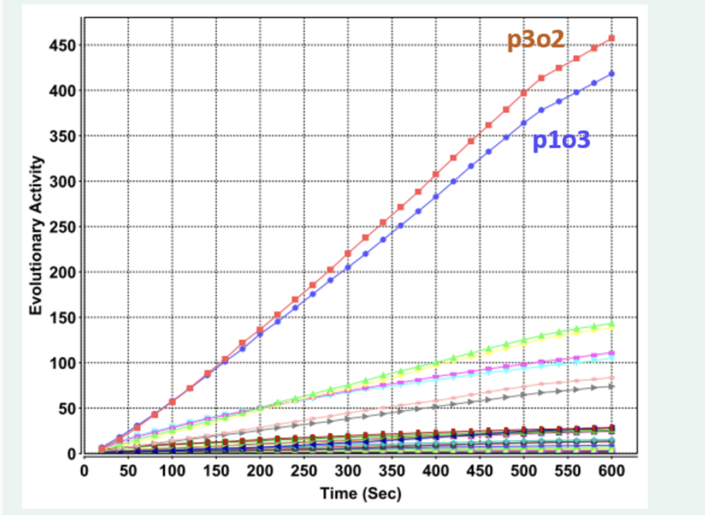

# Quiz-lec06

## Q1

There is no difference between a self-adaptive multi-meme memetic algorithm and a memetic algorithm with adaptive control.

-   a. TRUE
-   **b. FALSE**

##  Q2

A multi-meme memetic algorithm is based on a framework where both genetic and memetic materials are co-evolved.

-   **a. TRUE**
-   b. FALSE

## Q3

Assume that you are solving MAX-SAT using a generic multi-meme memetic algorithm and there is only one meme controlling the choice of the hill-climbing operator with two options, where 0 indicates Davis's Bit Hill Climbing and 1 indicates Steepest Gradient Hill Climbing. The meme values are randomly initialised and the simple inheritance mechanism is used for transmitting the memes from the parent individuals to offspring. A meme gets mutated to a different value based on the innovation rate.

If the population size is fixed as 200 and the innovation rate is set to `0.0`, which of the following observations would be highly likely?

-   **a. About half of the individuals in the initial population would have the value of 0 for the meme** 
-   b. At an intermediate stage during the search process, the number of 1s could exceed the number of 0s in the population for the meme
-   c. None of the individuals would have a value of 1 for the meme at any generation
-   d. At the end of the search process, about half of the individuals in the final population would have the value of 1 for the meme 

## Q4

If the population size is fixed as 200 and the innovation rate is set to `1.0`, which of the following observations would be highly likely?

-   a. At an intermediate stage during the search process, the number of 1s would never exceed the number of 0s in the population for the meme
-   b. None of the individuals would have the value of 1 for the meme at any generation
-   **c. At the end of the search process, about half of the individuals in the final population would have the value of 0 for the meme** 
-   **d. About half of the individuals in the initial population would have the value of 0 for the meme** 

## Q5

If the population size is fixed as 200 and the innovation rate is set to `0.2`, which of the following observations would be highly likely?

-   **a. About half of the individuals in the initial population would have the value of 0 for the meme** 
-   b. At an intermediate stage during the search process, the number of 0s could exceed the number of 1s in the population for the meme
-   c. At the end of the search process, about half of the individuals in the final population would have the value of 1 for the meme 
-   d. None of the individuals would have the value of 1 for the meme at any generation

## Q6

Assume that a multi-meme memetic algorithm is run for **50 trials** on the problem instance Inst with an innovation rate of **0.2** based on the memplex of `p#o#`, which identifies the choice of probability (p) of applying the operator indicated by (o). The meme options are `p={0: 0.005, 1: 0.01, 2: 0.02, 3: 0.03, 4:0.5, 5:0.9}` and `o={0:randomSwap, 1:insertion, 2:randomReversal, 3:adjacentSwap}`. Given the mean evolutionary activity plot above, which of the following conclusions can be driven about the search behaviour of the multi-meme algorithm?

-   a. The memetic algorithm using the operator randomReversal with the probability of 0.01 can outperform this multi-meme memetic algorithm on Inst.
-   **b. Some of the memes are rarely used during the search process.**
-   c. The innovation rate should be increased to improve the performance of the multi-meme memetic algorithm.
-   **d. The number the meme randomReversal with the probability of 0.03 surpasses the others in the population as the search progresses on average.**
