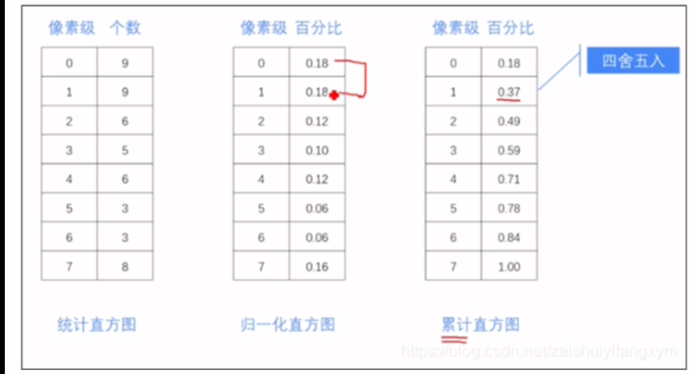
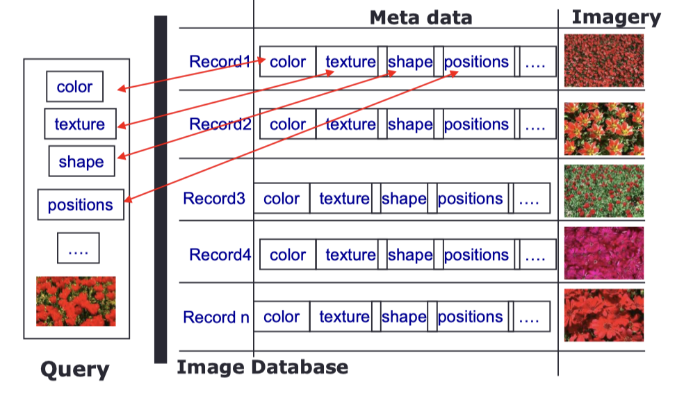
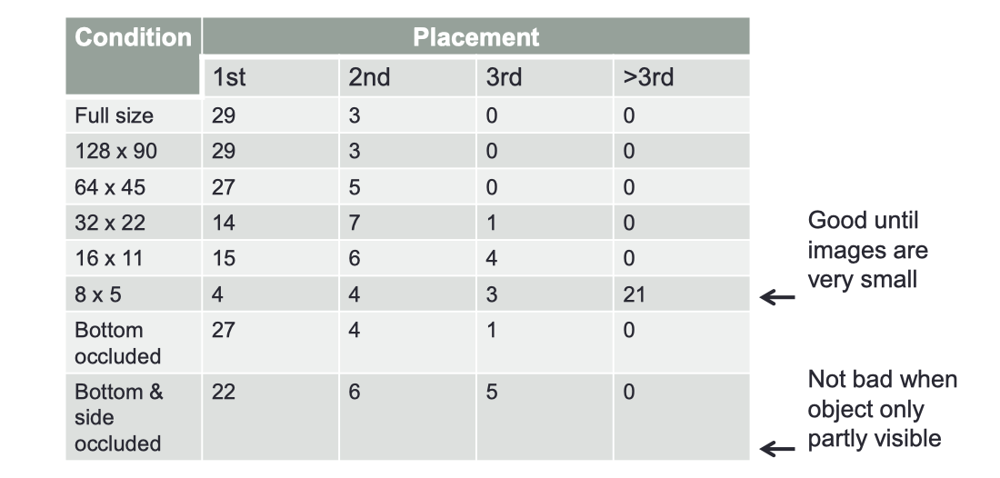
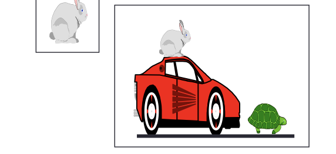
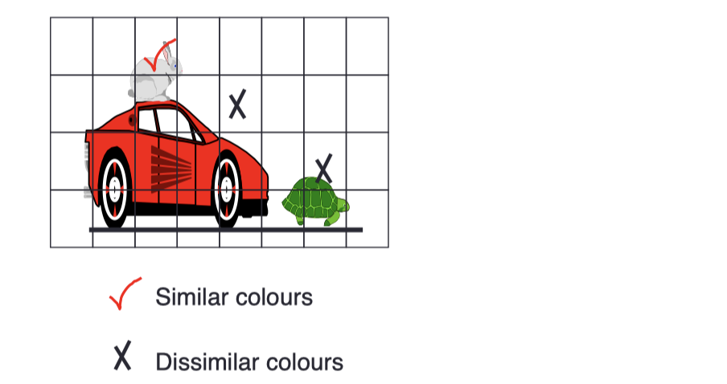
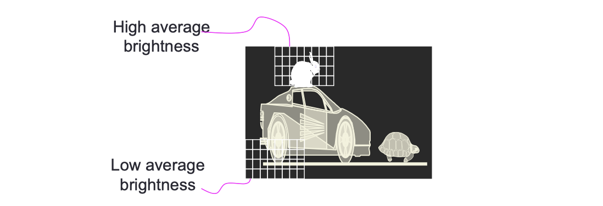

# lec02: Histogram Processing

## Histograms

### Definitions

- The histogram of a digital image with grey levels in the range `[0, L-1]` is discrete function

$$
p(r_k) = n_k
$$

- where
  - $r_k$ is the kth grey level
  - $n_k$ is the number of pixels in the image with that gray level
  - k = 0, 1, .., L-1

### Normalised Histograms 归一化直方图

- A normalised histogram is a discrete function

$$
p(r_k) = n_k/ n
$$

- where
  - n: width x height is the total number of pixels in the image
- The bins in a normalised histogram **sum to one**
- Each bin gives **the probability of the corresponding grey level** appearing in the image
- The probabilistic interpretation is valuable in e.g. contrast enhancement and automatic thresholding

### Histogram Equalisation 直方图均衡化

- Goal is to **improve the contrast of an image**
  
  - To transform an image in such a way that the transformed image has a nearly uniform distribution of pixel values
  - More general than linear or piecewise contrast stretching

- **Histogram transforms**
  
  - Map an input histogram `r` onto a new histogram `s`
  - Assume `r` has been normalized to the interval `[0,1]`, with `r = 0` representing black and `r = 1` representing white
  
  $$
  s = T(r), \ 0\le r \le 1
  $$

- The transformation function satisfies the following conditions
  
  - $T(r)$ is single-valued and strictly monotonically **increasing** in the interval `0 ≤ r ≤ 1`
  - `0 ≤ T(r) ≤ 1` for `0 ≤ r ≤ 1`

- This means it is possible to **invert the process**

- In Gonzalez and Woods’ notationz
- Let $p_r(r)$ and $p_s(s)$ denote the **probability density function**(PDF) of random variables $r$ and $s$, respectively
- If $p_r(r)$ and $T(r)$ are known, then the probability density function $p_s(s)$ of the transformed variable s can be obtained

$$
p_s(s) = p_r(r) \cdot \left | \frac{\mathrm{d} r}{\mathrm{d} s} \right |, \ r = 1/ T(s)
$$

- If we choose as the transformation function the **cumulative distribution function**(CDF)
  - $T(r)$ depends on $p_r(r)$
  - but the resulting $p_s(s)$ is **always uniform**

- We have a **discrete** histogram, not a PDF of a continuous random variable
- The probability of occurrence of gray level $r_k$ in an image is, with k = 0, 1, ..., L-1

$$
p_r(r_k) = n_k / n
$$

- The transformation function is

$$
s_k = T(r_k) = \sum^k_{j=0}p_r(r_j)=\sum^k_{j=0}\frac{n_j}{n}
$$

- An output image is obtained by **mapping** each pixel with level $r_k$ in the input image into a corresponding pixel with level $s_k$

### In Practice

- To perform histogram equalisation
  - Compute the **CDF** of the input image.
  - For each pixel in the input image, the corresponding output pixel intensity is calculated by using the CDF as a **look-up function.**
  - CDF values will be in the range `[0,1]`, scale the equalised image to fit the range supported by the output image format.
- The histogram of the output image will be **approximately** uniform
    - 这里 $s_k = (2^3 - 1) \cdot T(r_k)$，因为是3位灰度图，最高的灰度级就是7

### Strengths & Weaknesses

- Histogram equalisation **works well** when the input images
  
  • aren’t too **noisy**
  
  • don’t have **large** bright or dark areas

- **Histogram Specification** is a related method which transforms an image’s histogram so that it matches a target histogram

### Histogram Specification

-   **Histogram Specification** is a related method which transforms an image’s histogram so that it **matches a target histogram**

### Conclusion

-   Histograms, particularly normalised histograms, provide useful summary information
-   Images can be manipulated by manipulating their histograms
-   Histogram equalisation is a powerful and widely used image enhancement operation
-   Global equalisation has drawbacks which can be addressed using local processing
-   The method generalises to Histogram Specification

## Applications: Image Matching with Colour Histograms

**Storing & Retrieving Images**

- Given a large image database, find all the images containing e.g. **horses**

- We will focus on individual images, but many of the problems & methods discussed extend to video databases

**Text-based Approaches**

- **Annotation**: relevant words are added to each image

- Retrieval is via text search

**Content-based Retrieval**

- Indexes the image database on **visual features**
  
  - colour
  
  - shape
  
  - Texture

- Queries are expressed in those terms or via visual examples

- Simple approaches compute metric distances between the query image and each image in the database

- Advanced approaches use AI techniques, machine learning, etc., and may be interactive

- Some simple measures and data structures can be very useful

### Colour Histograms

- Choose a colour space: RGB, HSV

- Divide the axes to create a reasonable number of divisions
  
  - Trade-off detail against memory/computational cost

- Build a histogram

- Normalise if images are different sizes or colour resolution

**Why Colour Histograms**

- Colour correlates well with **class identity**

- Human vision **works hard to preserve colour constancy**: presumably because colour is useful

- Histograms

  - Are invariant to **translation and rotation**

  - Change slowly as **viewing direction** changes

  - Change slowly with **object size**

  - Change slowly with **occlusion**

- Colour histograms summarise target objects quite well, and should match a good range of images

**Common Distance Metrics**

**Some Problems**

- Colour quantisation
  
  - Noise and/or different camera responses can give similar images very different histograms

- HIstogram resolution
  
  - May need many bins (4096) to accurately store colour distributions
  
  - Expensive

- The **illumination** may be coloured
  
  - Same object may generate a different histogram under different lighting

- Colour histograms ignore **spatial information**

### Histogram Intersection

- Measures how much of the query may be present in the target image (and vice-versa)

- A bin in the target histogram can have a larger value than the corresponding query bin (and vice-versa)

$$
\text{Intersection}(H_1, H_2) = \sum_i \min(H_1(i), H_2(i))
$$

### Using Histograms: Object Location

- Matching whole images is not always appropriate
  
  - e.g. we wanna find rabbit in the following image

**Region/Object based Queries**

- We know the rabbit is mostly grey

- Divide the image into windows and see how grey each window is
  
  - Highlight pixels in the image that are similar to those in the query
  
  - Look for regions with lots of these pixels

**The Histogram Ratio**

- The image is usually much bigger than the query region
  
  - Other objects in the image may be the same colour as parts of the query object
  
  - So some colours are not reliable cues: if you’re looking for a zebra at night look for white pixels

$$
R_j = \min (M_j / I_j, 1 )
$$

- Compute the ratio of corresponding Model and Image histogram **bins**

- If the **image** has many **more pixels of a given colour** $R_j$ is small and that colour is **not useful**

- If the **model has more**, $R_j$ is **1 and that colour is useful**

**Backprojection**

- The greater the value of $R_j$ , the more valuable the colour(s) represented by bin `j`
  
  - consider each image pixel
  
  - if that pixel maps to histogram bin `k`, replace the pixel value with a grey value $R_k$

- Regions with **high average brightness** are likely to contain the rabbit
  
  - **its more complex**, but still a histogram matching approach

