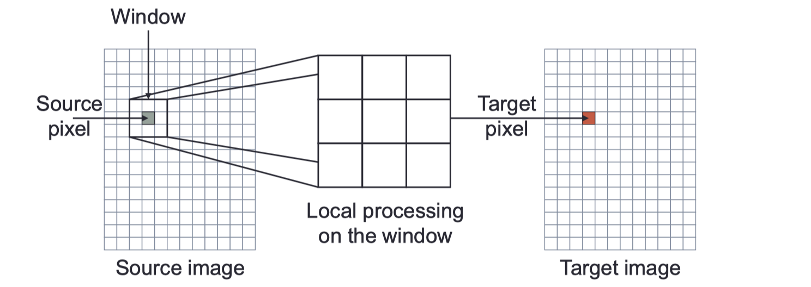
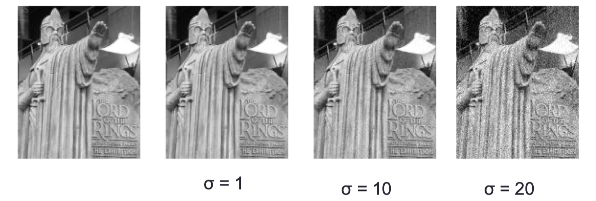
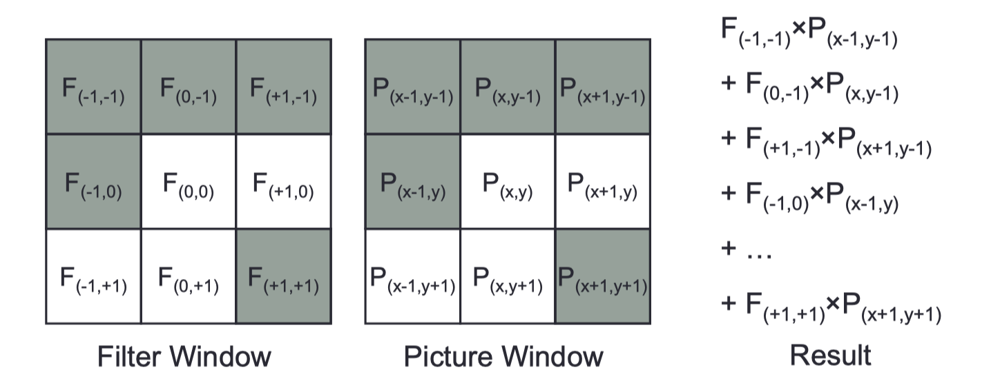
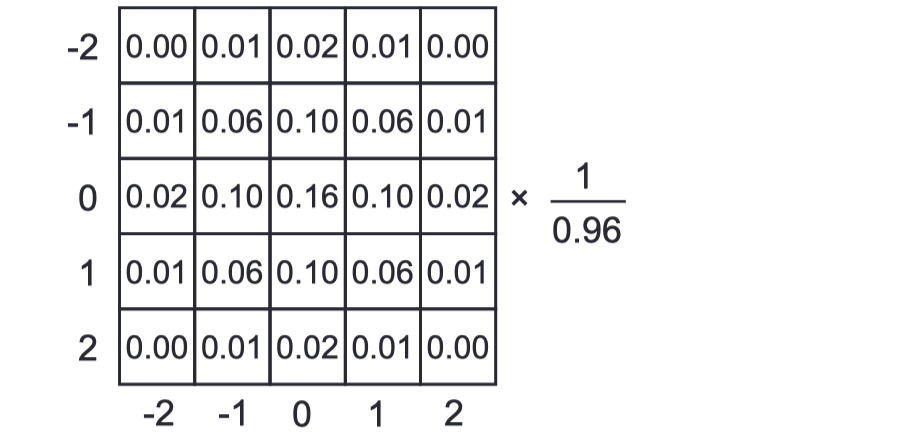
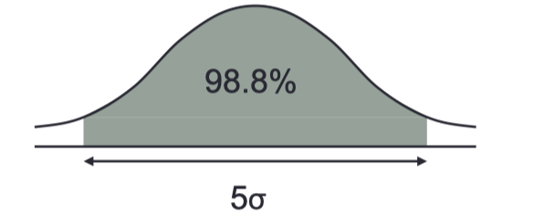

# lec03a: Linear Filters

[toc]

## Spatial Filtering

**Why** (Defects of intensity transforms)

- Intensity Transforms read and affect **only a single pixel**, their power is limited

- Images are **spatially organised data structures**, many important attributes vary slowly across the image
  
  - Object identity
  
  - Viewed surface orientation, colour, etc.
  
  - Illumination

- Processes restricted to a **small, compact area** have access to more info but are still likely to consider a single object, surface, illumination pattern, et.c

### Noises

**Image Noise**

- **Noise = small errors in image values**

- Imperfect sensors introduce noise

- Image compression methods are **lossy**: repeated coding & decoding adds noise

- Noise is often modelled as additive:
  
  - Recored value = true value + random noise value

**Gaussian Noise**

- Sensors often give a measurement a little off the true value
  
  - On average they give the right value
  
  - They tend to give values near the right value rather than far from it

$$
P(x) = \frac{1}{\sigma \sqrt{2 \pi}} e ^{\frac{-(x-\mu)^2} {2\sigma ^2} }
$$

- Where
  
  - mean $\mu$ = 0
  
  - variance $\sigma^2$ indicates **how much noise there is**

> **区别**
> 
> - **分布**：普通噪点的分布是随机且离散的，主要表现为随机分布的黑白点；而高斯噪点的强度遵循高斯分布，影响图像的每个像素，使图像整体上看起来模糊。
> - **视觉效果**：盐和胡椒噪点在视觉上容易识别，因为它们以明显的黑点和白点出现；高斯噪点则让图像看起来像是轻微失焦或存在一层轻微的雾。
> - **去噪方法**：由于这两种噪点的特性不同，去除它们通常需要使用不同的方法。例如，中值滤波器非常擅长去除盐和胡椒噪点，而高斯滤波器或双边滤波器则更适合减少高斯噪点的影响。

**Noise Reduction**

- If you have multiple images, taking the **mean value of each pixel** will reduce noise
  
  - Noise is randomly added to each value
  
  - Mean value added is `0`
  
  - If you average a large set of estimates of the same pixel **the random noise values will cancel out**

- Given only a single image, **averaging over a local region** has a similar effect

- Ideally, we would choose the region to only **include pixels** that should have the same value

- Therefore we need a spatial filter

### Convolution 卷积

**What is Convolution**

-   The operator to be applied is represented as a 2D array (mask)
-   That mask is placed over each pixel of the input image
-   Mask weight are multiplied by the corresponding pixel value and the results are summed.
-   The weighted average value is written to the same location in the output image

>   线性滤波器的定义是，对于输入图像 I  和滤波器 H，输出图像 O 是通过如下卷积操作得到的：
>$$
>   O(x,y) = \sum_{i,j} H(i,j)I(x-i,y-j)
>   $$

- More generally, with a filter with radius `r`

$$
p'(x,y) = \sum^{+r}_{dx=-r} \sum^{+r}_{dy=-r}f_{dx, dy} \cdot p(x+dx, y+dx)
$$

### Mean Filters 均值滤波

均值滤波器通常采用一个简单的、形状为正方形或矩形的滤波器核（kernel），其中每个元素的权重都是相等的。例如，在一个3x3的均值滤波器中，每个元素的权重都是1/9，这表示目标像素的新值是其自身加上周围8个像素值的总和，然后除以9。均值滤波的主要目的是减少图像中的随机噪声，但它也可能导致图像边缘的模糊。

**Key Points**

- Spatial filters operate on **local image regions**

- Many can be formulated as convolution with a suitable mask

- Noise reduction via mean filtering is a classic example

## Gaussian Filters

- **Convolution with a mask** whose weights are determined by a **2D Gaussian function**

- **Higher weight** is given to pixels **near the source pixel**

$$
P(x,y) = \frac{1} {\sigma^2 2\pi} e^{\frac{-(x^2 + y^2)}{2 \sigma^2} }
$$

- where
  
  - σ 是高斯分布的标准差，控制了滤波器的**宽度**
  
  - 标准差σ越大，权重分布越宽，滤波效果越强，即图像越模糊
  
  - 反之，σ越小，滤波效果越弱。

### Discrete Gaussian Filters

- The Gaussian
  
  - Extends infinitely in all directions, but we want to process just a local window
  
  - Has a **volume underneath it of 1**, which we want to maintain

- We can approximate the Gaussian with a discrete filter
  
  - We restrict ourselves to a **square window** and **sample the Gaussian function**
  
  - We normalise the result so that the filter entries add to **1**

**Example**

- Suppose we want to use a 5x5 window to apply a Gaussian filter with σ^2 = 1
  
  - The centre of the window has x = y = 0
  
  - We sample the Gaussian at each point **and then normalise it**

- How big should the filter window be:
  
  - With Gaussian filters this depends on the variance ($\sigma^2$)
  
  - **Under a Gaussian curve 98% of the area lies within `2σ` of the mean**
  
  - A filter width of 5σ gives more than 98% of the values we want

### Separable Filters

- The Gaussian filter is separable
  
  - **A 2D Gaussian is equivalent to two 1D Gaussians**
  
  - First horizontal and then vertical

$$
P(x,y) 
= \frac{1} {\sigma^2 2\pi} e^{\frac{-(x^2 + y^2)}{2 \sigma^2} }
= \left ( \frac{1} {\sigma \sqrt{2 \pi}} e^{\frac{-x^2}{2 \sigma^2} }\right ) \cdot
\left ( \frac{1} {\sigma \sqrt{2 \pi}} e^{\frac{-y^2}{2 \sigma^2} }\right )
= P(x) \cdot P(y)
$$

- The separated filter is **more efficient**: 
    - Given an N*N image and a n *n  filter, we need to do $O(N^2n^2)$ operations
    - Apply two 1 filters to a N*N images takes $O(2N^2 n)$
- Example

  - A 600×400 image and a 5×5 filter

  - Applying it directly takes around 6,000,000 operations

  - Using a separable filter takes around 2,400,000 - less than half as many
