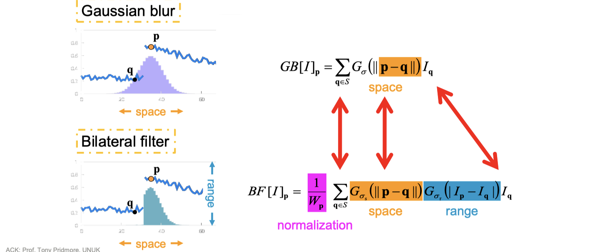

# lec03b: Non-Linear Filters

[toc]

## Non-Linear Filters

- Linear filters smooth **sharp** image changes
    - linear filter: convolution with a mask of weights

- Nonlinear filters tend to **preserve or even enhance** them

## Median Filtering 中值滤波

**Salt and Pepper Noise**

- Sometimes sensors either fail to respond or saturate in error
  - A **false saturation** gives a **white spot** in the image (salt)
  - A **failed response** gives a **black spot** in the image (pepper)
  - Sometimes called **speckle noise**

**Median Filter**

- Statistically the median is the middle value in a set

- Each pixel is set to the median value in a local window

- Result is a **real pixel value**, **not a combination**

- **Noise pixels are outliers** => ==Good at deleting salt&pepper noise==

- Noise would have to affect >1/2 the pixels to appear in the output

**Evaluation**

- good at small regions of **speckle noise**
- less good if **edges** are important

## Anisotropic Diffusion 各向异性滤波

-   **Anisotropic**: not the same in all directions
-   **Diffusion**: spreading out
    -   Mean and Gaussian filters can be seen as **diffusion processes**

**Basic Idea**

- Mean and Gaussian filters make each pixel **more like its neighbours**
- Anisotropic diffusion makes each pixel more like those neighbours **that it is already similar to**

$$
p' = \frac{\sum q \cdot s(p.q) } {\sum s(p,q)}
$$

- We have similar function $s(p,q)$ of value `[0,1]`
  - If pixels p and q are **similar** then close to **1**
  - If pixels p and q are **different** then close to **0**
- We use $s(p,q)$ to compute a weighted average of pixel values
  - The new value at a pixel p, is based on all its neighbours, q

>   When similar function $s(p,q) = 1$ then **Anisotropic Diffusion is Mean Filtering**

**The Similarity/Smoothing Function**

- If `d` is the **difference** between p and q and `D` is the **maximum possible difference** we can use

$$
s(p,q) = (D- d) / D
$$

- Other functions
  - `K` determines the amount of smoothing
  - A higher value of `K` gives **greater smoothing**, but **edges** are still (quite) sharp
  

$$
s(p,q) = e^{ \left( \frac{p-q}{K} \right)^2 } \quad or \quad
s(p,q) = 1 / ( 1 + ( \frac{p-q}{K} )^2 )
$$

## Bilateral Filtering 双边滤波

- **Anisotropic Diffusion** is related to **mean filtering**
  - If the **similarity function is always 1** we get a mean filter
- **Bilateral filters** modify Gaussian smoothing in a similar way
  - One Gaussian weights pixels that **are near the source**
  - Another Gaussian weights pixels that have **similar intensity to the source pixel**
- **Gaussian Smoothing**

- **Bilateral Filtering**

