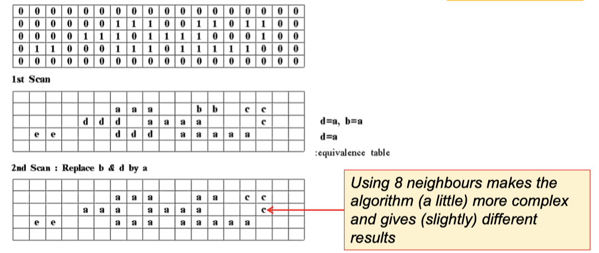
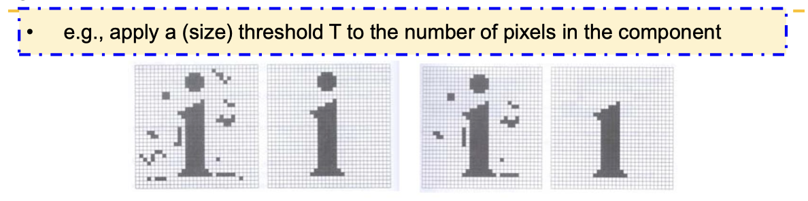
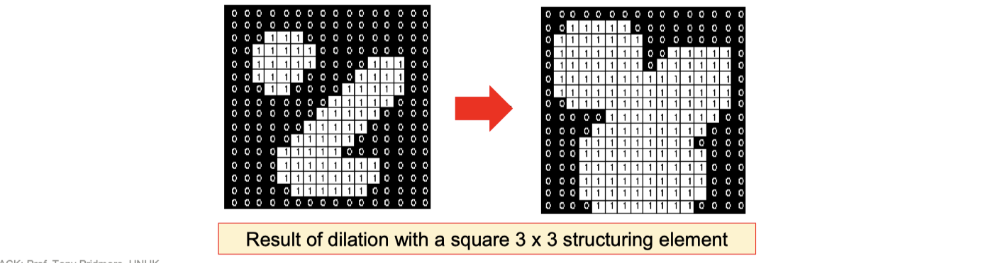
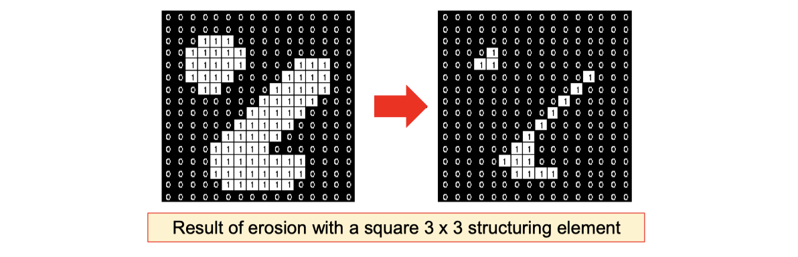

# lec05: Morphology 形态学

[toc]

## Connected Components 连通分量

- **Connected can mean 4- or 8- neighbours**
  - 4连通：上下左右
  
  - 8连通：上下左右加对角线
  
- Connected component algorithms are **slow** and often a **bottleneck**

- A sequential algorithm using 4-neighbours
  
  - Keep a separate output array for labels
  
  - Two passes over the image

**First pass**

- Scan image **top left to bottom right**

- Look at top and left neighbours

-   If the **current pixel is foreground**, there are 3 cases

    - ==left = top = background== => assign current pixel a **new label**

    - ==one is background and the other is foreground== => assign current pixel the foreground pixel's label

    - ==left = top = foreground== => assign current pixel one of their labels and note that their labels are equal in an *equivalence table*

- **Step 3 detects mergers between two previously separate components**

**Second pass**

- Consider each equivalent pair of labels, set all instances of the higher label to the lower

-   **Connected components**
    -   Can compute features of and apply tests to components to process the underlying image
    -   Shap is captured by measures like area/boundary length

## Mathematical Morphology

- A branch of image processing which **treats images as sets of pixels** and uses **set theoretic operations** to process them

- Developed for **binary images**, extended to **grey level images**

- Elements of sets are `(x,y)` **coordinates** of black (or white) pixels

- Perform operations by combining two sets:
  
  - A patch of the binary image to be processed
  
  - A structuring element, similar to the mask in a convolution process

**Structuring Element 结构元**

- **Binary masks**
  - filter masks but **identifying** rather than **weighting** pixels
  
- Larger structuring elements produce more extreme effects

- Very similar effects can be achieved by **repeated operations** using a smaller but similarly shaped structuring element

- With larger structuring elements, it is quite common to use an approximately disk-shaped structuring element

- Need not be square, **origin need not be in the centre**

**Morphological Operations**

- **Dilation**: **Expands** a foreground (or background) object A using structuring element B

- **Erosion**: **Shrinks** a foreground (or background) object A using structuring element B

Note:

-   The boundaries between foreground and background are **often smoothed** in the process
-   The amount and the way objects grow and shrink depend upon the **choice of the structuring element**
-   Dilating or eroding without specifying the structural element makes no sense than trying to filter an image without specifying the filter

## Erosion & Dilation 腐蚀和膨胀

### Dilation 膨胀

**Two inputs**

- **Binary image** to dilate: set of points to be considered

- A **structuring element**: 3*3 {1}: origin is the central element

**Algorithm**

- The structuring element is superimposed on each of the **background pixels** such that origin of the structuring element coincides with the input pixel position
- If any of the `1` pixels in the structuring element **overlap** (intersect) the **foreground**, then the **background pixel is also set to foreground**

- Gradually **enlarges the boundaries of regions** of foreground pixels (i.e., white pixels, typically)

- Areas of foreground pixels grow in size while holes within those regions become smaller

**Edge Detection by Dilation**

- Dilation input image (note rounding of corners)

- Subtract from original

- **Edges remain** (pixels on the outside of the boundary)

### Erosion 腐蚀

**Two inputs**

- **Binary image** to dilate: set of points to be considered

- A **structuring element**: 3*3 {1}: origin is the central element

**Algorithm**

- The structuring element is **superimposed** on each of the **foreground pixels** 

- If any of the `1` pixels in the structuring element **overlap** (intersect) the **background**, then the **foreground pixel is also set to background**

- Erosion is the dual of dilation, i.e., **eroding foreground pixels** is equivalent to **dilating the background pixels** with the same structuring element

- Counting objects (cells, coins) can be difficult if they touch

    - Erosion can separate them
- Erosion can be used for **edge detection** too – giving pixels on the inside of the boundary

## Opening & Closing

**Combing Dilation and Erosion**

It's rare to need only erosion and dilation, and they are much more useful when **combined**

- **Opening** 先腐蚀再膨胀
  - First erode A with B, then dilate A with B
  - **Smoothes contours, eliminates protrusions**

- **Closing** 先膨胀再腐蚀
  - First dilate A with B, then erode A with B
  - Smoothes sections of contours, fuses narrow breaks and long thin gulfs, **eliminate small holes and fill gaps in contours**

- These operations are **dual** to each other
- These operations can be applied multiple times, but have an effect **only once**

## ROIs & Masks

- **ROI: Region of Interest**
- All our examples so far have applied processes to **the whole image**
- The tools we have become more powerful if we can apply them to **selected pixels**, and more powerful still if the selection can be automatic

**OpenCV supports filtering and inpainting of**

- Manually defined rectangular ROIs

- Interactively drawn bounding box ROIs

- ROIs defined by any appropriately sized binary image

- ROIs defined by colour

