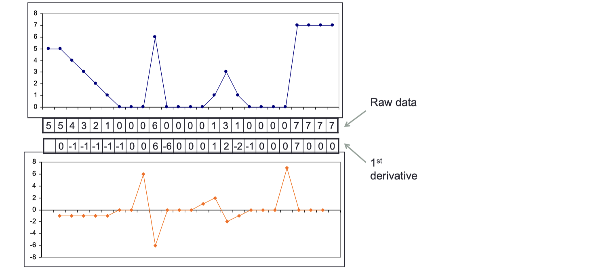
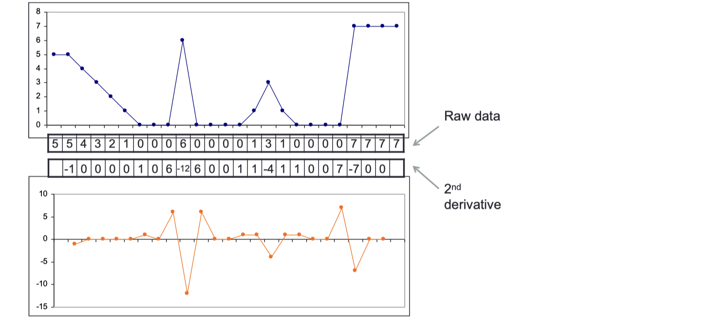
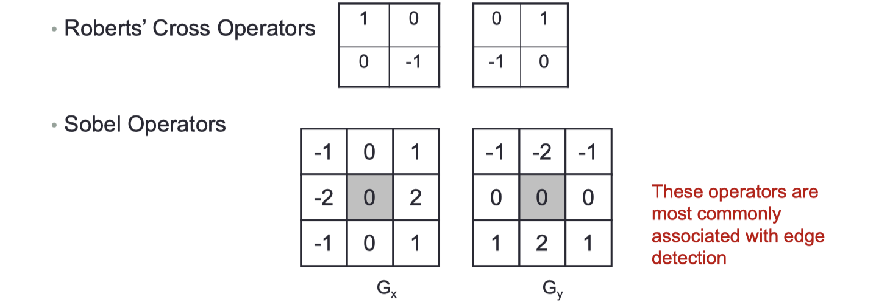
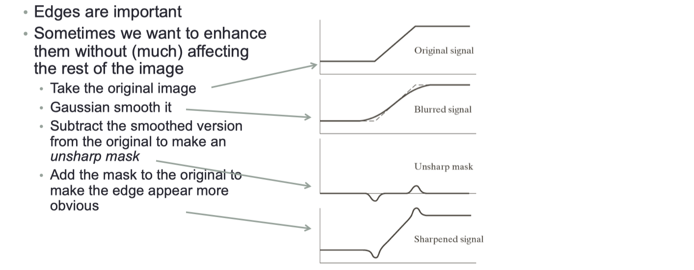
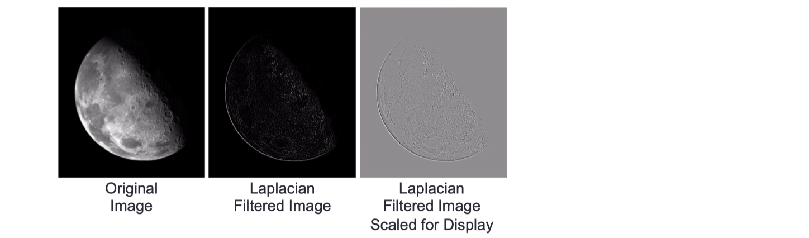
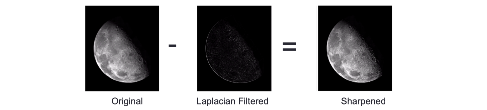
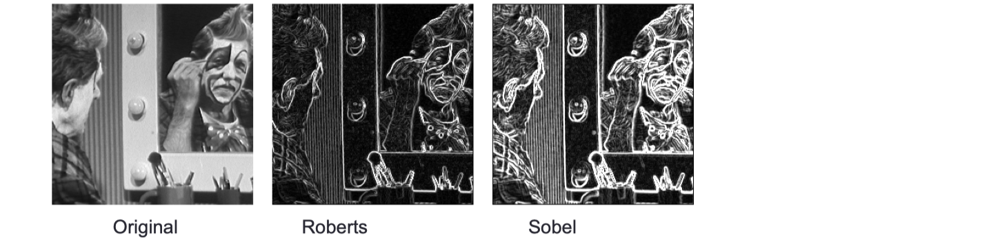
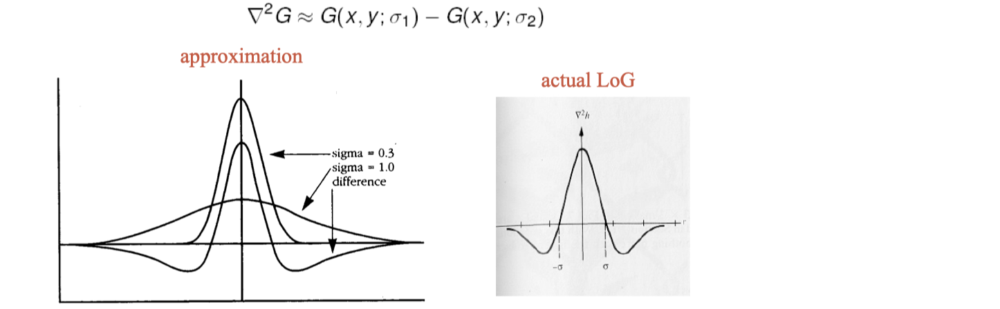

# lec06: Derivative and Edges

[toc]

## Derivative Filters

### In 1D: 1st Derivative


-   The 1st derivative of a function can be approximated by:

$$
\frac{\partial f}{\partial x} = f(x+1) - f(x)
$$

-   The difference between **neighbouring values** and measures the rate of change of the function 
-   Can also be approximated by $(f(x+1) – f(x-1))/2$, etc.



### 2nd Derivative

-   The formula for the 2nd derivative of a function is

$$
\frac{\partial^2 f}{\partial^2 x} = f'(x+1) - f'(x)=(f(x+1) - f(x)) - (f(x) - f(x-1))
$$

-   Simply takes into account the values both **before and after the current value**
-   Derived by estimating the 1st derivative at `x+0.5` and `x-0.5` and computing the derivative of the resulting data



-   2nd derivatives generalize to 2D quite easily, implementing a 1st derivative in 2D is a little more complex
-   Computation of the 1st derivative can't be done by convolution alone


### 1st Derivative Filtering

-   The magnitude of the 1st derivative vector could be simplified to

$$
\nabla f \approx |G_x| + |G_y|
$$

-   Many 1st derivative filters have been proposed



## Image Sharpening

### Edge Enhancement



### Unsharp Masking

>   说是unsharp，但其实是用来增加图片锐度的

-   Makes edges noticeably sharper
    -   Even if they are noise
    -   Sometimes too much

### Derivative Filters

- Unsharp filtering enhances edges by comparing the **original** with a **smoothed** image
    - relies on the smoothing effect of a **Gaussian function** introducing a difference between original and processed images
    - parameterised by $\sigma$
    - simple, but effect is hard to predict, so hard to parameterise

- A more direct way to highlight edges and other features associated with high image gradients is to estimate derivatives…….

### Image Sharpening with Derivatives

-   The **2nd derivative is more useful for image enhancement** than the 1st derivative
    -   Stronger response to fine detail 
    -   Simpler implementation
-   The most common sharpening filter is the **Laplacian**
    -   Isotropic 各向同性
    -   One of the simplest sharpening filters 
    -   Straightforward digital implementation via convolution

### The Laplacian


-   HIghlights edges and other discontinuities



-   The result of Laplacian filtering is not an enhanced image
    -   subtract the Laplacian result from the original image to generate the **final sharpened enhanced image**, c.f. **unsharp maskin**
    -   $g(x,y) = f(x,y) - \nabla^2 f$



### A Single Enhancment Operator


-   Convolution with this operator performs image sharpening in a single step


-   Some formulations take 2 ndderivatives measured across the diagonals into account


## Edge Detection

**Edge Detection**

-   First step in many image analysis and computer vision processes and applications
-   The goal is to **mark points at which image intensity changes sharply edges**
-   Sharp changes in image properties reflect events/changes in the world
-   This is only an assumption, but it is usually true
-   To detect edges find peaks in the 1st derivative of intensity or zero-crossings in the 2nd derivative


```python
im = imread('cameraman.tif');
edges = edge(im, 'Canny');
imshowpair(im, edges, 'montage');
```


### Edge Detection using 1st Derivatives

**1st Derivative Filters**


**Detections & Thresholding**

-   Significant peaks in magnitude of 1st derivative are high
-   Apply a threshold, all peaks higher than the threshold value are significant, all others are ignored

**Edge Magnitude & Direction**

-   For an image function, I(x,y), the gradient magnitude, g(x,y) is given by

$$
g(x,y) = \sqrt{(\triangle x^2 + \triangle y^2)}
$$

-   The gradient direction, $\theta (x,y)$, gives the direction of **steepest image** gradient

$$
\theta(x,y) = \arctan (\triangle y / \triangle x)
$$

-   This gives the direction of a line perpendicular to the edge

**Roberts' Cross Operator**

-   Very quick to compute - 4 pixels, only subtractions and additions, but is very sensitive to noise and only gives a strong response to very sharp edges


**Sobel vs Roberts**

-   Both use a user-supplied threshold. Sobel is still in use, **Roberts is less common**.
-   Larger Sobel operators are more stable in noise



### Edge Detection using 2nd Derivatives

**2nd Derivatives: Marr-Hildreth**

-   Biologically inspired
-   Gaussian smooth, compute Laplacian
-   Convolve with the **Laplacian of a Gaussian**

**Difference of Gaussians**

-   The Laplacian of Gaussian can be approximated by the difference between two Gaussian functions:



**1st vs 2nd Derivative Methods**

-   **Peaks in 1st derivative**
    -   strong response at edges, but also respond to noise
    -   Peak detection and threshold selection need care
-   **Zero crossings in 2 nd derivative**
    -   **well-defined, easy to detect**
    -   must form smooth, connected contours
    -   tend to round off corners
-   1st derivative methods are **much more common** in practical applications,
    -   in part because of John Canny

## The Canny Operator

-   John Canny tried to find the optimal edge detector, assuming a perfect step edge in Gaussian noise
-   Optimal means
    -   **Good Detection** - it should mark all the edges and only all the edges
    -   **Good Localisation** - the points marked should be as close to the real edge as possible
    -   **Minimal Response** - each edge should be reported only once
-   Canny used the *Calculus of Variations*: finds the function which best satisfies some functional

**The Canny Operator**

-   The **optimal detector** was a sum of 4 exponential terms, but is very **closely approximated** by the 1st derivative of a Gaussian
    -   i.e. 1 st derivative of a Gaussian smoothed image
-   Gives a cleaner response to a noisy edge than square operators
-   **Most implementations** are **2D Gaussian smoothing + Roberts style derivative**


**Non-Maximal Suppression**

-   The Canny operator’s response is **cleaner than** Sobel or Roberts, but it needs an explicit step to enforce Minimal Response
-   Thresholding raw operator response would leave thick lines


-   Check if pixel is a **local maximum** along the gradient direction
-   Select **a single maximum** across the width of the edge

**Thresholding with Hysteresis**

-   **Simple thresholding tests each pixel independently**: edges aren’t really independent, they make up lines
-   The industry standard edge thresholding method
    -   Allows a band of variation, but assumes **continuous edges**
    -   User still selects parameters, **but its easier, less precise**
-   The effect is to keep weak edges if they connect strong edges, as long as
    -   the strong edges are really strong
    -   the weak edges aren’t really weak


**Canny Components** (conclusion by Shu)

-   2D Gaussian Smoothing with a 1st derivative
-   Non-Maximal Suppression
-   Thresholding with Hysteresis

>   **阈值滞后的基本原理**
>
>   1.  **高阈值和低阈值**：
>       -   高阈值（T_high）：较高的边缘强度值。如果一个像素的梯度强度大于高阈值，那么这个像素被认为是一个“强边缘”。
>       -   低阈值（T_low）：较低的边缘强度值。如果一个像素的梯度强度小于低阈值，那么这个像素被认为不是边缘。如果梯度强度在高阈值和低阈值之间，这个像素被认为是一个“弱边缘”。
>   2.  **强边缘和弱边缘**：
>       -   强边缘：梯度强度超过高阈值的像素，直接被认为是边缘。
>       -   弱边缘：梯度强度介于高阈值和低阈值之间的像素。
>   3.  **连接性**：
>       -   通过强边缘像素，将弱边缘像素连接起来，形成连续的边缘。换句话说，**只有那些与强边缘相连的弱边缘像素才被认为是实际边缘。**


