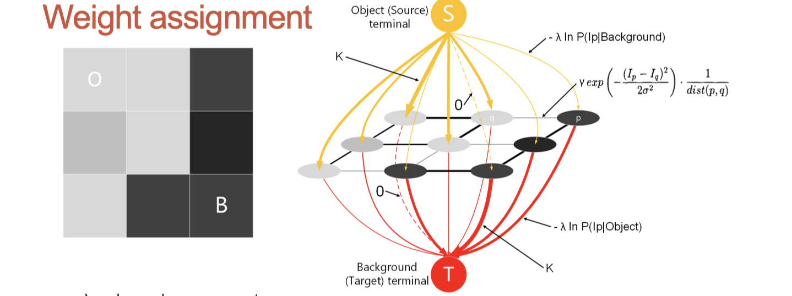

# lec09: Interactive Segmentation: Graph Cut

[toc]

## What is Interactive Segmentation

-   The user selcect a rough area in the image to indicate the content she/he would like to segment
-   The algorithm segments the area of the user’s interest
-   We will focus on **Graph Cut** in this module

## Graph Cut

**Organizing the image into a graph**

-   two kinds of links: t-link (links between pixels and Source or Target) and n-link (links between adjacent pixels) 
-   thickness of the link indicates its weight - the higher the weight is, the thicker the link is 
-   t-links are directed, while n-links are undirected 
-   make an n-link thick if values of the two pixels connected by it are closed 
-   make a t-link from Source to a pixel thick if the pixel likely belongs to the object 
-   make a t-link from a pixel to Target thick if the pixel likely belongs to the background 
-   remove (cut) thin links (including both t-links and n-links) to divide the graph into two independent parts with each has a terminal inside 
-   the summation of weights of removed links should be minimum, also known as min-cut problem

**Preliminary: colour distribution**

-   calculate colour distributions of pixels covered by red curves (foregound) and blue curves (background) separately

**Weight Assignment**

-   λ and γ are hyper-parameters
-   K should be a large value, can be determined by the formula below

**Solving min-cut problem**

-   min-cut problem is equivalent to max-flow problem 
-   imagine each link as a tube with different capacities - larger weights, larger capacities 
-   water is pumped from the Source to the Target, try to maximize the water flow to find the bottleneck 
-   bottleneck is the link to be cut

