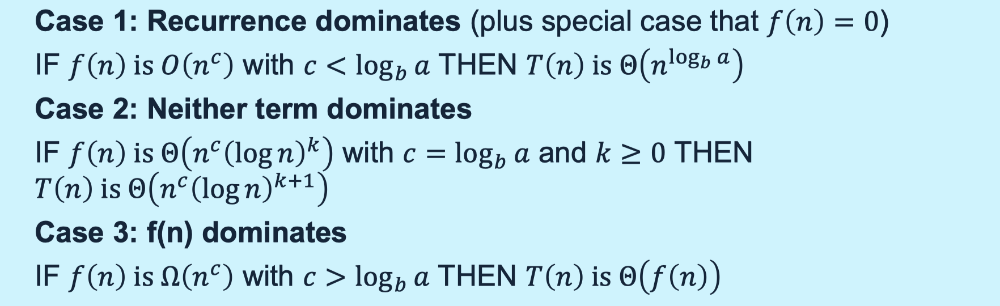

# lec11: The Master Theorem

## Definition

Consider **recurrence relations** of the form
$$
T(n) = a\cdot T(n/b) + f(n)
$$

-   Designed for “divide and conquer” in which problems are divided into `a` instances of a problem of size `n/b`.
-   Aim is to be able to quickly express the “**big-Oh family**” behavior of $T(n)$ for various cases of the values of a and b, and the scaling behavior of $f(n)$.
-   It does **not** cover all cases, but does cover many useful cases.
-   No proof neede in this module

## Consider $f(n) = 0$

-   Consider the special case that $f(n) = 0$
-   $T(n) = a\cdot T(n/b), \quad T(1) = 1$ 
    -   $T(b) = a$
    -   $T(b^2) = a^2$
    -   $T(b^3)=a^3$ 
-   So $T(b^k) = a^k$
-   Let $n = b^k$
    -   $a^k = (b^{\log_b(a)})^k = (b^k)^{\log_ba} = (n)^{\log_ba}$
    -   $T(n) = n^{\log_ba}$

## Consider $f(n)\ \text{is} \ O(n^c)$

Results are split into 3 cases, according to comparing the **growth rate** of $f(n)$ and $\log_b(a)$​

-   Case 1: $f(n)$ grows slower
    -   Recurrence term dominates. Solution ignore $f$
-   Case 2: $f(n)$ grows the same
    -   up to log factors
    -   mix of recurrence with a,b, also the $f(n)$​ term
-   Case 3: $f(n)$ grows faster
    -   Solution ignores recurrence terms and a,b

### Case 1

-   $f(n)$ is $O(n^c)$ with $c < \log_ba$
-   $T(n)$ is $\Theta(n^{\log_ba})$

**Example**
$$
T(n) = 2\cdot T(n/2) + d
$$

-    $a=b=2, \ c = 0 < \log_ba = 1$
-   $f(n)$ is $O(n^0) = O(1)$ 
-   Hence MT gives that $T(n)$ is $\Theta(n)$

### Case 2

-   $f(n)$ is $\Theta(n^c(\log n)^k)$ with $c = \log_ba, \ k \ge 0$
-   $T(n)$ is $\Theta(n^c(\log n)^{(k+1)})$​

**Example**
$$
T(n) = 2\cdot T(n/2) + 3n + 5
$$

-    $a=b=2, \ c = 1 = \log_ba = 1, \ k=0$
-   $f(n)$ is $\Theta(n)$​ 
-   $T(n)$ is $\Theta(n \log n)$
-   Same as merge sort 

### Case 3

-   $f(n)$ is $\Omega(n^c)$ with $c > \log_ba$
-   $f(n)$ satisfies the **regularity condition**
    -   for some $k < 1$, $a\cdot f(n/b) \le k\cdot f(n)$
-   $T(n)$ is $\Theta(f(n))$

**Example**
$$
T(n) = 2\cdot T(n/2) + n^2
$$

-    $a=b=2, \ c = 2  \log_ba = 1, \ k=1/2$​
-   $f(n)$ satisfies the **regularity condition**
    -   $2f(n/2) = 2(n/2)^2 \le k\cdot f(n)$​
-   $T(n)$ is $\Theta(n^2)$

**Regularity Condition**

-   $a \cdot f(n/b) \le k\cdot f(n)$ for some $k<1$
-   Suppose $f(n) = d\cdot n^c$, then we need
    -   $a\cdot d \cdot (n/b)^c \le k\cdot d \cdot n^c $
    -   $a/b^c \le k < 1 \Rightarrow a < b^c \Rightarrow \log_ba < c$
    -   which is already satisfied

