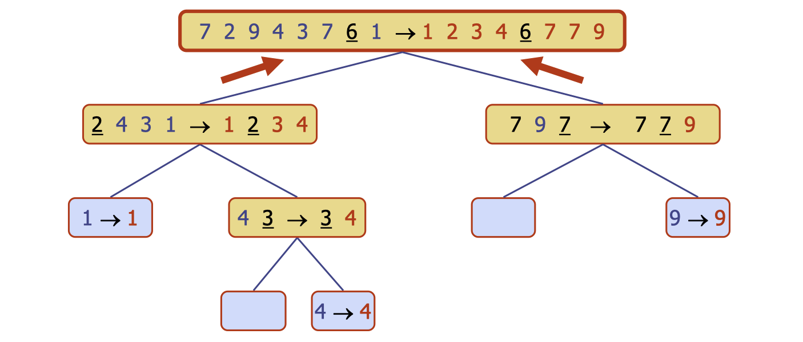

# lec12: Quicksort

## Quicksort

**When is 'merge' simple**

-   When the lists A and B are sorted and known to be in **disjoint ordered ranges**
    -   all of elements of A are smaller than all those of B
-   If A and B are stored as **consecutive sub-arrays**, then merge needs no work at all:
    -   Just “forget the boundary”

### **Quick-Sort**

**Quick-sort** is a (randomized) sorting algorithm based on the **divide-and-conquer paradigm**:

-   **Divide**: pick an element x (called **pivot**) and partition S into
    -   **L**: elements less than x, and it is **not empty**
    -   **GE**: elements greater than or equal to x
    -   Pivot is often picked as a **random element**
-   **Recur**: sort L and GE
-   **Conquer**: join L, GE

### Partition of lists

-   Suppose store **L, EG** as separate structures as arrays,
-   We parititon an input sequence as follows:
    -   We remove, in turn, each element `y` from `S`
    -   Insert `y` into `L`, `E` or `G`, depending on the result of the comparison with the pivot `x`
-   **Each insertion and removal** is at the beginning of the sequence and takes $O(1)$ time
-   Thus the partition step takes $O(n)$ time

### "In-place"

-   “In-place” means they only a **“little” extra space** (e.g. $O(1)$) is used to store data elements.
    -   **The input array is also used for output**, and only need a few temporary variables
    -   **in-place算法主要在原数组上进行操作**
    -   Exercise: check that bubble-sort is “in-place”
    -   Previous “merge” used extra $O(n)$ array (can be made in-place, but messy and so we ignore this option)

## Implementation

-   2-way split

```java
public static void recQuickSort(int[] arr, int left, int right) {
	if (right - left <= 0) 
        return; 
    else {
		int border = partition(arr, left, right); // “crossing position”
		recQuickSort(arr, left, border);
		recQuickSort(arr, border+1, right); 
    }
}
```

-   3-way split

```java
public static void recQuickSort(int[] arr, int left, int right) { 
    if (right - left <= 0) 
        return; 
    else { 
        int border = partition(arr, left, right); // pivot position 
        recQuickSort(arr, left, border-1); 
        recQuickSort(arr, border+1, right); 
    }
}
```



### Worst Case

-   When the pivot is the **unique min or max element**
-   One of L and E+G has size `n-1` and the other has size `1`
-   The running time is proportional to the sum
    -   $n + (n-1) + \dots + 2 + 1$
-   $O(n^2)$

### Best Case

-   Occrus when the pivot is the **median element**
-   L and G has equal size, similar to **merge sort**
-   $O(n \log n)$

### Average Case

-   $O(n \log n)$
-   e.g.: the pivot is always in the middle third


