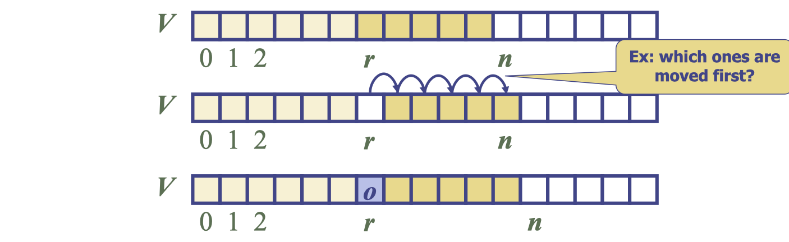
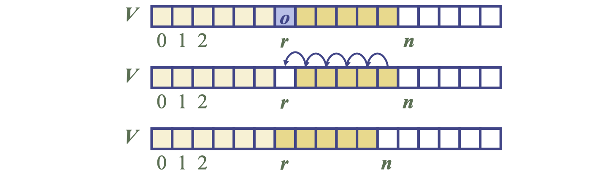
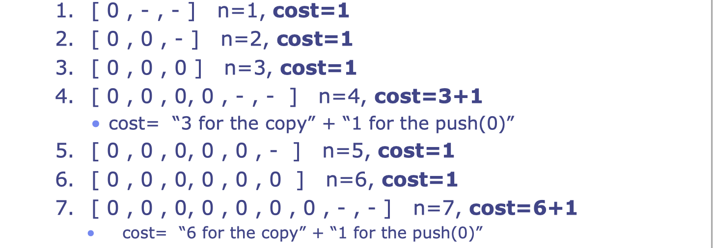
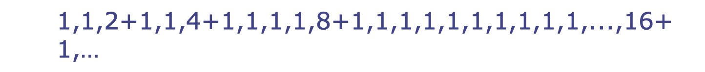
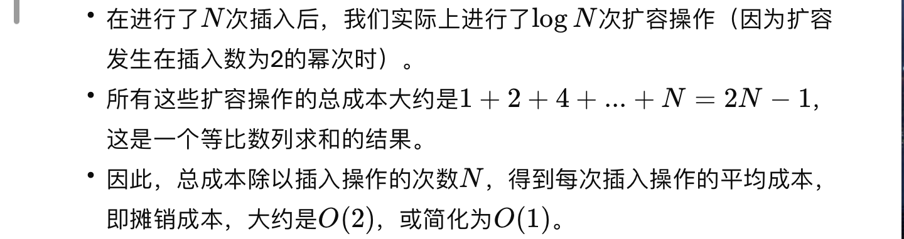

# lec14: The Vector Data Type, and Amortised Analysis

[toc]

## Vector ADT

-   The “Vector” is an **Abstract Data Type, ADT**, corresponding to generalising the notion of the “Array” **(Concrete Data Type, CDT)**
-   **Key Ideas**
    -   The “index” of an entry in an array can be thought of as the “number of elements preceding it”
    -   E.g. in an array A, then `A[2]` has two elements, `A[0]`, `A[1]` that precede it
    -   In these lectures it is then called **“rank”**
    -   The notion of “rank” can be more general than the idea of index:
-   The **Vector ADT** is based on the **array CDT**, and stores a sequence of **arbitrary objects**
-   An **exception** is thrown if an `incorrect rank` is specified (e.g., a negative rank)
-   **Main vector operations**:
    -   `object elemAtRank(integer r)`: returns the element at rank r without removing it
    -   `object replaceAtRank(integer r, object o)`: replace the element at rank with o and return the old element
    -   `insertAtRank(integer r, object o)`: insert a new element o to have rank r
    -   `object removeAtRank(integer r)`: removes and returns the element at rank r
    -   `integer size()`
    -   `boolean isEmpty()`

**Vector as Stack**

A common usage of a Vector is as a **Stack**

-   add and remove elements at the end
-   `push(o)` - `insertAtRank(size(), object o)`
    -   hence the new element is after all the existing ones 
-   `pop()` - `removeAtRank(size())`
    -   hence the element remove

**Applications**

-   No automatic limit on the storage size
    -   arrays: has a fixed size
-   Direct applications
    -   Sorted collection of objects (elementary database)
-   Indirect applications
    -   Auxiliary data structure for many algorithms
    -   Components of other data structures

### Array based Vector

-   Use an array `V` of size `N` as the CDT
-   A variable `n` keeps track of the size of the vector (number of elements currently stored)
-   Operation `elemAtRank(r)` is implemented in $O(1)$ time by simply returning `V[r]`

**Insertion**

-   In operation `insertAtRank(r, o)`, we need to make room for the new element by shifting forward the `n-r` elements `V[r], ..., V[n-1]`
-   For the worst case `r=0`, it would take $O(n)$

**Deletion**

-   In operation `removeAtRank(r)`, we need to fill the hole left by the removed element by shifting backward the `n-r-1` elements `V[r+1], …, V[n-1]`
-   In the worst case (`r = 0`), this takes $O(n)$ time

**Performance**

-   The **space** used by the data structure is $O(n)$
-   `size`, `isEmpty`, `elemAtRank` and `replaceAtRank` run in $O(1)$ time
-   `insertAtRank` and `removeAtRank` run in $O(n)$ time
-   push runs in $O(1)$ time, as do not need to move elements
    -   unless need to resize the array
-   `pop` runs in $O(1)$​ time
-   In an `insertAtRank` operation, when the array is **full**, instead of throwing an exception, we can **replace the array with a larger one**

### Growable Array-based Vector

-   In a `push` operation i.e. `insertAtRank(n)`
-   Two strategies
    -   incremental strategy
    -   doubling strategy

**Comparison of the Strategies**

-   by analyzing the total time `T(n)` needed to perform a series of `n` push operations
    -   push: add an element at the end
-   We assume that we start with an **empty stack** represented by an array of size `1`
-   We call **amortized time** of a push operation the **average time** taken by a push over the series of operations, i.e., $T(n)/n$

## Amortised Time

### Remarks on Amortised Analysis

-   Suppose some individual operation (such as ‘push’) takes time `T` in the worst-case
-   Suppose do a **sequence** of operations:
    -   Suppose s such operations take total time `Ts` 
    -   Then `sT` is an upper-bound for the total time `Ts `
    -   But, such an upper-bound **might not ever occur.**
-   The time `Ts` might well be `o(sT)` even in the worst-case
    -   the average time per operation, T s /s can be the most relevant quantity in practice

**Question: Why is amortised analysis different from the average case analysis?**

-   **amortised**: **real sequence** of dependent operations
-   **average**: **set** of (possibly independent) operations

### Incremental Strategy Analysis

-   with start capacity of 3, suppose we do a sequence of `push(0)`

-   We replace the array `k = n/c` times
-   Each “replace” costs the **current size**
-   The total time `T(n)` of a series of n push operations is proportional to
    -   n + c + 2c + 3c + 4c + … + kc = n + ck(k + 1)/2 
-   Since c is a constant, $T(n)$ is $O(n + k^2)$, i.e., $O(n^2)$
-   The amortized time of a push operation is $O(n)$
-   **This is bad** as the normal cost of a push is $O(1)$.

### Doubling Strategy Analysis

-   with start capacity of 2, suppose we do a sequence of `push(1)`

-   For every push of cost $O(n)$ we will be able to do another $O(n)$ pushes of cost $O(1)$ before having to resize again
-   The $O(n)$ cost on resizing can be amortised over n other $O(1)$ operations
-   Gives an average of $O(1)$ per operation

