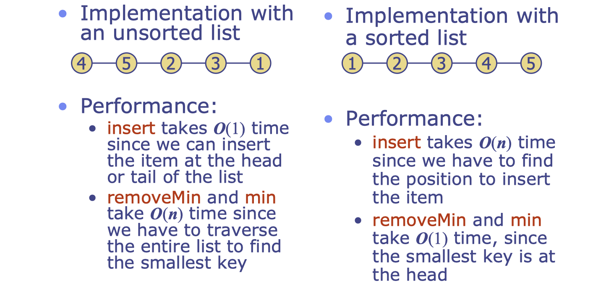
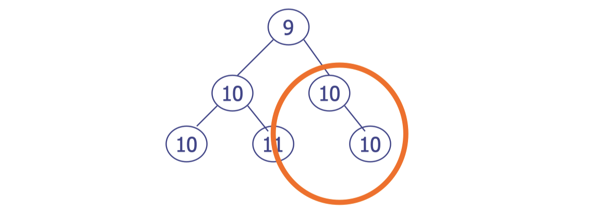
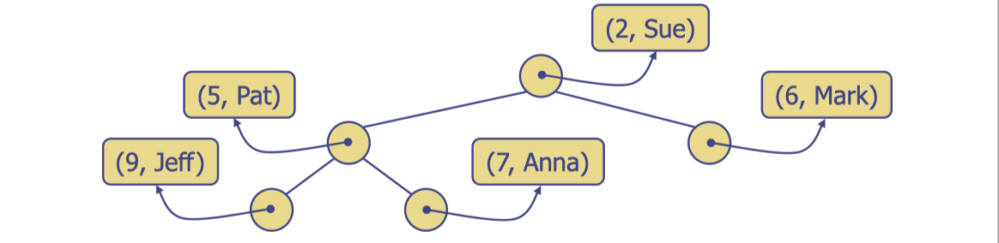
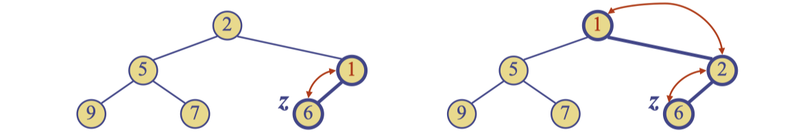
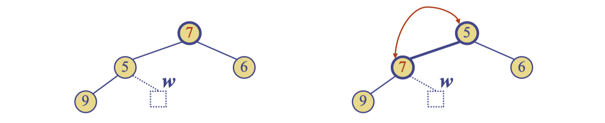

# lec15: Priority Queues & Heaps

## ADT and CDT

-   **Abstract Data Type (ADT)**
    -   Only concerned with specifying the **interface**
    -   “Behaviour as seen from the outside”
    -   Specifies the methods provided - and possibly requirements on their complexity, 
        e.g. “must run in $O(n)$”
-   **Concrete Data Type (CDT)**
    -   Some structure and algorithm used for an **actual implementation**
    -   “Behaviour as seen from the inside”

**ADE and CDT utility**

-   Separation of the “specification” from the “implementation details”
-   Allows different CDTs to be explored for the same ADT
-   Quickly swap or improve CDTs without users of the ADT having to change their code

## Priority Queue

### ADT

-   A priority queue stores a collection of entries
-   Each entry is a pair `(key, value)`
-   Main methods of the Priority Queue ADT
    -   `insert(k,v)` inserts an entry with key k and value v
    -   `removeMin()` removes and returns the entry with smallest key
    -   Note: unlike Map (seen later), there is no requirement of a method `find(k)`.
-   Additional methods
    -   `min()` returns, but does not remove, an entry with smallest key
    -   `size()`, `isEmpty()`
-   Applications:
    -   Standby passengers
    -   Auctions
    -   Stock market
    -   Printer queues

**Total Order Relations**

-   Keys in a priority queue can be arbitrary objects on which an order is defined (between all different pairs)
-   Two distinct entries in a priority queue can have the same key

### Simple Implementation CDT

-   Suppose that 99% take time 1 and 1% take time n
-   The average: `(n+99)/100` is still $O(n)$

**Aim**

-   Can we find an implementation of a PQ such that all operations are better than $O(n)$

## Binary Heaps

A binary heap is a **binary tree** storing key-value pairs at its nodes and satisfying the following properties:

-   **Heap-Order**: for every internal node `v` other than the root, `key(v)>=key(parent(v))`
-   **Complete Binary Tree**: let `h` be the height of the heap
    -   at `depth i`, there are `2^i` nodes
    -   at depth `h-1`, the nodes are to the left of any ‘missing nodes’
    -   in this case the children of 6 are ‘missing’
-   The last node of a heap is the rightmsot node depth `h`

### Exercises

-   This is NOT a heap
-   The circled nodes are leftwards
-   If a node has just one child then it must be a left child

### Height of a Heap

-   Theorem: A heap storing n keys has height $O(\log n)$

### Heaps and Priority Queues

-   We can use a heap to implement a priority queue
-   We store a `(key, element)` item at each node
-   We keep track of the position of the last node

### Insertion into a Heap

The insertion algorithm consists of three steps

-   find the insertion node `z` the new last node
-   store `k` at `z`
-   restore the heap-order property

### Upheap

-   After the insertion of a new key k, the heap-order property may be violated
-   Algorithm upheap restores the heap-order property by swapping k along an upward path from the insertion node
-   Upheap terminates when the key k reaches the root or a node whose parent has a key smaller than or equal to k
-   Since a heap has height $O(\log n)$, upheap runs in $O(\log n)$ time

### Removal from a Heap

-   Method removeMin of the priority queue ADT corresponds to the removal of the root key from the heap
-   The removal algorithm consists of three steps
    -   Replace the root key with the key of the **last node w**
    -   Last node means the rightmost node in the lowest level
    -   Remove w
    -   Restore the heap-order property (discussed next)

### Downheap

-   After replacing the root key with the key k of the last node, the heap-order property may be violated
-   Algorithm downheap restores the heap-order property by swapping key k along a particular downward path from the root
    -   **swap with the smallest child**
-   Downheap terminates when key k reaches a leaf or a node whose children have keys greater than or equal to k
-   Since a heap has height O(log n), downheap runs in O(log n) time

## Implementation

### Array-Heap

-   We can represent a heap with n keys by means of an Array (or Vector) of length `n+1`
-   Links between nodes are not explicitly stored, instead:
-   For the node at index i
    -   the left child is at index `2i`
    -   the right child is at index `2i+1`
    -   the parent is at index `i/2`
-   The cell at index `0` is not used
    -   Makes the equations easier/faster
-   Notice that there are no “**gaps**” when storing a heap
-   Operation **insert** corresponds to inserting at index `n+1`
-   Operation **removeMin** corresponds to moving index `n` to index `1`
-   **Up-heap** and **down-heap** operations just swap appropriate elements within the array
-   Together with the lack of gaps, this makes the implementation very efficient, and this is the standard way to implement a Heap

### Implementing Priority Queue with a Heap

-   To create a priority queue, initialise a heap
-   To insert in the priority queue, insert in the heap
-   To get the value with the minimal key, ask for the value of the root of the heap 
-   To dequeue the highest priority item,
    -   remove the root and return the value stored there.

### Heap-Sort

-   Consider a priority queue with n items implemented by means of a heap
    -   the space used is $O(n)$
    -   methods `insert` and `removeMin` take $O(\log n)$ time
    -   methods `size`, `isEmpty` and `min` take time $O(1)$
-   Using a heap-based priority queue, we can sort a sequence of n elements in $O(n \log n)$ time 
-   **The resulting algorithm is called heap-sort**
-   Heap-sort is **much faster** than quadratic sorting algorithms, such as **insertion sort and selection sort**

**Two stages**

-   Insert all elements into the heap one by one. This takes `n` insertions with $O(\log n)$ each for a total of $O(n \log n)$
-   Remove all elements one by one, using `removeMin()`, hence obtaining them in sorted order
    -   This takes n removals with $O(\log n)$ each for a total of $O(n \log n)$
-   Hence the overall cost is $O(n\log n)$

### Conclusion

-   Priority Queue ADT can be implemented using an unsorted list, a sorted list, or a heap.
    -   In the first two cases, one of the methods requires $O(n)$ time.
    -   For the heap implementation, all methods run in $O(\log n)$.
