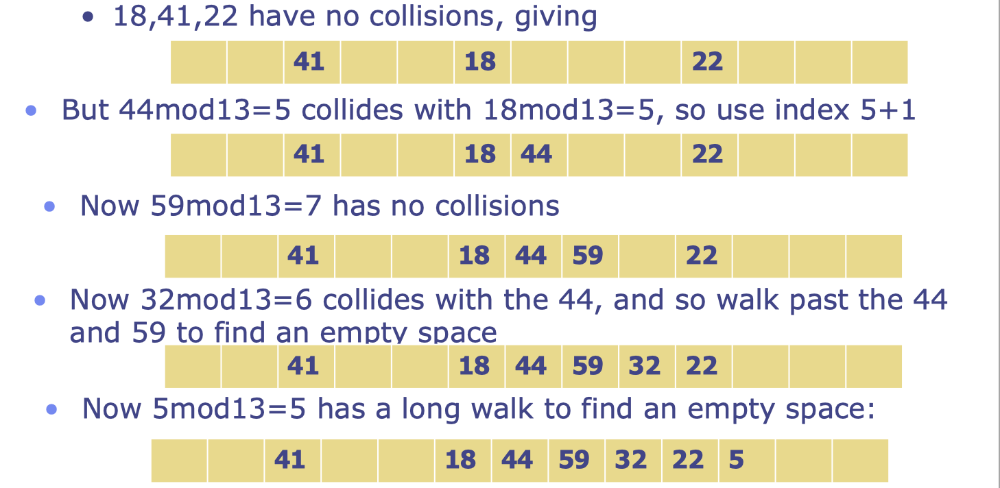
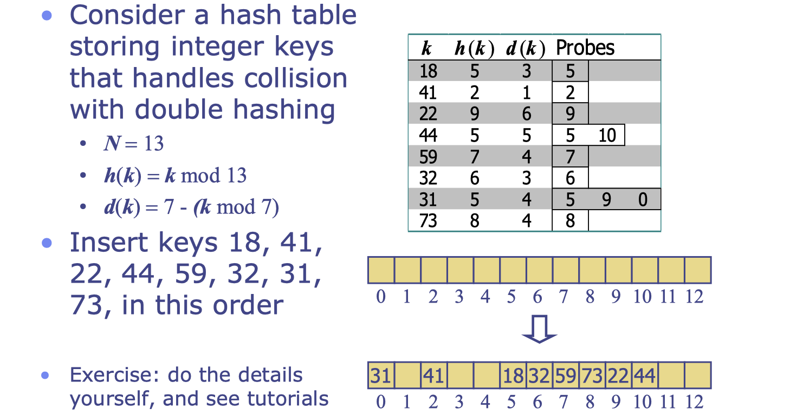

# lec17: Map ADT and hashtables

## Hash Tables

-   Hash tables are a **concrete data structure** which is suitable for implementing maps.
-   Basic idea: convert each key into an index into a (big) array.
-   Look-up of keys and insertion and deletion in a hash table usually runs in $O(1)$ time.
    -   Not guaranteed, and design of the table needs to be done carefully if want the access to be "reliably $O(1)$"

### Hash Functions

-   A hash function h maps keys of a given type to integers in a fixed interval [0, N - 1]
    -   Example: `h(k) = k mod N` is a hash function for integer keys
-   The integer `h(k)` is called the **hash value** of key k
-   A hash table for a given key type consists of
    -   Hash function `h`
    -   Array (called **table**) of size `N`
-   When implementing a map with a hash table, the goal is to store item `(k, v)` at index `i = h(k)`

### Collision Handling

>   Collisions occur when different elements are mapped to the same cell


## Hash Functions

-   A hash function is usually specified as the composition of **two functions:**
    -   **Hash code**: `h1: keys => integers`
    -   **Compression function**: `h2: integers => [0, N-1]`
-   The hash code is applied first and the compression fucntion is applied next on the result
    -   $h(x) = h_2(h_1(x))$
-   **The goal of the hash function is to disperse the keys in an apparently random way**
-   Why disperse
    -   to reduce the numbers of collision
-   Why random
    -   random means no pattern
    -   if there is an obvious pattern then the incoming data might have a matching pattern that leads to many collisions

### Hash Codes

-   **Memory address:**
    -   We reinterpret the memory address of the key object as an integer (default hash code of all Java objects)
    -   Good in general, except for numeric and string keys
-   **Integer cast:**
    -   We reinterpret the bits of the key as an integer
    -   Suitable for keys of length less than or equal to the number of bits of the integer type (e.g., byte, short, int and float in Java)
-   **Component sum:**
    -   We partition the bits of the key into components of fixed length (e.g., 16 or 32 bits) and we sum the components (ignoring overflows)
    -   Suitable for numeric keys of fixed length greater than or equal to the number of bits of the integer type (e.g., long and double in Java)
-   **Polynomial accumulation**
    -   ...

### Compression Functions

-   **Division**
    -   $h_2(y) = y \ \text{mod} \ N$
    -   The size N of the hash table is usually chosen to be a prime
-   **Mutiply, Add and Divide (MAD)**
    -   $h_2(y) = (ay+b) \ \text{mod} \ N$
    -   `a` and `b` are nonnegative integers
    -   $a \  \text{mod} \ N \neq 0$

## Separate Chaining for Collision Handling

-   **Separate Chaining**: let each cell in the table point to (e.g.) a **linked list** of entries that map there
    -   Note: In practice, should use a more efficient Map; e.g. a Binary Search Tree (BST), (see later lectures)
-   Simple and fast, but requires additional memory outside the table


**Algorithm `get(k)`:**

-   **Output**: The value associated with the key k in the map, or **null** if there is no entry with key equal to k in the map
-   **return** `A[h(k)].get(k)`


**Algorithm `put(k,v)`**

-   **Output**: If there is an existing entry in our map with key equal to k, then we return its value (replacing it with v); otherwise, we return **null**

```
t = A[h(k)].put(k,v)
if t == null then
	n = n + 1
return t
```


**Algorithm `remove(k)`:**

-   **Output**: The (removed) value associated with key k in the map, or **null** if there is no entry with key equal to k in the map

```
t = A[h(k)].remove(k)
if t != null then
	n = n - 1
return t
```

## Open addressing

-   **Open addressing**: the colliding item is placed in a **different cell of the table**
-   **Linear probing** handles collisions by placing the colliding item in the next (circularly) available table cell **(variant: cell + c where c is a constant)**
    -   “Circular array” – once get to the right-hand end, then just start again at the beginning of the array
-   Each table cell inspected is referred to as a “probe”
-   Disadvantage: Colliding items lump together, causing future collisions to cause a longer sequence of probes

**Example**

-   $h(x) = x \ \text{mod} \ 13, c=1$
    -   Insert keys `18, 41, 22, 44, 59, 32, 5` in this order



### Search with Linear Probing

-   Consider a hash table A that uses linear probing
-   `get(k)`
    -   We start at cell `h(k)`
    -   We probe consecutive locations until one of the following occurs
    -   An item with key k is found, or
    -   An empty cell is found, or
    -   N cells have been unsuccessfully probed


**Example**

-   $h(x) = x \ \text{mod} \ 13, c=1$
    -   Insert keys `18, 41, 22, 44, 59, 32, 5` in this order


### How to safely remove an element

**One answer**

-   Find x using **get and set** the entry back to blank, i.e. null or empty (which sometimes write as `#`)
-   Fix the sequence on its right-hand-side
    -   move such entries and re-insert them all

**Another solution**

-   **Lazy deletion**: don't mark the entry as a blank, but as a **deleted** and fix the entries later

## Double Hashing

-   Double hashing uses a secondary hash function `d(k)` and handles collisions by placing an item in the first available cell of the series

$$
(h(k) + j \cdot d(k))  \ \text{mod} \ N, \ j \in [0, N-1]
$$

-   $d(k)$ cannot have zero values
-   The table size N must be a prime to allow probing of all the cells
-   Common choice for the secondary hash function
    -   $d(k) = q - (k \  \text{mod} \ q )$
    -   $q < N$ and **q is a prime**
    -   possible values for $d(k)$ are `1, 2, .. q`

### Remarks

-   The table size N must be a **prime** to allow probing of all the cells
-   consider $d(k) = 4$
    -   with `N = 12`, the only positions scanned are `4, 8, 0, 4, ...`
    -   so we miss many cells that might have space
    -   with `N = 11`, then the positions are `4, 8, 1, 5, 9, 2, ...`
-   With a **prime N**, eventually all table positions will be probed

### Example



## Evaluation

### Performance of Hashing

-   In the **worst case**, searches, insertions and removals on a hash table take $O(n)$ time
-   The worst case occurs when **all the keys inserted into the map collide**
-   The **load factor** $\alpha = n/N$ affects the performance of a hash table
-   In Java, maximal load factor is 0.75 (75%) – after that, rehashed
    -   as for Vector, it may be good to “roughly double” the table size each rehash
    -   pick a new (prime) close to twice the current size
-   The expected running time of all the map ADT operations in a hash table is $O(1)$
-   In practice, hashing is very fast provided the load factor is not close to 100%

### Re-Hashing

When the table gets too full then “**re-hash**”: 

-   Create a new larger table and new hash function
-   Need to (eventually) transfer all the entries from the old table to the new one
-   If do so immediately, then
    -   one can amortise the cost over many entries (as for Vector) and so get an average cost of $O(1)$ again
    -   but the worst case might be O(n) when the table is rehashed, and this might be bad for a real time system
    -   Option: do not transfer all entries “in one go” but do “a few at a time”
    -   Keep both tables until the transfer is complete; but only do insertions into the new table.

### Applications of Hashing

-   Direct applications of hash tables:
    -   small databases
    -   compilers
    -   browser caches – the weird and wonderful filenames in the browser cache folder are hashcodes of something?
-   Hash tables as an auxiliary data structure in a program:
    -   Look-up table: if you want to check whether some object has been seen before, for example in a graph or list traversal, keep a hashtable of (object,”seen before”) pairs, where the key is the reference to the object, and the value is some arbitrary marker.

### Comparison of HashMap and PQ

-   HashMap does not use the ordering of keys
    -   E.g. does not implement min()
    -   In a hash table it would need a scan of all the keys in the table, so $O(n)$ (or worse)
-   PQ does not allow direct access to a key
    -   E.g. there is no easy way to do get(k)
    -   In a (standard) heap we would have to walk through all the entries