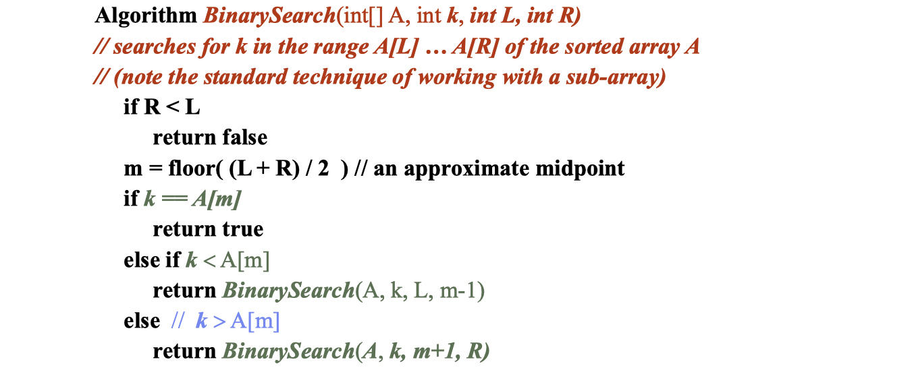
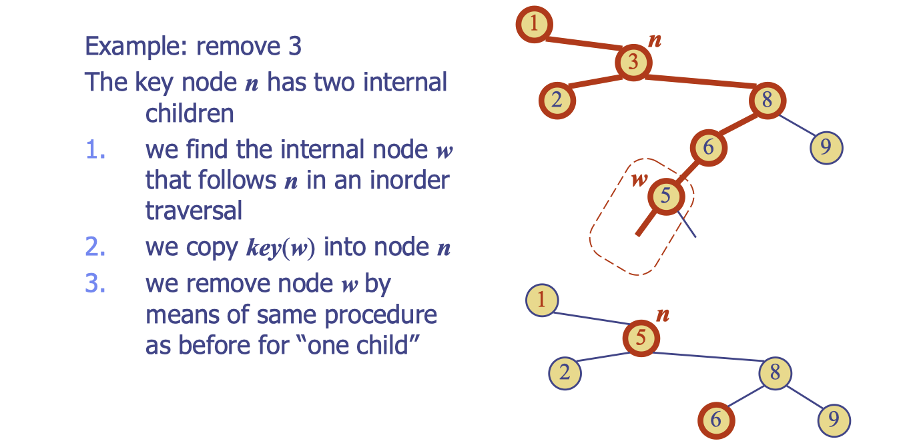

# lec19: Binary Search Trees

[toc]

## Binary Search Trees

**Binary Search for an element within a sorted array**

**Binary search complexity**

-   Using recurrence relations
    -   `T(n) = T(n/2) + 1`
    -   “n/2” because only have to search 1/2 the array after recursion
    -   “1” as the cost of doing the comparison and deciding whether to go left or right
-   Use Master Theorem
    -   `a = 1, b = 2, log_b(a) = log_2(1) = 0`
    -   `c = log_b(a) = 0`
    -   `f(n) = 1` which is $\Theta(n ^ 0)$
    -   Hence $\Theta(\log n)$

**Recursive vs. Iterative**

-   Generally: Recursive programs are easier to implement, but less efficient
    -   because of the overhead of a **function call**
-   For best efficiency, will need to convert to an iterative program `while ( test ) { … }`

## Fundamental Property of Search Tree

>   An **inorder traversal** of a (binary) search trees visits the keys in **increasing order**

### Insertion

-   We search for key k (using TreeSearch)
-   If k is already in the tree then just replace the value
-   Otherwise, k is not already in the tree, and let w be the leaf reached by the search
    -   We “insert k at node w and expand w into an internal node”
-   Again, only follows a path from the root and so is $O(h)$

### Deletion

-   As usual we start by trying to find(k)
-   **Four cases**: (think of the externals as null – not as real children)

1. **k is not present**, e.g. remove(7) nothing to do, otherwise k is stored in some node n

2. **n has no children**, e.g. remove(5), (straightforward, left as an exercise)

3. **n has one child**, e.g. remove(4)

4. **n has two children**, e.g. remove(2)

**Example: deletion with one child**

**Example: deletion with two children**

-   As a sorted list, we would have [1,2,3,5,6,8,9]
-   If we want to remove ‘3’ then a way to do this **with minimal change** to the rest of the list is to copy a key k’ that is **adjacent** to ‘3’ on top of ‘3’ and then delete that key k’
-   Options in this case are k’ being 2 or 5. We will focus on the **nextKey**, that is, ‘5’
-   To access the nextKey, we need to go right, and then **recursively-go-left**

**General procedure**

Consider the case where the key k to be removed is stored at a node n **whose children are both internal**

-   we find the internal node w that follows n in an inorder traversal
-   we copy key(w) into node n
-   we remove node w and its left child z (which must be a leaf) by using the same procedure as discussed earlier for “remove node with one child”

### Balanced Trees

-   Binary search trees: if all levels filled, then search, insertion and deletion are $O(\log N)$.
    -   As they are all $O( height )$
-   However, performance may deteriorate to linear if nodes are inserted in order:

**Performance**

**Solution: Self balancing**

-   Goal of “Self-Balancing”:
    -   Constantly re-structure the trees:
    -   Keep the trees height balanced so that the height is logarithmic in the size
    -   Performance always logarithmic.
-   Issues in Self-Balencing
    -   Suppose you have a very imbalanced search tree, there are always corresponding balanced search trees
    -   Could make trees balanced using a “total rebuild”
        -   But would require O(n), and so very inefficient compared to the desired $O( \log n)$
    -   Re-balancing needs to be $O(\log n)$ or $O( height )$
    -   Suggests re-balancing needs to just look at the path to some recently changed node, not the entire tree
    -   A priori, it is not at all obvious that this is possible!
    -   In a later lecture we show how to use “rotations” to adjust the tree whilst preserving the ordering

