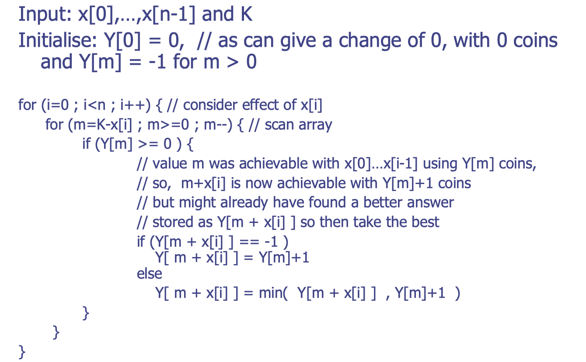
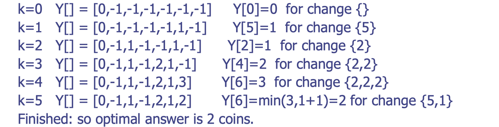

# lec20: Brute force, D&C, heuristics and “Dynamic Programming”

[toc]

## Brute Force

-   This is roughly “generate and test”
    -   Generate all potential solutions
    -   Test for which ones are actual solutions
-   Example: we could do “sorting” by
    -   Generate all possible **permutations**
    -   Test to see which one is correctly ordered
    -   Extremely inefficient, as is $O(n!)$
-   Can be useful in some (small) cases
    -   E.g. Due to the simplicity

## Divide and Conquer

-   Recursively, break the problem into smaller pieces, solve them, and put them back together
-   **Merge-sort and Quicksort were classic examples**

## Heuristics

-   “Heuristic” = “rule of thumb”
    -   Generally, meant to mean something that gives better decisions, than the naïve methods, but still not necessarily optimal
-   Two common types (the term is **over-loaded**)
    -   Decisions within a procedure that **gives exact/optimal answers**, but are designed to make it go faster (usually)
    -   Decisions within a procedure that **might not give optimal answers**, but are designed to give good answers that are impractical to obtain otherwise

These are general methods that works in an algorithm that **does give exact or optimal answers**

-   But need the heuristics to decrease the (average/typical) runtime
    -   “Admissible heuristic” in A* search (from first year AI) – decreases the search time compared to plain search
    -   “pick a random pivot” in quicksort

These are general methods that (generally) are not be guaranteed to **give the best possible answers, but that can give good answers** quickly

-   Used on problems when the exact methods are too slow, e.g.
    -   Timetabling and scheduling
    -   Many design problems
-   It is a vast research area, e.g.
    -   genetic algorithms
    -   metaheuristics (simulated annealing, tabu search, etc, etc)
    -   approximate greedy methods

### Greedy algorithms

>   Take the decision that looks best in the **short term** – without looking ahead

**Optimal: Prim's algorithm**: for constructing a Minimal Spanning Tree

-   It just adds the **shortest edge** without worrying about the overall structure, without looking ahead.
-   It makes a locally optimal choice at each step.
-   But it turns out that this is sufficient for the final answer to be optimal

**Non-optimal**

-   Usually greedy algorithms **cannot guarantee** to give optimal answers
    -   but often still give (nearly) optimal answers in practice
-   **Example: “Change-giving”:**
    -   Problem: given a collection of coins (a multi-set, that allows repeated elements), and a desired target for the change. Supply the change in as few coins as possible:

### Min Coins Change Giving

**Instance**

-   Given a set S of coins and their values `x[]` $S = \{ x[1] , x[2], … x[n] \}$ 
    (coins can be repeated, so S is actually a **multi-set**)
-   A target K (the total value to be returned)

**Task**

-   Find the set, a subset of S, with the **minimum number of coins** but whose total value, total sum, is exactly K.
-   That is, supply the change in as few coins as possible.
-   (Or show it is not possible with the given coins.)

**Change-Giving Greedy Algotihm**

-   Iterate the process of:

    Pick the largest coin which is still available and does not cause to exceed the target

-   Coins = {50,50,20,20,10,5,2,2,1,1}. “Change”: 73

    -   Greedily pick 50, leaving change = 23
    -   Greedily pick 20, leaving change = 3
    -   Greedily pick 2, leaving change = 1
    -   Greedily pick 1, leaving change = 0
    -   Answer: 50+20+2+1 = 73

-   Sometimes it fails, e.g. Coins = {5,2,2,2,2}. Change= 8

## Dynamic Programming

-   DP is a general method that can be suitable when the optimal solutions satisfy a “decomposition property"
    -   (Ignore the choice of the name – “dynamic” is not a very helpful jargon.)
-   The general idea is roughly:
    -   Splitting an optimal solution into sub-solutions corresponds to splitting the problem into sub-problems and the sub-solutions are optimal for the sub-problems
    -   So optimal solutions can be built out of optimal solutions of (smaller) sub-problems
    -   Hence: “solve small sub-problems first, then build up towards the full solution.”
    -   (Difference from divide-and-conquer is that in **DP the sub-problems can overlap**.)

### DP for Change-giving/Subset Sum

-   Firstly, consider just giving exact change and not worrying about the number of coins. 
-   The problem is better known as: **“Subset-Sum**”:
-   Given (multi-)set S of positive integers x[i] and a target K Is there a subset of S that sums to exactly K

**Algorithm**: 

-   Consider the numbers one at a time keeping track of “which subset sums are possible so far”.

**Main data structure**

-   Boolean Array, Y, for `[0,…,K]`
-   `Y[m] = true` iff some subset has been found that sums to m

The simple underlying idea is to suppose we have found all the subset-sums for `x[0],…x[i-1]` and then want to also add the effect of x`[i]`

-   if some subset summed to `m`, then with the inclusion `x[i]`, we can also find a subset that sums to `m+x[i]`
-   Note this works: upwards from small sets with small sums, moving to larger sets with larger sums

**Pseudocode**

**Complexity**

-   Outer loop has to consider all the coins: hence $O(n)$
-   Inner loop scans the entire array Y,: hence $O(K)$
-   Overall is $O( n K )$, Much better than $O( 2^n )$ ?
-   However, “K” has the “hidden exponential” if it is represented in binary:
    -   The relevant input size is the number of bits B that are needed to represent, $B=O(\log(K))$
-   The complexity in terms of the size of the binary input is $O(n 2^B )$
    -   Is called “**pseudo-polynomial**”.

### Min-Coins version

We also wanna the minimum number of coins that are needed

**Algorithm**: 

As before, inspect the coins one at a time keeping track of the best answers obtained with the coins inspected so far

**Main data structure:**

-   Integer Array, Y, for `[0,…,K]`
    -   `Y[m] = -1` if have not found any sum for m as yet
    -   `Y[m] = c >= 0` means that have found that can achieve the sum `m` with `c` coins.

**Aim**: 

-   when the algorithm finishes then `Y[K]` will be the minimum number of coins
-   “Side-effect”: All the values of `Y[m] m < K`, will also be the minimum number for a value of m.

The simple underlying idea is to suppose we have found all the best answers for the coins x[0],…x[i-1] and then want to also add the effect of one more coin x[i]

-   if some set summed to m, then with the inclusion `x[i]` we can also find a subset that sums to `m+x[i]`
-   and with one more coin than was recorded as possible for m
-   If a set of coins had already been found then take the one that gives the minimum.

**Pseudocode**

**Example:** input: `x[] = {5, 2, 2, 2, 1}, K = 6`

