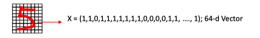
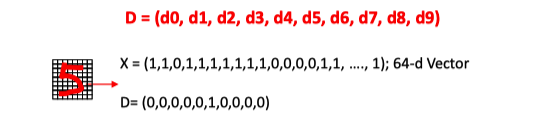

# Lec02: Designing Learning System

[toc]

## Motivating Problems

- Face Recognition
- Fingerprint Recognition 
- Handwritten Character Recognition (MNIST)
- Space Robot
- Object Recognition 

## Definition of Learning

> A computer program is said to learn from **experience E** with respect to some class of **tasks T** and **performance measure P**, if its performance at tasks in **T**, as measured by **P**, improves with experience **E**.

**Example: Handwriting Recognition Problem**

- **Task T**: Recognizing hand written characters
- **Performance measure P**: percent of characters correctly classified
- **Training experience E**: a database characters with given classifications

## Design a Learning System

### Step 0: Treat the learning system as a black box

### Step 1: Collect Training Examples 

### Step 2: Representing Experiences

- Choose a representation scheme for the examples
    - The sensor input represented by an n-d vector called the feature vector, $X = (x_1, x_2, x_3, \dots, x_n)$
    - To represent the experience, we need to know what $X$ is
    - So we need a corresponding vector $D$ to record our experience about $X$
    - The experience $E$ is a pair of vectors $E = (X,D)$ 
- The [MNIST](http://yann.lecun.com/exdb/mnist/) Datasets, where the feature vector of input data is a **28*28 dimensional vector**

- There are many possibilities of $D$
    - Assuming our system is to recognise **10 digits** only, 
    - then $D$ can be **a 10-d binary vector**, each correspond to one of the digits.

### Step 3: Choose a Representation for the Black Box

- We need to choose a function $F$ to approximate the block box. 
- For a given $X$, the value of $F$ will give **the classification** of $X$. 
- $F$ will be a function of some **adjustable parameters**, or weights, $W = (w_1, w_2, w_3,\dots, w_n)$, which the learning algorithm can modify or learn

### Step 4: Learning/Adjusting the Weights

- We need a learning algorithm to **adjust the weights** such that the experience/prior knowledge from the training data can be learned into the system:

### Step 5: Use/Test the System

- Once learning is completed, all parameters are fixed.
- An **unknown input** $X$ is presented to the system, the system computes its answer according to $F(W,X)$

## Feature Space

> **Objects => Feacture Vectors => Points in the Feature Spaces**

