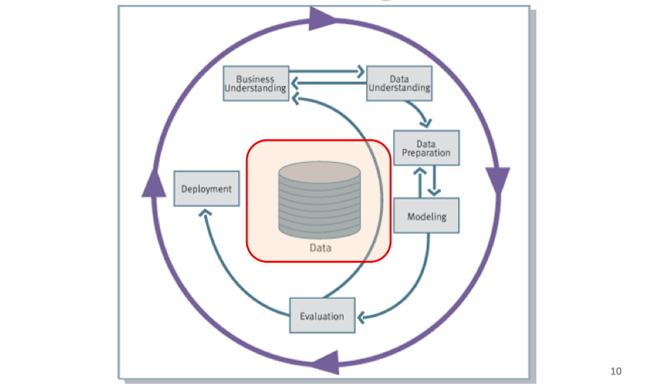
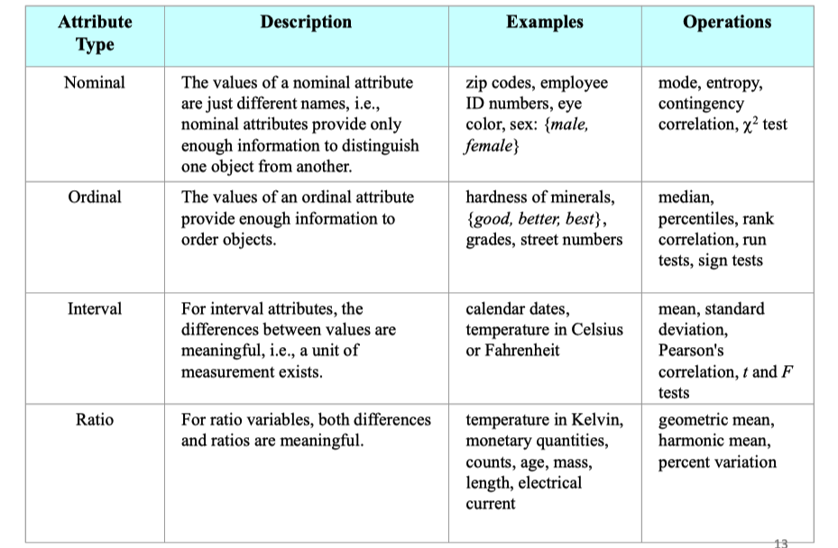

# lec03: Data Collection

[toc]

## Data Mining Process Model

- **CRoss Industry Standard Process for Data Mining (CRISP-DM)**



### Step 1: Business Understanding

- Define the problem
- Choose a machine learning model(s)
- Estimate project cost
- Estimate project completion time
- Address legal issues
- Develop a maintenance plan

### Step 2: Data Understanding


### Step 3: Data Preprocessing

- **Noisy data**
    - Locate **duplicate** records
    - Locate incorrect attribute values
    - **Smooth** data
- **Missing data**
    - **Discard** records with missing values
    - **Replace** missing real-valued items with the class mean
    - **Replace** missing values with values found within highly similar instances
- **Data transformation**
    - Data **normalization**
    - Data **type conversion**
    - Attribute and instance selection

### Step 4: Modeling

- Choose **training** and **test** data
- Designate a set of **input** attributes
- If learning is **supervised**, choose one or more **output attributes**
- Select **learning parameter** values
- Train the model

### Step 5: Evaluation

**Types of Analyses**

- Statistical analysis

    Heuristic analysis

- Experimental analysis

- Human analysis

**Measures of Effectiveness of the Model**

- **Accuracy**: Percentage of total predictions that were correct
- **Return on investment**: Cost-benefit ratios
- **Explanation**: Able to justify intuition
- **Validation**: Automated checking of correctness, indexes

### Step 6: Deployment

- Apply the model to real world usage
- Apps, API, etc.
- Regularly update the model with new data
- …

## What is Data?

- An **attribute** is a property or characteristic of an object 
    - Attribute is also known as variable, field, characteristic, or feature
- A **collection of attributes** describe an **object**
    - Object is also known as record, point, case, sample, entity, or instance

## Types of Attributes

**Nominal Ordinal Interval Ratio**



**Discrete and Continuous Attributes**

- **Discrete attribute**
    - Has only a **finite or countable** set of values.
    - Examples: zip codes, number of employees, or sale counts.
    - Often represented as **integer variables**.
    - Note: **binary attributes** are a special case of discrete attributes.
- **Continuous attribute**
    - Has **real** numbers as attribute values.
    - Examples: temperature, stock prices, or net income.
    - Continuous attributes are typically represented as **floating-point** variables.

## Types of Data

- **Record**
    - Data matrix, Transaction data
- **Graph**
    - Social networks, Molecular structures
- **Ordered**
    - Spatial data, Temporal data, Sequential data, Genetic sequence data

### Record Data

- Data that consists of **a collection of records**, each of which consists of a **fixed set of attributes**.

**Data Matrix**

- If data objects have the **same fixed set of numeric attributes**, the data objects can be thought of as points in a multidimensional space, where each dimension represents a distinct attribute.
- Such data set can be represented as an **`m` by `n` matrix**, where there are `m` rows (one for each object) and `n` columns (one for each attribute).


**Transaction Data**

- Each **record (transaction)** involves a set of items.
- For example, consider a grocery store. The set of products purchased by a customer during one shopping trip constitute a transaction, while the individual products that were purchased are the items.


### Graph Data


### Ordered Data

- Genomic sequence data


## Obtaining Data

- **Data sources**
    - Obtained directly **from owner**: text file or relational database.
    - Collect **public available data**: web.
- **Unstructured vs. structured**
    - Text file: can be unstructured or structured.
    - **Relational database**: structured.
    - **Web**: unstructured.
    - Need to structure the data if necessary.
- **Data need to be cleaned**
- **Tools for data collection and cleaning**
    - Python, R, Excel, SQL, etc.

### Text Files

- Most companies use proprietary software to store data that can be exported into text files.
    - Usually with `.txt` extension.
    - Sometimes with `.csv` extension
- Commonly used **text file format**
    - **Fixed-width**: each attribute value starts and stops a fixed positions (columns) in the lines.
    - **Delimited**: there is a delimiter character, usually **a tab, space, or comma**, that separates different values in the lines.
- **CSV**: comma separated values
    - Example below

### Data from the Web

- Web sites containing data are structured in all sorts of ways, and the steps required to collect the data for analysis vary greatly.
- No matter the server side is a **program or file**, what the client side received (and the browser shows) are **all files**.
    - Usually in HTML (hypertext markup language) format.
    - HTML uses **tags** for displaying various items on the web page.

**HTML File and Representation**

- Most html tags control **font, color, images, actions**, etc., which are **not related** to the content of data.
- The layout of html is often controlled using **table (old fashion)** or **CSS** (Cascading Style Sheets, **new fashion**).
- Tablet data are normally put inside table tag, but many data we are interested are not in the table.

### Web Crawling

> ###### URL参数的结构
>
> 1. **基础URL**：`https://www.example.com/search`
> 2. **参数部分**：以`?`开始，表示传递参数的部分。
> 3. **name=value对**：键值对用来传递具体的参数信息。
>
> ```
> https://www.example.com/search?query=data&category=science&page=2
> ```
>
> - **query=data**：`query`是参数名（name），`data`是对应的值（value），表示查询数据相关的内容。
> - **category=science**：`category`是参数名，`science`是值，表示分类是科学类内容。
> - **page=2**：`page`是参数名，`2`是值，表示请求的页面是第2页。

- Find out the patterns of URL, e.g.http://finance.yahoo.com/q?s=SINA
    - actual address: http://finance.yahoo.com/q
    - **Parameter**: `s=SINA`
    - **name=value** pairs separated by `&`
- Write a program to generate the URLs and download.
    - By changing **parameters** and **name=value** pairs
- Sometimes need to find and download the URLs **inside a web page** (spidering).
    - URLs normally start with “http” in raw html files.
- Parsing the web pages to collect useful data
    - **Identify** where the useful data is in a web page.
    - Finding patterns to help the program auto locate the data by looking at raw html files.
    - Use **Python Regular Expression 正则表达式** to locate the data according to the pattern.

**Python Regular Expression Example**

```python
import urllib.request import re

url="http://google.com" 

# regular expression for locating title 
these_regex=b"<title>(.+?)</title>"
pattern=re.compile(these_regex)

# load the url
with urllib.request.urlopen(url) as response:
	html = response.read()

# find the pattern in the downloaded file 
titles=re.findall(pattern, html) 
print(titles)
```

