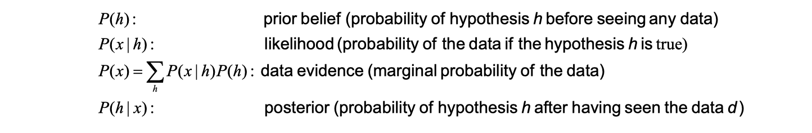
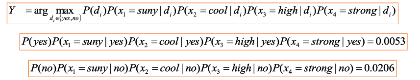

# lec07: Bayesian Learning

[toc]

## Random Variables

- A variable whose possible values are outcomes of a **random phenomenon.**
- Maybe result of experiment (**flipping a coin**) or a real world observation (**measuring attendance rate**).

### Boolean-valued Random Variable

- P(A): " the fraction of possible worlds in which A is true"

### Multivalued Random Variables

Suppose a random variable A can take on exactly one value out of `{v1, v2, ..., vk}`
$$
P(A=v_i \cap A=v_j) = 0, \ \mathrm{if} \  i \ne j \\
P(A=v_1 \cup A=v_2 \cup \dots \cup A=v_k) = 1
$$

### Joint Probability

- Consider two random **variables A and B**.
- If we observe multiple paired instances, some combinations of outcomes are more likely than others.
- This is captured by **joint probability** $P(A\cap B)$

**Marginalization 边缘化**

> 假设我们有两个随机变量 X 和 Y 的联合概率分布 P(X,Y)。如果我们想只知道 X 的概率分布而忽略 Y，我们就需要对 Y 进行边缘化。这是通过对 Y 求和（离散情况）或积分（连续情况）来完成

$$
P(B) = \sum^k_{j=1}P(B\cap A =v_j )
$$

### Conditional Probability

$$
P (A|B) = \frac{P(A\cap B)}{P(B)} \\
P(A\cap B) = P(A|B)\cdot P(B) = P(B|A)\cdot P(A)
$$

### Bayes Rule

$$
P(A|B) = \frac{P(A\cap B)}{P(B)} = \frac{P(B|A) \cdot P(A)}{P(B)}
$$

> A video of 3B1B [here](https://www.bilibili.com/video/BV1R7411a76r/?spm_id_from=333.337.search-card.all.click&vd_source=acc215f6914b68c7f4072a5f3e332d05)

## Bayesian Learning

$$
P(h|x) = \frac{P(x|h) \cdot P(h)}{P(x)}
$$

- where `x` = data, `h` = hypothesis(model)

### Choosing Hypotheses

Generally, we want the most probable hypothesis(class label) given the observed data

- **Maximum A Posteriori (MAP)** hypothesis
- **Maximum likelihood (ML)** hypothesis

**Maximum A Posteriori (MAP)**
$$
h_{\mathrm{MAP}} = \arg \max_{h\in H} P(h|x) = \arg \max_{h\in H} P(x|h)\cdot P(h)
$$

- ==$P(x)$ is independent of h hence it can be ignored==

**Maximum likelihood (ML)** 

- Assuming that each hypothesis in H is equally probable, i.e., $P(h_i) = P(h_j)$ for all i and j, then we can drop $P(h)$ in MAP
- $P(x|h)$ is often called the **likelihood of data x given h**. 
- Any hypothesis that maximizes $P(x|h)$ is called the maximum likelihood hypothesis

$$
h_\mathrm{ML} = \arg \max_{h\in H} P(x|h)
$$

### An Illustrating Example

- d = Play Tennis = {yes, no}

### Bayesian Classifier

- The Bayesian approach to classifying a new instance X is to assign it to the most probable target value **Y (MAP classifier)**

$$
Y = \arg\max_{d_i\in d}P(d_i|X) = \arg\max_{d_i\in d}P(x_1,x_2,x_3,x_4|d_i)P(d_i)
$$

- $P(d_i)$ is easy to calculate
    - $P(d=yes) = 9/14$, $P(d=no)=5/14$
- $P(x_1,x_2,x_3,x_4|d_i)$ is much more difficult to estimate
    - There are `3*3*2*2*2=72` possible terms

### Naive Bayes Classifier

Naive Bayes classifier is based on the **simplifying assumption** that the **attribute values are conditionally independent** given the target value.
$$
P(x_1,x_2,\dots,x_n|d_i) = \prod^n_1 P(x_j|d_i)
$$
Therefore we need to calculate
$$
Y = \arg\max_{d_i \in d} P(d_i) \prod_{j=1}^4 P(x_j|d_i)
$$

**So the answer is NO**

### Estimating Probabilities

- So far, we estimate the probabilities by the fraction of times the event is observed to occur over the entire opportunities

$$
P(\mathrm{wind} = \mathrm{strong}|\mathrm{play \ tenis} = \mathrm{no}) = N_c/N
$$

- Where
    - $N = 5$ is the total number of training samples for which `play tennis=no`
    - $Nc = 3$ is the number of these for which `wind=strong`
    - *Given `play tenis=no`, the possibility of `wind=strong`*

$$
\frac{N_c+mP}{N+m}
$$

- When **Nc is small**, such approach provides poor estimation. To avoid this, we could adopt **m-estimate**, where
    - $P$ is the prior estimate of the probability we wish to estimate
    - $m$ is a constant called the **equivalent sample size**, which determines how heavily to weight P relative to the observed data.
- If an attribute has $k$ possible values we set $P=1/k$.

## Naive Bayesian Classifier for MNIST

**Problem Formulation**

- 784 $x_i$ representing each pixel
- 10 $d_i$ representing each digit
- $P(x_1=255|d=0)$ is the ratio of (Number of images whose first pixel value is 255 and contain digit 0) to (total number of images containing digit 0)
- For a given input image $X$ and given digit label $d_k$

$$
P(d_k|X ) = P(d_k)\cdot P(x_1|d_k) \cdot P(x_2|d_k)\cdots P(x_{784}|d_k)
$$

