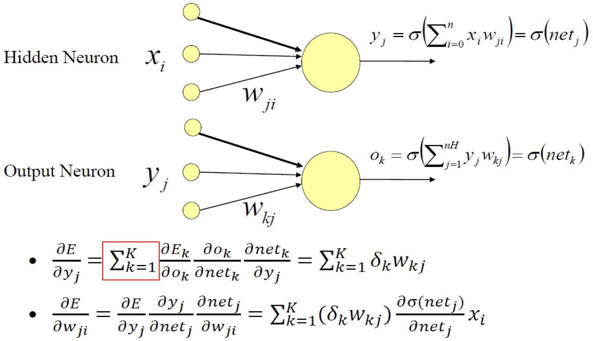

# lec12: Multilayer Perceptrons

[toc]

## Multilayer Perceptron (MLP)

### MLP Architecture

- **A single Perceptron only express linear decision surfaces**
- A more general network architecture: between the input and output layers there are **hidden layers**
- Hidden nodes do not directly receive inputs nor send outputs to the external environment
- **Fully connected** between layers

- **Feedforward network**: connections between the nodes **do not form a cycle**
- MLP usually interconnected in a feed-forward way
- The input layer does not count as a layer

### Activation Function

> **这张图非常他妈的重要，下面的运算都是基于这一张图的例子**
>
> 注意，这里从unit i 到unit j的权重表示是$w_{ji}$，我个人习惯于表达成$w_{ij}$

## Error Gradient for a *Sigmoid* Unit

### Chain Rule

$$
\frac{\mathrm{d}y}{\mathrm{d}x} = \frac{\mathrm{d}y}{\mathrm{d}u}\cdot \frac{\mathrm{d}u}{\mathrm{d}x}
$$

### Paritial Derivative of Sigmoid Function

$$
\sigma (x) = \frac{1}{1+e^{-x}} \\
\frac{\mathrm{d}}{\mathrm{d} x}\sigma (x) = \sigma(x)\cdot (1-\sigma(x))
$$

### 用一个 Output Node来举例

> 这里的 k 代表的是第几个feature，例如MNIST里的第几张图片，因此$\sum_{k=1}^k$ 也就是统计所有input feature的error的和

$$
\begin{align*}
\frac{\partial E}{\partial w_i} 
&= \frac{1}{2}\sum^K_{k=1}\left (\frac{\partial}{\partial w_i}(d(k)-o(k))^2 \right) \\
&= \frac{1}{2}\sum^K_{k=1}\left( 2(d(k)-o(k)) \cdot \frac{\partial}{\partial w_i}\left((d(k)-o(k))  \right) \right) \\
&= \sum^K_{k=1}\left( (d(k)-o(k)) \cdot \frac{\partial}{\partial w_i}\left( -o(k)  \right) \right) \\
\end{align*}
$$

- Where

$$
\frac{\partial o(k)}{\partial w_i} = \frac{\partial o(k)}{\partial net(k)} \cdot \frac{\partial net(k)}{\partial w_i}\\

\frac{\partial o(k)}{\partial net(k)} = \frac{\partial o(net(k))}{\partial net(k)} = \sigma(net(k))(1-\sigma(net(k))) = o(k)(1-o(k))\\

\frac{\partial net(k)}{\partial w_i} = \frac{\partial WX(k)}{\partial w_i} = x_i(k) \\
$$

- Therefore

$$
\frac{\part E}{\part w_i} = - \sum_{k=1}^K \left( (d(k) - o(k)) \cdot o(k)(1-o(k))\cdot x_i(k)  \right)
$$

## Back-propagation

### Initial Steps

- Training Set: A set of input vectors corresponding targets with the corresponding targets
- $\eta$: learning rate, controls the change rate of the weights.
- Begin with random weights.

### Hidden and Output Neurons

> 红框里的k和上面一个Output Node里所表示的k不太一样
>
> - 一个Output Node里所表示的k是第k个training sample
> - 红框里的k表示的是第k个Output Unit
>
> 用MNIST数据集来举例，给定一张训练集图片X，
>
> - Output：神经网络应该有10个Output Node，分别对应该图片是0-9的概率，用向量来表示的话，$o = (0.9,0.1,0,0,\dots)$ 代表该图片是数字0的概率是90%，是数字1的概率是10%。
> - Label：同样的，Label也可以表示成长度为10的one-hot vector，如果一张图片的label是1，那么他可以被表示为$o=(0,1,0,0,\dots)$
> - 对于每一个output node $o_0\dots o_9$，都和对应的label node 有一个Error
>
> $$
> E_k = \frac{1}{2}(d_k - o_k)^2
> $$
>
> - 因此对于一整张图片，神经网络Output的Error就是把每个Output Node的Error累加
>
> $$
> E = \sum_{k=0}^9E_k =\sum_{k=0}^9\frac{1}{2}(d_k - o_k)^2
> $$
>
> 这里的k也就是红框里k的意思，代表第k个Output Node

因此

### Full Steps

1. Initialise weights randonly

2. For each input training example $x$, compute the outputs (**forward pass**)

3. Compute the **output neurons** errros and then compute the update rule for output layer weights (**backward pass**)

    

4. Compute the **hidden neurons** errors and then compute the update rule for hiddne layer weights (**backward pass**)

    

5. Compute the sum of all $\Delta w$, once all training examples have been presented to the network

6. Update weights $w_i \gets w_i + \Delta w_i$

7. Repeat until the stopping criterion is met

## Generalization, Overfitting and Stopping Criterion

- Stop training when the validation set has the lowest error
- Error might decrease in the training set but increase in the ‘validation’ set (overfitting!)
- **Early stopping: one way to avoid overfitting**

### Dropout

- Dropout: Randomly remove some nodes in the network (along with incoming and outgoing edges)
- Notes:
    - Usually: `p>=0.5`
    - Input layers p should be much higher
    - Most deep learning frameworks come with a dropout layer

### Weight Decay

- **L2 Penalty: Penalize squared weights.** 
    - Keeps weight small unless error derivative is very large.
    - Prevent from fitting sampling error.
    - Smoother model (output changes slower as the input change).
    - If network has two similar inputs, it prefers to put half the weight on each rather than all the weight on one.
- **L1 Penalty: Penalize absolute weights.** 
    - Allow for a few weights to remain

### Normalization

- **Network Input Normalization**
    - Example: Pixel to [0, 1] or [-1, 1] or according to mean and std.
- **Batch Normalization (BatchNorm, BN)**
    - **Normalize hidden layer inputs** to mini-batch mean & variance
    - Reduces impact of earlier layers on later layers
- Batch Renormalization (BatchRenorm, BR)
    - **Fixes difference b/w training and inference** by keeping a moving average asymptotically approaching a global normalization.
