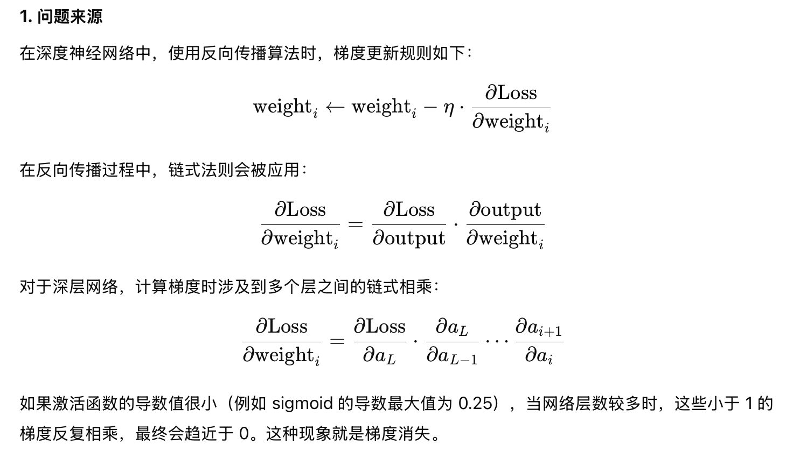

# lec14: Deep Learning Basics

[toc]

## Vanishing Gradients

### Problems

- 下图为sigmoid函数和它的导数

### Solutions

**Solution1: Better Activation Function**

- **Rectified Linear Units (ReLU)**: $f(x) = \max(0,x)$

**Solution2: Normalization**

- Batch normalization

**Solution3: Better Architecture**

- Residual networks
    - provide **residual connections** straight to earlier layers
    - This residual connection doesn’t go through activation functions that “squashes” the derivatives, resulting in a higher overall derivative of the block

## Other Problems with Going Deeper

- **Parameter explosion**
    - Too many weights to optimize as we go deeper
    - Search space is much harder to navigate
- **Proposal: shared weights**
    - Spatially shared (CNN)
    - Temporally shared (RNN)

> The Lottery Ticket Hypothesis

## Biological and Artificial Neural Networks

