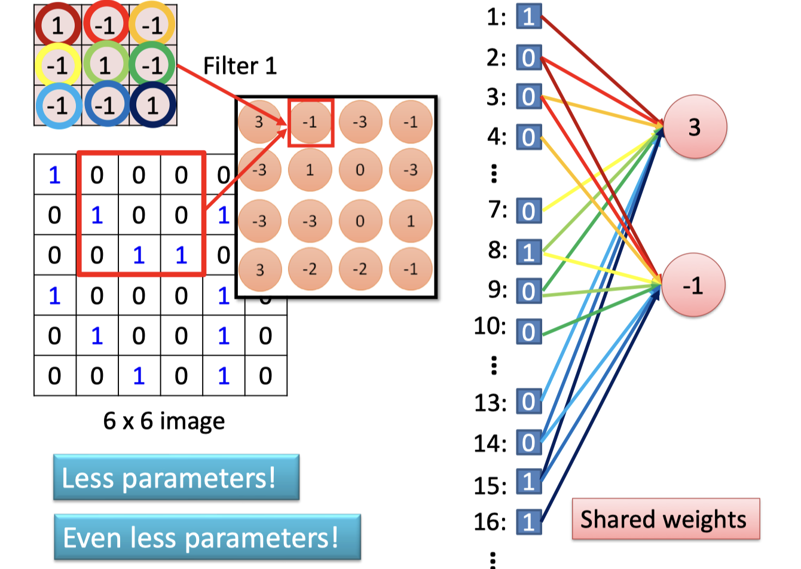

# lec15: Convolutional Neural Network

[toc]

## Basics

- **Regression**: The output variable takes continuous values
- **Classification**: The output variable takes class labels

**Famous CV Datasets**

- **MNIST**: Handwritten digits
- **ImageNet**: WorldNet hierarchy
- **CIFAR-10(0)**: Tiny images
- **Places**: Natural Scenes

## Convolutional Neural Network

### Why CNN for Image

- Some patterns are much smaller than the whole image
- The same patterns appear in different regions.
- Downsampling the pixels will not change the object
    - We can downsample the pixels to make image smaller 
    - Less parameters for the network to process the image

### CNN Layers

- **INPUT**: will hold the raw data (e.g., pixel values of the image)
- **CONV**: will compute the output of neurons that are connected to local regions in the input, each computing a dot product between their weights and a small region they are connected to in the input volume
- **RELU**: will apply an elementwise activation function
- **POOL**: will perform a downsampling operation along the spatial dimensions (width, height)
- **FC**: will compute the class scores

### Convolution Layer

**Spatial Dimensions**

> 对于一个 7*7 的input image和3 * 3的filter来说，stride可以选1和2，**但是不能选3！**

**Benefits: Less params and Shared Weights**

### Pooling Layer

- Makes the representations smaller and more manageable
- Operates over each activation map independently 

- The result of using a pooling layer and creating down sampled or pooled feature maps is a **summarized version** of the **features detected** in the input.
- They are useful as small changes in the location of the feature in the input detected by the convolutional layer will result in a pooled feature map with the feature in the same location.
- This capability added by pooling is called the model’s **invariance to local translation.**

### Fully Connected Layer

- Contrains neurons that connect to the entire input volume, as in ordinary Neural Networks

### Output Layer

- Classifier could be a fully connected net, SVM, softmax, etc.
- **Softmax**
    - **Input**: A vector of **real numbers**, $\mathbf{z} = [z_1, z_2, \dots,z_n]$
    - **Output**: A vector of **probabilities**, $\mathbf{p}= [p_1,p_2,\dots,p_n]$

$$
\mathrm{Softmax}(z_i) = \frac{e^{z_i}}{\sum_{j=i}^n e^{z_i}}
$$

## Examples

- LeNet 1998
- AlexNet 2012
- Inception V3 2015
- ResNet 2015
- U-Net 2015
- V-Net 2016

