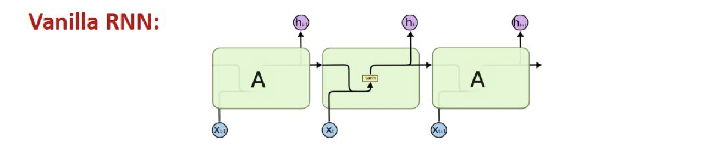
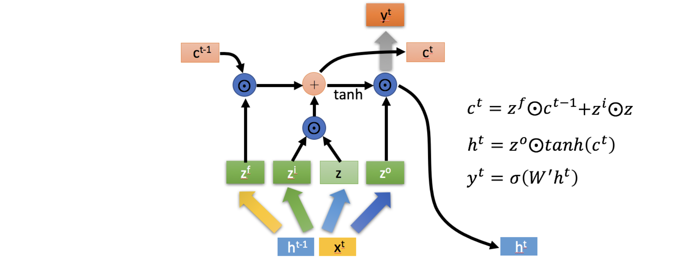

# lec16: RNN and LSTM

[toc]

## Recurrent Neural Networks

- Excellent models for problems more than o to-one
    - **Time series prediction** and classification.
    - **Sequence prediction** and classification.
    - Simplify some problems that are difficult for multilayer perceptron.

- We can process a sequence of vectors $x$ by applying a recurrrenc formula at every time step
- The same function and the same set of params are used at every time step

- **Many to many**

- **Many to One**

- **In theory** RNN retains information from the **infinite past**.
    - All past hidden state has influence on the future state.
- **In practice** RNN has **little response** to the early states.
    - Little memory over what seen before.
    - The hidden outputs blowup or shrink to zeros.
    - The “memory” also depends on activation functions.
    - ReLU and Sigmoid do not work well. `Tanh` is OK but still not “memorize” for too long.
- Vanishing gradient problem
    - Deeper layers do not have meaningful weights.

## RNN vs. LSTM

### RNN

- Recurrent neurons receive past recurrent outputs and current input as inputs.
- Processed through a `tanh()` activation function
- Current recurrent output passed to next higher layer and next time step.

### LSTM

- **Constant Error Carousel**
    - Key of LSTM: a **remembered cell** state
    - $C_t$ is the **linear history** carried by the constant error carousel.
    - Carries information through and only effected by a gate
    - Addition of history (gated).

## LSTM Gates

- A simple **sigmoid function** to project output in range (0, 1).
    - Information is let through (~1)
    - Information is not let through (~0)
- ⊗ : element-wise multiplication.

### Forget Gate

- The first gate determines whether to carry over the history or forget it
    - Actually, determine how much history to carry over.
    - The memory `C` and hidden state `h` are distinguished.

### Input Gate

- The second gate has two parts
    - A `tanh` unit determines if there is something new or interesting in the input.
    - A gate decides if it is worth remembering.

### Memory Cell Update

- Add the output of input gate to the current memory cell
    - After the forget gate.
    - ⊕ : Element-wise addition.
    - Perform the forgetting and the state update

### Output and Output Gate

- The output of the memory cell
    - Similar to input gate.
    - A `tanh` unit over the memory to output in range [-1, 1].
    - A sigmoid unit [0,1] decide the filtering.
    - Note the memory is carried through without `tanh`.

### "Peephole" Connection

### The Complete LSTM Unit

## Back Propagation Through Time (BPTT)

- Forward through entire sequence to **compute loss**
- Backward through entire sequence to **compute gradient**

### Truncated BPTT

- Run forward and backward through chunks of the sequence instead of whole sequence
- Carry hidden states forward in time forever, but only backpropagate for some smaller number of steps

