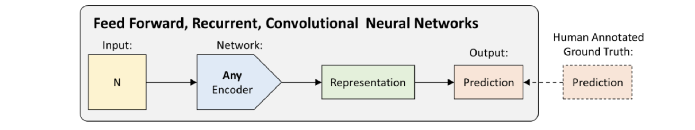

# lec17: Deep Reinforcement Learning Intro

[toc]

## Deap Reinforcement Learning

- **Supervised learning** is "teach by **example**"
- **Reinforcement learning** is "teach by **experience**"

### RL Framework

- At each step, the agent should:
    - Executes action
    - Observes new state
    - Receives reward

### Major Components of an RL Agent

- An RL agent may be directly or indirectly trying to learn a:
    - **Policy**: agent’s behavior function
    - **Value function**: how good is each state and/or action
    - **Model**: agent’s representation of the environment

### RL Agent: Maximize Reward

- Future reward: $R_t = r_t + r_{t+1}+r_{t+2} +\dots+r_n$
- Discounted future reward: $R_t = r_t + \gamma \cdot r_{t+1} + \gamma^2 \cdot r_{r+2}+\dots+ \gamma^{n-t}\cdot r_n$
- A good strategy is to choose an action that maximizes the **discounted future reward**

### Key Takeaways

- **Deep Learning:**
    - Fun part: Good algorithms that learn from data
    - Hard part: Good questions, huge amounts of representative data
- **Deep Reinforcement Learning:**
    - Fun part: Good algorithms that learn from data
    - Hard part: Defining a useful state space, action space, and reward
    - Hardest part: Getting meaningful data for the above formalization

## RL Classifications

- **Model-based**
    - Learn the model of the world, then plan using the model
    - Update model often
    - Re plan often
- **Value-based**
    - Learn the state or state action value
    - Act by choosing best action in state
    - Exploration is a necessary add on
- **Policy-based**
    - Learn the stochastic policy function that maps state to action
    - Act by sampling policy
    - Exploration is baked in

## Q-Learning

### Q-Learning

- State-action value function: $Q^{\pi}(s,a)$
    - expected return when starting in $s$, performing $a$ and following $\pi$
- Q-Learning: Use any policy to estimate Q that maximizes future reward:
    - $Q$ directly approximates $Q^*$ (Bellman optimality equation)
    - Independent of the policy being followed
    - Only requirement: keep updating each $(s,a)$ pair

**Exploration vs. Exploitation**

- Deterministic/greedy policy won't explore all actions
    - Don't know anything about the environment at the beginning
    - Need to try all actions to find the optimal one
- $\epsilon$-greedy policy
    - With probability $1-\epsilon$ perform the optimal/greedy action, otherwise random action
    - Slowly move it towards greedy policy: $\epsilon \rightarrow 0$

**Value Iteration**

**Representation**

- In practice, Value iteration is impractical
    - very limited states/actions
    - cannot generalize to unobserved states

### Deep Q-learning Network (DQN)

- Loss function (squared error):

- DQN: same network for both Q
- Double DQN: separate network for each Q

**DQN Tricks**

- **Experience Replay**
    - Stores experiences (actions, state transitions, and rewards) and creates mini-batches from them for the training process
- **Fixed Target Network**
    - Error calculation includes the target function depends on network parameters and thus changes quickly. 
    - Updating it only every 1,000 steps increases stability of training process.

**Dueling DQN (DDQN)**

## Policy Gradient (PG)

- **DQN (off-policy)**: Approximate Q and infer optimal policy
- **PG (on-policy)**: Directly optimize policy space
- **REINFORCE**: Policy gradient that increases probability of good actions adn decreases probability of bad action

$$
\nabla_{\theta}E[R_t] = E[\nabla_{\theta}\log P(a)R_t]
$$

- **Pros vs DQN:**
    - **Messy World**: If Q function is too complex to be learned, DQN may fail miserably, while PG will still learn a good policy.
    - **Speed**: Faster convergence
    - **Stochastic Policies**: Capable of learning stochastic policies - DQN can't
    - **Continuous actions**: Much easier to model continuous action space
- **Cons vs DQN:**
    - **Data**: Sample inefficient (needs more data)
    - **Stability**: Less stable during training process.
    - Poor **credit assignment** to (state, action) pairs for delayed rewards

## Actor-Critic

- Combine **DQN**(value-based) and **REINFORCE**(policy-based)
- Two neural networks (Actor and Critic)
    - **Actor is policy-based**: Sample the action from a policy
    - **Critic is value-based**: Measures how good the chosen action is
- Update at each time step - temporal difference (TD) learning

### Neural Network as Actor

- **Input** of neural network: the observation of machine represented as a vector or a matrix
- **Output** of neural network: each action corresponds to a neuron in output layer

### Critic

- A critic does not determine the action. It evaluates how good the actor is
- A critic is a function depending on the actor $\pi$ it evaluates 
    - The function is represented by a neural network
- **State value function** $V^{\pi}(s)$
    - When using actor $\pi$, the cumulated reward expects to be obtained after seeing observation $s$
- **State-action value function** $Q^{\pi}(s,a)$
    - When using actor $\pi$, the cumulated reward expects to be obtained after seeing observation $s$ and taking $a$

### How to estimate $V^{\pi}(s)$

- Monte-Carlo based approach

- Temporal-difference approach

### A2C and A3C

- Advantage Actor-Critic (A2C)
- Asynchronous Advantage Actor-Critic (A3C)

