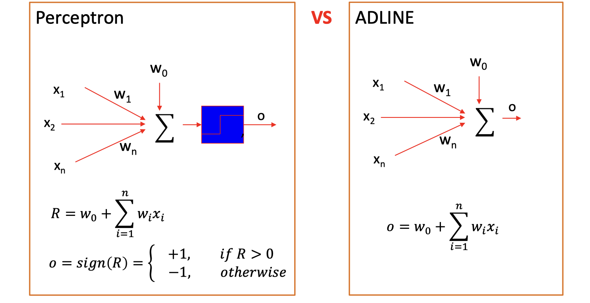
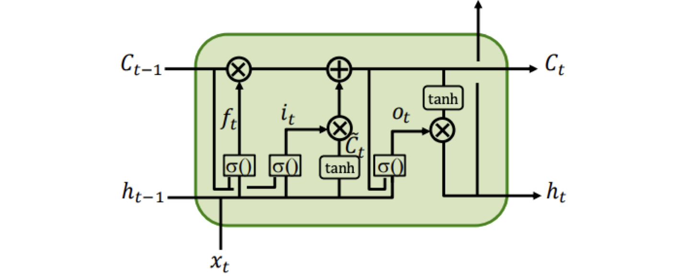
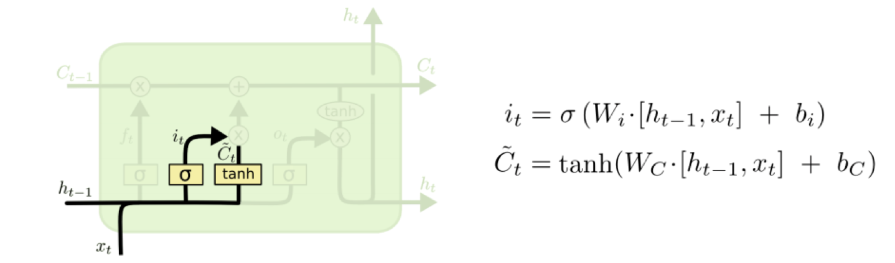
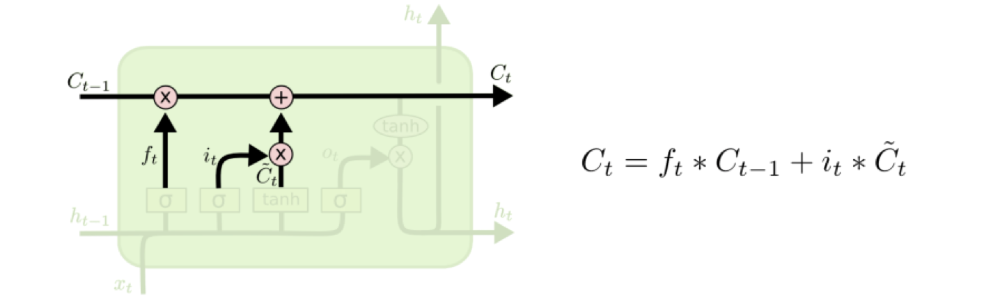
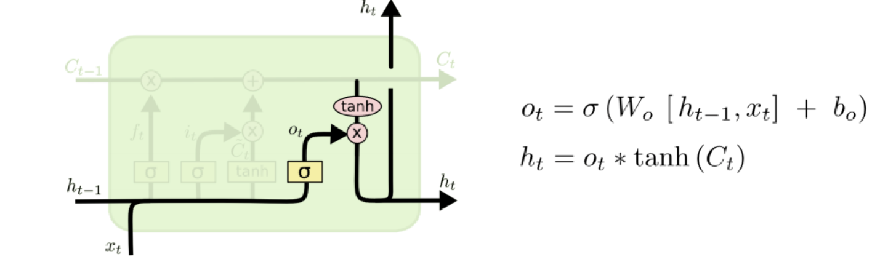
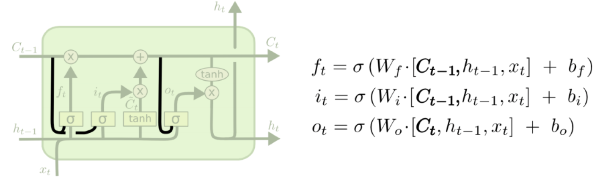

# ML-Revision

[toc]

## lec01: Intro

### Types of Learning

- **Supervised Learning**
    - Training data includes desired outputs
    - Learns a function that maps an input to an output based on example input-output pairs.
    - Training data is labeled.
- **Unsupervised Learning**
    - Training data does not include desired outputs
    - Learns from test data that has not been labeled.
    - Learns relationships between elements in a data set and classify the raw data without "help.”
- **Semi-supervised Learning**
    - Training data includes a few desired outputs

## lec02: Design a Learning System

### Design a Learning System (5 steps)

- **Collect Training Examples (Experience).**
- Choose a **representation** for the **experience**
    - The sensor input represented by an n-d vector, called the feature vector
        X = (x1, x2, x3, …, xn)
    - So we need a corresponding vector D, which will record our knowledge (experience) about X.
    - The experience E is a pair of vectors E = (X, D).
- Choose a **representation** for the **Black Box**
    - We need to choose a function F to approximate the block box. 
    - For a given X, the value of F will give the classification of X.
    - F will be a function of some **adjustable parameters**, or weights, 
        W = (w1, w2, w3, …wN ), which the learning algorithm can modify or learn
- **Learning the Weights**
    - We need a learning algorithm to adjust the weights
- **Test the System**
    - Once learning is completed, all parameters are fixed.
    - An unknown input X is presented to the system, the system computes its answer according to F(W,X)

## lec03: Data Collection

### Data Mining Process Model

**CRoss Industry Standard Process for Data Mining (CRISP-DM)**

**6 Steps of CRISP-DM** 

- **Business Understanding**
    - Define the problem
    - Choose a machine learning model(s)
    - Estimate project cost
    - Estimate project completion time
    - Address legal issues
    - Develop a maintenance plan
- **Data Understanding**
- **Data Preprocessing**
    - **Noisy data**
        - Locate **duplicate** records
        - Locate **incorrect** attribute values
        - **Smooth** data
    - **Missing data**
        - **Discard** records with missing values
        - Replace missing real-valued items with the class **mean**
        - Replace missing values with values found within **highly similar** instances
    - **Data transformation**
        - Data normalization
        - Data type conversion
        - Attribute and instance selection
- **Modeling**
    - Choose training and test data
    - Designate a set of input attributes
    - If learning is supervised, choose one or more output attributes
    - Select learning parameter values
    - Train the model
- **Evaluation**
    - Statistical analysis
    - Heuristic analysis
    - Experimental analysis
    - Human analysis
- **Deployment**
    - Apply the model to real world usage

### Types of Attribute

- **Nominal**
    - Examples: ID numbers, eye color, zip codes
- **Ordinal**
    - Examples: rankings (e.g., taste of potato chips on a scale from 1-10), grades, height in {tall, medium, short}
- **Interval**
    - Examples: calendar dates, temperatures in Celsius or Fahrenheit.
- **Ratio**
    - Examples: temperature in Kelvin, length, time, counts

## lec05: Machine Learning Theory and Practice

### Classification vs. Regression

- **Classification**: predict a label (discrete value)
- **Regression**: predict a response (continuous value)

### Overfitting

- **Overfitting can occur when:**
    - Learning is performed for **too long** (e.g. in Neural Networks).
    - The examples in the training set are **not representative** of all possible situations (is usually the case!).
    - Model parameters are adjusted to **uninformative features** in the training set that have no causal relation to the true underlying target function!
- **Increasing the size of the data set reduces the overfitting problem.**

### Cross Validation

- **Cross-Validation**: Split data into **folds**, try **each fold as validation** and average the results
- Cross Validation is often used to **counter overfitting**.
- Partition the dataset into S groups, with (S-2) training sets, a validation set and a testing set.
    - The training set is used to **determine the coefficients** `w`
    - The validation set is used to **optimize the model complexity** (**hyperparameters**, either `M` or `𝜆` in the previous example )
    - The testing set is used to **evaluate the final selected mode**

### Classification Measures

- Common performance measure for classification problems
    - TP：真阳，TN：真阴，FP：假阳，FN：假阴
    
    - **FP: Type I error, FN: Type II error**
- **Error Rate**: `(FP + FN) / (P+N)`
- **Precision**: `TP / (TP + FP)`
- **Recall**: `TP / (TP + FN)`
- **F-measure:**

$$
f_\beta = (1+\beta^2) \frac{PR}{(\beta^2P) + R }
$$

- **ROC Curves**
    - Receiver Operator Characteristic (ROC) curves plot **TP vs FP rates**
    - **Area under the curve (AUC)** is often used as measure of goodness
    - ==越靠近左上越好==

- Confusion Matrix

## lec06: Instance Based Learning (KNN)

### Instance Based Learning

- **Directly compare** new problem instances with instances seen in training
- No **explicit modeling** of the training data
- Complexity grows with the training data

### Picking K

- Use **N fold cross validation**
- For each of N training example
    - Find its K nearest neighbours
    - Make a classification based on these K neighbours
    - Calculate classification error
    - Output average error over all examples

- Use the K that gives lowest average error

### KNN-Example

## lec07: Bayesian Learning

### Bayesian Learning

$$
P(h|x) = \frac{P(x|h) \cdot P(h)}{P(x)}
$$

- $h$: hypothsis, $x$: data
- $P(h)$: **prior belief** (probability of hypothesis)
- $P(x| h)$: **likelihood** (probability of the data given hypothesis h)
- $P(x) = \sum_h P(x|h)P(h)$ : **data evidence** (marginal probability of the data)
- $P(h|x)$: **posterior** (probability of hypothesis h given the data d)

### MAP and ML

- **Maximum A Posterior (MAP)**

$$
h_{\mathit{MAP}} = \arg \max_{h\in H} P(h|x) = \arg \max_{h\in H} P(x|h)\cdot P(h)
$$

- **Maximum Likelihood (ML)**

$$
h_{\mathit{ML}}=\arg \max_{h\in H} P(x|h)
$$

### Bayesian Example

$$
P(x_1, x_2, \dots, x_n \mid d_i) = \prod^n_i P(x_i\mid d_i) \\
Y = \arg \max_{d_i \in d} P(d_i) \cdot \prod_{k=1}^{n}P(x_k \mid d_i)
$$

### M-Estimate

$$
\frac{N_c + mP}{N + m}
$$

- $P$ is the **prior estimate of the probability** we wish to estimate,
    - If an attribute has **k possible values** we set $P=1/K$.
    - 这个attribue的可能取值的数量

- $m$ is a constant called the **equivalent sample size**
    - attribute的数量

## lec08: Data Clustering (K-Means)

### K-Means

**5 Steps**

- Arbitrarily choose from the given sample set **k initial cluster centres**
- **Assign** each of the samples $X(i)$ to one of the clusters according to the distance between the sample and the centre of the cluster
- Update the cluster centres
- Calculate the error of approximation
- If the terminating criterion is met, then stop, otherwise go to step2

**Stopping Criterion**

- The **errors do not change** significantly in two consecutive epochs (误差足够小)

- No further change in the **assignment of the data points** to clusters in two consecutive epochs. (点的分类不变了)
- It can also stop after **a fixed number of epochs** regardless of the error (设置循环次数)

### K-Means Example

### Remarks on K-Means

- A **gradient descent algorithm**, trying to minimize a cost function E
- In general, the algorithm **does not achieve a global minimum** of E over the assignments
- **Sensitive to initial choice of cluster centers**. Different starting cluster centroids may lead to different solution

## lec09: Decision Tree

### Decision Trees

- A hierarchical data structure that represents data by implementing a **divide and conquer strategy** 
- Can be used as a **non-parametric classification** method

### Variations of Decision Trees

- **Classification tree**
    - The output is **discrete (label)**.
    - The leaves give the **predicted class** as well as the probability of class membership.
- **Regression tree**
    - The output is **continuous**.
    - The leaves give the **predicted value** of the output.
- Tree with binary splits
- Tree with multiway splits

### Picking the Root Node

- The goal is to have the **resulting decision tree as small as possible** (Occam’s Razor)
- The main decision in the algorithm is the selection of the **next attribute** to condition on (start from the root node).
- We want attributes that split the examples to sets that are relatively **pure** in one label; this way we are closer to a leaf node.
- The most popular heuristics is based on **information gain**, originated with the ID3 system of Quinlan.

### Entropy

$$
\mathit{Entropy}(S) = -p_+\log(p_+) - p_-\log(p_-)
$$

- $S$ is a sampel of training examples
- $p_+$ and $p_-$ is the proportion of **positive** and **negative** examples in S
- Entropy measures the **impurity of S**
- In histogram

$$
H = -\sum_{k=0}^{L-1} p(r_k)\cdot\log(p(r_k))
$$

### Information Gain

$$
\mathit{Gain}(S,A) = \mathit{Entropy} - \sum_{v\in \mathit{Values}(A)} \frac{|S_v|}{|S|}\mathit{Entropy}(S_v)
$$

- $Values (A)$ is the set of all possible values for attribute A
- $S_v$ is the subset of S which attribute A has value v
- $Gain(S,A)$: **expected reduction in entropy** caused by knowing the value of attribute A.

## lec10: Data Processing and Representation

### PCA Procedures (3 Steps)

- Subtract the **mean**
- Calculate the **covariance matrix**
- Calculate the **eigenvectors and eigenvalues** of the covariance matrix

## lec11: Perceptron and ADLINE

### Perceptron

- Perceptron takes a vector and calculates the **linear combination** of inputs
- It outputs 1 if the result is greater than some threshold and -1 otherwise

$$
R = w_0 + \sum^n_{i=1}w_ix_i \quad

output = sign(R) = 
\begin{cases}
	1,  & \text{if } R \geq 0 \\
	-1, & \text{otherwise} \\
\end{cases}
$$

- Perceptron can be regarded as representing a hyperplane **decision surface (decision boundary)** in the n-dimensional feature space of instances.
- The hyperplane is called the **Decision Surface**, which is **linear**
- The perceptron outputs a **1 for instances lying on one side of the hyperplane** and a **-1 for instances lying on the other side**.
- Perceptron can only solve **Linearly Separable Problems.**

### Perceptron-Training Algorithm (4 Steps)

- Set the weights to small random values
- Present features $X$ and calculate results $R$ and output $o$
- Update weights $w_i \gets w_i + \eta \cdot (d-o) x_i$
- Repeat by going to step 2
- **Termination of Training**
    - When a pre-set number of training **epochs** is reached
    - When the **error** is smaller than a pre-set value.

### Perceptron vs. ADLINE

- When the problem is not **linearly separable**, perceptron will fail to converge.
- **ADLINE** can overcome this difficulty by **finding a best fit** approximation to the target.

### Gradient Descent Rule

**Batch Mode: Calculate gradient for all samples and updating the weight** 

- Initialise all **weights** $w_i$ and choose a **learning rate** $\eta$

- Until the termination condition is met

    - For **all** training sample $(X(k), d(k))$, compute

    $$
    \delta_i = - \sum_{k=1}^K (d(k) - o (k))\cdot x_i(k)
    $$

    - Update each weight

    $$
    w_i \gets w_i - \eta \cdot \delta_i
    $$

**Online Mode: Calculate gradient for each sample and update the weight**

- Initialise all **weights** $w_i$ and choose a **learning rate** $\eta$

- Until the termination condition is met

    - For **each** training sample $(X(k), d(k))$, compute

    $$
    \delta_i = - (d(k) - o (k))\cdot x_i(k)
    $$

    - Update each weight

    $$
    w_i \gets w_i - \eta \cdot \delta_i
    $$

## lec12: Multilayer Perceptron

### MLP Architecture

- **Feedforward network**: connections between the nodes do not form a cycle
- MLP usually interconnected in a feed-forward way
- **The input layer does not count as a layer (数层数的时候要注意)**

### Activation Function

### Back-propagation Summary

- ==**Will find a local, not necessarily a global error minimum.**==

## lec13: Support Vector Machine SVM

### Classification Margin

- Distance from example $x_s$ to the separator is $r = |w^Tx_s + b| / \|w\|$
- Examples closest to the hyperplane are **support vectors**
- **Margin** $\rho$ of the separator is the **distance between support vectors**

**Maximum Margin Classification**

- Implying that only support vectors matter; other training examples are ignorable.

### Soft Margin Classification

- If the training set is not linearly separable
- **Slack variables** $\xi_i$ which measures the distance of the point to its marginal hyperplane **if it is on the wrong side**, **otherwise 0**, can be added to allow misclassification of difficult or noisy examples, resulting margin called **soft**.
- Applying Soft Margin, SVM **tolerates a few dots to get misclassified** and tries to balance the **trade-off** between finding a line that **maximizes the margin** and **minimizes the misclassification**.

### Non-Linear SVM

- **General idea**: the **original feature space** can always be mapped to some **higher-dimensional feature space** where the training set is separable:

### The Kernel Trick

- The linear classifier relies on **inner product** between vectors

$$
K(x_i,x_j) = x_i^T x_j
$$

- If every data point is mapped into high-dimens space via some transformation $\Phi:x \to \phi(x)$, the **inner product** becomes:

$$
K(x_i,x_j) = \phi(x_i)^T \phi(x_j)
$$

- ==A **kernel function** is a function that is equivalent to an inner product in some feature space.==
- Thus, a kernel function **implicitly maps data to a highdimensional space (without the need to compute each φ(x) explicitly**).

**Examples of Kernel Function**

- **Gaussian RBF,  Sigmoid, Polynomial**

### Multi-Class Classification

- Some algorithms for **binary classification** problems:
    - Perceptron
    - Support Vector Machines
- Instead, heuristic methods can be used to split a **multi-class classification** problem into **multiple binary classification** datasets and train a binary classification model each
    - One-vs-All (OVA)
    - One-vs-One (OvO)

**One-vs-All (OVA)**

- Every class is paired with **the remaining classes**
- The base classifier needs to produce a **real-valued confidence score** for its decision, rather than just a class label

**One-vs-One (OVO)**

- Every class is paired with **the every other class**
- At prediction time, a voting scheme is applied: all classifiers are applied to an unseen sample and the class that got the highest number of "+1" predictions gets predicted by the combined classifier

## lec14: Deep Learning Basics

### Vanishing Gradients

**Problems**

- As more layers using certain activation functions are added to neural networks, the gradients of the loss function **approaches zero**, making the network hard to train

- Consider sigmoid function $\sigma'(x) = \sigma(x)\cdot (1-\sigma(x))$

**Solutions**

- **Use better activation function**: RELU
- **Use better architecture**: Residual Network
- **Use normalization**: Batch Normalization

### Parameter Explosion

**Problems**

- **Too many weights to optimize** as we go deeper
- Search space is much harder to navigate

**Solution: Shared weights**

- Spatially shared (CNN)
- Temporally shared (RNN)

## lec15: Convolutional Neural Network CNN

### CNN Layers

- **INPUT**: will hold the **raw data** (e.g., pixel values of the image)
- **CONV**: will **compute the output of neurons** that are connected to local regions in the input, each computing a dot product between their weights and a small region they are connected to in the input volume
- **RELU**: will apply an **elementwise activation function**
- **POOL**: will perform a **downsampling operation** along the spatial dimensions (width, height)
- **FC**: will compute the **class scores**

### Convolution Layer

$$
H_{out}=\frac{H_{in}+2P−K}{S}+1
$$

- $H_{in}, K$: 特征图和卷积核的边长
- $S, P$: Stride and Padding

### Pooling Layer

- Makes the representations smaller and more manageable
- Operates over each activation map independently 
- This capability added by pooling is called the **model’s invariance to local translation.**

## lec16: RNN and LSTM

### RNN: Process Sequences

- **One to many**: Image Captioning (image -> sequence of words)
- **Many to one**: Sentiment Classification
- **Many to many**: Machine Translation
- **Many to many**: Video classification on frame level

$$
h_t = f_W(h_{t-1}, x_t) \\ 
h_t = \tanh (W_{hh} h_{t-1} + W_{xh} x_t) \\
y_t = W_{hy} h_t
$$
**Computational Graph (Many to Many)**

### RNN Problems

- In theory RNN retains information from the infinite past
- In practice RNN has **little response to the early states**
    - Little memory over what seen before
    - The hidden outputs **blowup or shrink to zeros**.
    - The “memory” also depends on activation functions.
        ReLU and Sigmoid do not work well. 
        Tanh is OK but still not “memorize” for too long.
- **Vanishing gradient problem**

### LSTM

**Constant Error Carousel**

- Key of LSTM: **a remembered cell state**
- $C_t$ is the **linear history carried by the constant error carousel**.
- Carries information through and only effected by a gate
    - Addition of history (gated).

**Forget Gate**

- The first gate determines whether to carry over the history or forget it
- Actually, determine **how much history to carry over.**
- The memory $C$ and hidden state $h$ are distinguished.

**Input Gate (2 parts)**

- A $\tanh$ unit determines **if there is something new** or interesting in the input.
- A gate decides **if it is worth remembering.**

**Memory Cell Update**

- Add the **output of input gate** to the current memory cell
- Perform the **forgetting and the state update**

**Output Gate**

- A **$\tanh$ unit** over the memory to output in range [-1, 1] (**normalize**).
- A **sigmoid unit** [0,1] decide the **filtering**.
- The memory is carried through without $\tanh$.

**The Peephole Connection**

- Let the **memory cell directly influence the gates!**

## lec17: Deep Reinforcement Learning DRL

### Supervised Learning vs. Reinforcement Learning

- **Supervised Learning**: teach by **example**
- **Reinforcement Learning**: teach by **experience**

### RL Framework

- At each step, the agent should
    - Execute **action**
    - Observe **new state**
    - Receives **reward**

### RL Methods

- **Model-based**
    - Learn the **model** of the world, then plan using the model
    - Update model often
    - Re plan often
- **Value-based**
    - Learn the **state or state action value**
    - Act by choosing **best action** in state
    - Exploration is a necessary add on
- **Policy-based**
    - Learn the **stochastic policy function** that maps state to action
    - Act by sampling policy
    - Exploration is baked in

### Actor-Critic

- Two neural networks (Actor and Critic)
    - **Actor (policy-based)**: samples the action from a policy
    - **Critic (value-based)**: measures how good the chosen action is 

**Actor**

- **Input of neural network**: the observation of machine represented as a vector or a matrix
- **Output neural network** : each action corresponds to a neuron in output layer

**Critic**

- Given an actor, it evaluates the how good the actor is
- A critic is a function depending on the actor $\pi$ it is evaluated
    - The function is represented by a neural network
- **State value function** $V^{\pi}(s)$
    - When using actor 𝜋 , the cumulated reward expects to be obtained after seeing observation (state) $s$
- **State-action value function** $Q^{\pi}(s,a)$
    - When using actor 𝜋 , the cumulated reward expects to be obtained after seeing observation $s$ and taking $a$
- How to estimate $V^{\pi}(s)$
    - Monte-Carlo based approach
    - Temporal-difference approach

## lec18: Others

### Pre-training

- Train the large network models on **a large amount of general data**
- Save the network parameters
- Learn general things

### Fine-tuning

- Initialize the large network model using parameters **trained during pre-training**.
- Continue training with additional data (usually small number and **task-specific**).
- Adapt to the task.

