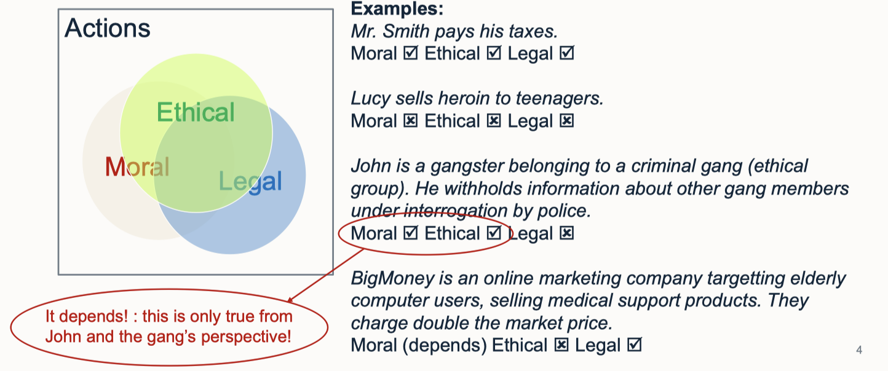

# lec02: Theories of Ethics

[toc]

## What is Ethics, Morality and Law

**Definitions**

- **Ethics**: Set of principles of how each member of a group ought to behave, shared by **the group**.
- **Morality**: One’s **individual belief** about how one **ought to behave**. This typically implies an expectation of others.
- **Law**: Social rules of right and wrong, enforced by the state (i.e. police and law courts).

**Examples**

## Some interesting ideas about Ethics

**Ethical decisions may differ between different groups**

- Ethics depends on the group which is being considered.
- Even between two rational people in the same culture, they may make different ethical decisions.
    - 对于安乐死的决定

**Context**

- Ethical decisions often depend on context.

> **Examples**
>
> - Mrs. Smith lies to police that she is harboring people wanted by the police in her home.
> - Is this wrong or right?
> - Suppose additionally: Mrs. Smith is living in **Nazi-occupied Denmark** in 1942 and the people wanted by police are a Jewish family who have committed no crime.
> - Is she right or wrong?

**Cost is important**

- The consequence or “cost” of ethical decisions is important.

**Egoism vs. Altruism**

- Egoism
    - Everyone is motivated to do only what is good for themselves as individuals.
    - Hence, only ethical theory is “**Do what is best for me**”.
    - Clearly, this is problematic: Selfish and uncaring society.
- Altruism
    - Ethical principle: **Do what is good for other people**.
    - Altruism may not be realistic!
    - At its extreme, this is not good because people may not care for themselves.

- Modern approach blends egoism and altruism:
    - Following social rules (altruism) is good for individual (egoism).
    - Caring for self (egoism) is a requirement before helping others (altruism).

**Framework for Ethical Decision-making**

## Theories of Ethics

### 1. Cultural Relativism (Pluralism) 文化相对主义

> **Ethical principle:**
>
> An action is judged good or bad based only on the standards **adopted by one’s society**.

- This follows from observation that ethics is different between groups.
- No valid rational criterion for determining the right thing to do exists.
- Different cultures cannot be judged against each other
- **Positives**: Promotes tolerance
    - We do not unfairly judge other cultures
- **Negatives**: Difficult to defend 
    - (e.g., slavery in 18 th century);
- Cultural relativism is **problematic** because it is **not objective**: we cannot apply the same ethical standards to people from different cultures.
- We need a **universal ethics code** for the computing profession.

### 2. Categorical Imperative 分类命令

> **Ethical principle:**
>
> An action is moral if it can be stated as **a universal rule without contradiction.**

- This derives ethics directly from reason.
- A flaw with the categorical imperative is that it forms universal laws that must be logically true.
- No room for exceptions.

**Deontological Ethics 义务论** 

- Categorical imperative is a type of **Deontological Ethics**:
- Concerned with **what people do**, not with consequences of actions.
- Do the right thing because it is your duty

- Deontological Ethics focusses on the intention of an action. **Principle of “good intention”.**
- But if an ethical decision is badly informed then it may lead to bad consequences.
    - 好心办坏事

### 3. Utilitarianism 功利主义

- **Hedonism** *享乐主义* is the principle that actions that make me happy are the best. However, this is egoistic.
- **Utilitarianism is the altruistic development of hedonism:**
- Utilitarianism is a reaction to **Deontological Ethics focusing on the consequence.**
- Hence, it is a form of Consequentialism: focus on **outcome**, not **intention**.

- However, utilitarianism requires a way to **quantify or “cost” the consequence.**

- Utilitarianism either can only be applied after the decision (when cost is known), or using a prediction of 

    consequence and cost, which may be wrong / misinformed.

Worse problem: **Tyranny of the Majority *多数人暴政***

- Because utilitarianism seeks to **maximize total happiness** amongst all affected people, then improving happiness **at the expense of a minority** is ethically acceptable, according to utilitarianism.

### 4. Contractarianism 契约主义

- Both a political and a moral theory. *起源于利维坦*
- Can be merged with consequentialist , or deontological theories.
- Premise:
    - People are rational and wish to promote self interests (egoism).
    - The best way of doing that is to promote the **common interests** of society.

**Social Contract**

- Originally, we were in a state of nature: Humans live “solitary, poor, nasty, brutish, and short.” [Hobbes]
- The only way to overcome this “**state of nature**” is to come together with others for mutual benefit.
- We enter into contracts in which each party agrees to certain obligations in exchange for other benefits
- Contracts are often **implicit** i.e., not written down, or spoken about ); but they are enforced by **social norms** and **state institutions** (police, law courts, government).

### 5. Ethics of Care 关怀伦理学

- Critical of **Utilitarian** and **Kantian** approaches.
- Believes logic and maths **not helpful** for moral philosophy:
- A single moral ideal virtue: **caring for other individuals.**

**Components of Caring**

- Caring is characterised by feeling of engrossment in the needs of another person and by acting to care for that person.

- For caring to happen, it is necessary for the cared for person to be receptive.

- We can “care about” everyone, but we cannot “care for” everyone.
    Hence, it is morally acceptable (and necessary) to only care for a small number of individuals

- Since caring involves the specific situation of the specific individual, it does not lead to universal moral rules. 

    - Focus on specific cases and analogy, not reasoning.

    

